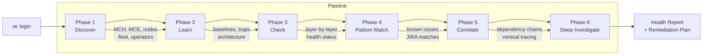
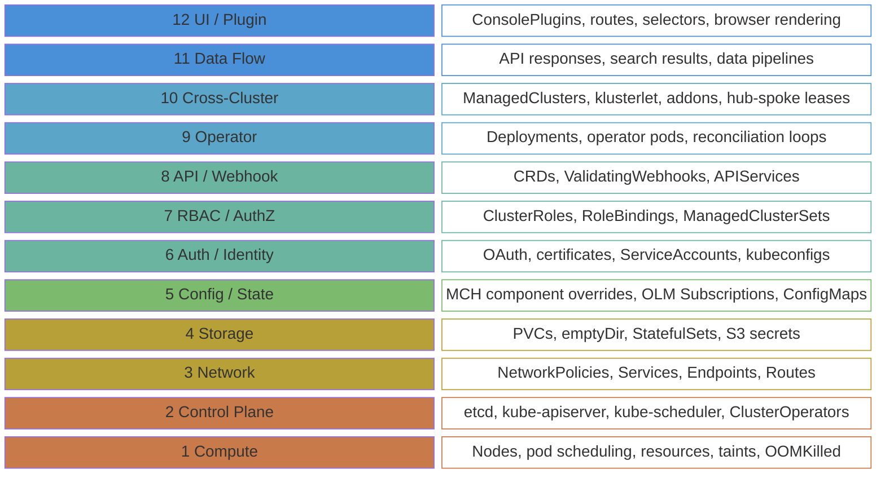

<div align="center">

# ACM Hub Health Agent

**Diagnose ACM hub clusters with evidence-based root cause analysis.**

6-phase diagnostic pipeline &mdash; 12-layer investigation model &mdash; 59 knowledge files &mdash; 3 MCP integrations

</div>

---

## Quick Start

```bash
cd acm-hub-health
oc login <hub-api>    # login to your hub
claude                # start the agent
```

```
/health-check
```

> [!NOTE]
> First-time setup: from the repo root, run `claude` then `/onboard`. It configures MCP servers and credentials automatically.

Other commands: `/sanity` (30s pulse), `/deep` (full audit), `/investigate <area>`, `/learn`.

> [!TIP]
> Or just say: `Why are my managed clusters Unknown?`

## How It Works



| Phase | What | How |
|:-----:|------|-----|
| **1** | Inventory what's deployed | MCH/MCE CRs, nodes, managed clusters, CSVs |
| **2** | Load knowledge baselines | Architecture docs, healthy baselines, 14 diagnostic traps |
| **3** | Layer-by-layer health checks | Bottom-up: foundational layers first, then components |
| **4** | Match against known issues | Failure patterns, JIRA references, version constraints |
| **5** | Trace root causes | 12 horizontal dependency chains + vertical layer tracing |
| **6** | Deep investigation | Pod logs, events, storage, networking, data flow |

## 12-Layer Diagnostic Model

The agent traces each symptom downward through 12 infrastructure layers to find the root cause.



A Layer 3 NetworkPolicy blocking search-postgres traffic looks like a Layer 11 data flow issue, which looks like a Layer 12 UI bug. The diagnostic model traces downward to find where the chain actually breaks.

## Depth Levels

| Command | Depth | Time | Phases |
|:--------|:-----:|:----:|:------:|
| `/sanity` | Quick pulse | ~30s | 1 |
| `/health-check` | Standard check | ~2-3 min | 1-4 |
| `/deep` | Full audit | ~5-10 min | 1-6 |
| `/investigate <area>` | Targeted deep dive | ~3-5 min | All, focused |
| `/learn` | Knowledge refresh | ~2 min | N/A |

## Diagnose First, Fix With Approval

Diagnosis is always **read-only** (`oc get`, `oc describe`, `oc logs`). Cluster modifications only happen after the agent presents a structured remediation plan and you explicitly approve.

```
## Remediation Plan

### Fix 1: Delete ResourceQuota blocking pod creation
Root Cause: Externally applied quota with 5-pod limit on ACM namespace (needs ~30)
Command:    oc delete resourcequota restrict-ocm -n ocm
Risk:       Low

Should I proceed? (yes/no)
```

## Subsystems

12 ACM subsystems, each backed by architecture docs, data flow maps, and failure signature catalogs.

Search &bull; Governance &bull; Observability &bull; Cluster Lifecycle &bull; Console &bull; Applications &bull; Virtualization &bull; RBAC &bull; Automation &bull; Addon Framework &bull; Networking &bull; Infrastructure

<details>
<summary><b>6-Phase Pipeline Details</b></summary>

### Phase 1: Discover

Inventory the hub -- runs in parallel:
- MCH CR (namespace, version, components, status)
- MCE CR (version, enabled components)
- Nodes (count, roles, pressure)
- Managed clusters (availability, join status)
- CSVs and OLM subscriptions
- Operator deployments (replica counts)

### Phase 2: Learn

Load knowledge baselines and compare against cluster state:
- `component-registry.md` -- master component inventory
- `healthy-baseline.yaml` -- expected pod counts and states
- `common-diagnostic-traps.md` -- 14 patterns where the obvious diagnosis is wrong
- Per-subsystem architecture docs
- Previous discoveries from `knowledge/learned/`

### Phase 3: Check

Layer-by-layer health checks, bottom-up:
1. **Foundational (Layers 1-3):** Nodes, control plane, NetworkPolicies, ResourceQuotas
2. **Component (Layers 4-10):** Storage, configuration, auth, RBAC, webhooks, pods, addons
3. **Application (Layers 11-12):** Data flow verification, ConsolePlugins, console image integrity

### Phase 4: Pattern Match

Cross-reference symptoms against documented issues:
- `failure-patterns.md` -- cross-component failure signatures
- Per-subsystem `known-issues.md` files
- `version-constraints.yaml` -- known version incompatibilities
- `post-upgrade-patterns.md` -- normal post-upgrade settling vs real issues

### Phase 5: Correlate

Trace root causes across subsystem boundaries:
- **Horizontal:** 12 dependency chains (e.g., Console -> search-api -> search-postgres -> collectors)
- **Vertical:** Identify the lowest affected layer across all findings
- Evidence weighting: 2+ sources per conclusion, at least one Tier 1

### Phase 6: Deep Investigate

Deep dive into critical findings:
- Pod logs (`--tail=100`, `--previous`)
- Namespace events (sorted by timestamp)
- Resource details (describe, YAML)
- Storage, networking, data flow verification
- Per-subsystem diagnostic playbooks

</details>

<details>
<summary><b>14 Diagnostic Traps</b></summary>

Patterns where the obvious diagnosis is wrong. The agent checks these before concluding any investigation.

| Trap | Symptom | Check First |
|:----:|---------|-------------|
| 1 | MCH says Running but things are broken | Operator pod replicas (stale status) |
| 2 | Console pod healthy, tabs missing | console-mce pod + ConsolePlugin CRDs |
| 3 | Search all green, empty results | Postgres schema + data count (emptyDir loss) |
| 4 | Observability dashboards empty | Thanos pods + S3 secret (not operator) |
| 5 | GRC non-compliant after upgrade | Addon pod age (normal settling, wait 15 min) |
| 6 | ManagedCluster NotReady | Lease + conditions (not klusterlet crash) |
| 7 | ALL addons Unavailable everywhere | addon-manager pod (single point of failure) |
| 8 | Multiple console pages broken | search-api pod (shared dependency) |
| 9 | Pods gradually disappearing | ResourceQuota in ACM namespace |
| 10 | ALL cluster operations fail | Hive webhook service (failurePolicy: Fail) |
| 11 | Pods Running but cross-service fails | NetworkPolicy in ACM namespace |
| 12 | TLS errors, service-ca healthy | Corrupted cert secret (delete to recreate) |
| 13 | Feature tabs present but broken | Plugin backend pod health |
| 14 | Both replicas Running, nothing reconciling | Leader election lease (renewTime stale) |

</details>

<details>
<summary><b>Knowledge Database</b> &mdash; 59 files</summary>

| Directory | Content | Files |
|-----------|---------|:-----:|
| `architecture/` | Per-subsystem architecture, data flow, known issues | 40 |
| `diagnostics/` | 12-layer model, dependency chains, traps, playbooks, evidence tiers | 8 |
| Root YAML/MD | Components, baselines, services, webhooks, certs, addons, versions, patterns | 11 |
| `learned/` | Agent-contributed discoveries (grows over time) | 0+ |

Each of the 12 subsystems has `architecture.md`, `data-flow.md`, and `known-issues.md`.

Refresh structured data from a live cluster:

```bash
python -m knowledge.refresh    # requires Python 3 + PyYAML
```

</details>

<details>
<summary><b>MCP Servers</b> &mdash; 3 servers, 27 tools</summary>

| Server | Tools | Purpose |
|--------|:-----:|---------|
| ACM-UI | 20 | ACM Console + kubevirt-plugin source search via GitHub |
| Neo4j RHACM | 2 | Component dependency analysis via Cypher (370 nodes, 541 relationships) |
| ACM Search | 5 | Fleet-wide spoke-side resource queries via search-postgres |

First-time setup: from the repo root, run `claude` then `/onboard`.

The agent also supports self-healing knowledge: when a component isn't covered by the knowledge base, it reverse-engineers dependencies from 8 live cluster metadata sources (owner refs, OLM labels, CSVs, env vars, webhooks, ConsolePlugins, APIServices, annotations).

</details>

<details>
<summary><b>Session Tracing</b></summary>

Every diagnostic session is automatically traced via Claude Code hooks. No setup required.

```
.claude/traces/
├── <session-id>.jsonl     # Detailed per-session trace
└── sessions.jsonl         # One-line summary per session
```

Each trace captures: tool calls (with `oc` verb/resource/namespace parsing), MCP interactions, knowledge file reads (with phase inference), mutation detection, and errors. Session index tracks aggregate stats: duration, tool call count, MCP calls, mutations.

See [docs/session-tracing.md](docs/session-tracing.md) for the full field reference.

</details>

<details>
<summary><b>CLI Mode</b> &mdash; run from any terminal</summary>

The `acm-hub` script is a CLI wrapper -- run diagnostics without launching an interactive session.

### Setup

```bash
mkdir -p ~/.local/bin
ln -s "$(pwd)/acm-hub" ~/.local/bin/acm-hub
```

### Commands

```bash
acm-hub sanity                           # quick pulse
acm-hub check                           # standard health check
acm-hub deep                            # full audit
acm-hub investigate observability        # targeted investigation
acm-hub investigate "why clusters Unknown"
acm-hub learn                           # knowledge refresh
```

### Print vs Interactive Mode

```bash
acm-hub check                           # print mode (default) -- streams and exits
acm-hub check -i                        # interactive mode -- can execute remediation
```

| | Print Mode (default) | Interactive Mode (`-i`) |
|---|---|---|
| **Output** | Streams diagnosis to terminal, exits | Full Claude Code session |
| **Remediation** | Presents plan but cannot execute | Can ask approval and execute fixes |
| **Use case** | Quick checks, scripting, CI | Full diagnostic + fix workflow |

</details>

## Prerequisites

- **`oc` CLI** -- logged into your ACM hub cluster
- **Claude Code CLI** -- [install guide](https://docs.anthropic.com/en/docs/claude-code/getting-started)
- **Node.js** + **`mcp-remote`** (`npm install -g mcp-remote`) -- for ACM Search MCP
- **Podman** -- for Neo4j knowledge graph container (optional)

## Documentation

| | |
|---|---|
| [Overview](docs/00-OVERVIEW.md) | [Depth router](docs/01-DEPTH-ROUTER.md) |
| [Diagnostic pipeline](docs/02-DIAGNOSTIC-PIPELINE.md) | [Knowledge system](docs/03-KNOWLEDGE-SYSTEM.md) |
| [MCP integration](docs/04-MCP-AND-EXTERNAL-SOURCES.md) | [Output and reporting](docs/05-OUTPUT-AND-REPORTING.md) |
| [Slash commands](docs/06-SLASH-COMMANDS.md) | [Session tracing](docs/session-tracing.md) |
