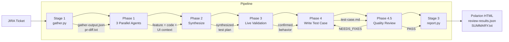
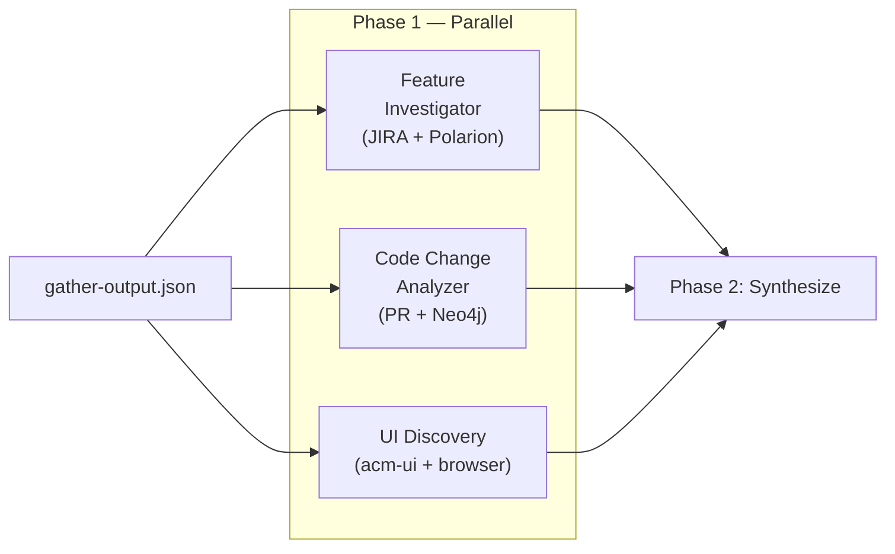

<div align="center">

# ACM Console Test Case Generator

**Generate Polarion-ready test cases from JIRA tickets.**

v2.0 &mdash; 6-phase subagent pipeline &mdash; 7 MCP integrations &mdash; 16 knowledge files

</div>

---

## Quick Start

```
/generate ACM-30459
```

Options: `--version 2.17`, `--pr 5790`, `--area governance`, `--skip-live`, `--cluster-url <URL>`

Other commands: `/batch ACM-30459,ACM-30460` (multi-ticket), `/review path/to/test-case.md` (standalone review).

> [!TIP]
> Or just say: `Generate a test case for ACM-30459 targeting version 2.17`

## How It Works



| Phase | What | How |
|:-----:|------|-----|
| **Stage 1** | Gather PR, JIRA, conventions | `gather.py` (deterministic, gh CLI) |
| **1** | Investigate the feature (3 agents in parallel) | Feature Investigator + Code Analyzer + UI Discovery |
| **2** | Synthesize test plan from all findings | Scope gating, AC cross-referencing |
| **3** | Live cluster validation (optional) | Browser + oc + acm-search + acm-kubectl |
| **4** | Write the test case | Test Case Generator agent |
| **4.5** | Quality review gate (mandatory) | Quality Reviewer agent (loop until PASS) |
| **Stage 3** | Generate Polarion output | `report.py` (validation + HTML) |

## Phase 1: Parallel Investigation

Three agents investigate simultaneously, each with distinct MCP tools:



| Agent | What it discovers | MCP tools |
|-------|-------------------|-----------|
| **Feature Investigator** | JIRA story, comments, linked tickets, Polarion coverage | jira, polarion, neo4j |
| **Code Change Analyzer** | Changed components, new UI elements, architecture impact | acm-ui, neo4j |
| **UI Discovery** | Selectors, translations, routes, wizard steps, test IDs | acm-ui, playwright (optional) |

## Supported Areas

9 ACM Console areas, each backed by architecture knowledge files in `knowledge/architecture/`.

Governance &bull; RBAC &bull; Fleet Virtualization &bull; CCLM &bull; MTV &bull; Clusters &bull; Search &bull; Applications &bull; Credentials

<details>
<summary><b>Area Tag Patterns</b></summary>

| Area | Tag Pattern | Knowledge File |
|------|------------|----------------|
| Governance | `[GRC-X.XX]` | `architecture/governance.md` |
| RBAC | `[FG-RBAC-X.XX]` | `architecture/rbac.md` |
| Fleet Virtualization | `[FG-RBAC-X.XX] Fleet Virtualization UI` | `architecture/fleet-virt.md` |
| CCLM | `[FG-RBAC-X.XX] CCLM` | `architecture/cclm.md` |
| MTV | `[MTV-X.XX]` | `architecture/mtv.md` |
| Clusters | `[Clusters-X.XX]` | `architecture/clusters.md` |
| Search | `[FG-RBAC-X.XX] Search` | `architecture/search.md` |
| Applications | `[Apps-X.XX]` | `architecture/applications.md` |
| Credentials | `[Credentials-X.XX]` | `architecture/credentials.md` |

</details>

## Quality Gates

Two independent validation layers. Both must pass before delivery:

| Layer | When | What it checks |
|-------|------|----------------|
| **Phase 4.5** (Quality Reviewer agent) | Before Stage 3 | MCP verification of UI elements, AC vs implementation, scope alignment, numeric thresholds, discovered vs assumed |
| **Stage 3** (`report.py`) | After Phase 4.5 | Title pattern, metadata fields, section order, step format, entry point, teardown |

The quality reviewer loops: if it returns `NEEDS_FIXES`, Phase 4 re-generates the test case and Phase 4.5 reviews again until `PASS`.

<details>
<summary><b>Pipeline Details</b></summary>

### Stage 1: Data Gathering

`gather.py` collects factual data (deterministic, no AI):
- JIRA ticket details, linked tickets, fix versions
- PR diff via `gh pr diff`
- Existing test case conventions from `knowledge/conventions/`
- File classification (test files, page objects, components)

### Phase 1: Parallel Investigation

Three subagents investigate simultaneously:
- **Feature Investigator** — Deep JIRA dive: story, comments, linked tickets, Polarion coverage, PR discovery
- **Code Change Analyzer** — PR diff analysis: changed components, new UI elements, Neo4j architecture impact
- **UI Discovery** — Source code: selectors, translations, routes, wizard steps, test IDs. Optional browser verification when cluster URL provided.

### Phase 2: Synthesis

Merges all Phase 1 findings into a test plan:
- Scope gating against JIRA acceptance criteria
- AC cross-referencing (every AC maps to at least one test step)
- Test step planning with discovered UI elements
- Setup/teardown requirements

### Phase 3: Live Validation (Optional)

When `--cluster-url` is provided (or a cluster is accessible):
- Browser navigation to confirm UI behavior
- `oc` CLI verification of backend state
- `acm-search` queries for resource existence
- `acm-kubectl` for spoke cluster verification

Skipped with `--skip-live` or when no cluster is available.

### Phase 4: Test Case Writing

The Test Case Generator agent writes `test-case.md` following conventions from `knowledge/conventions/test-case-format.md`. Every UI label, route, and selector must come from MCP discovery or PR diff.

### Phase 4.5: Quality Review (Mandatory)

The Quality Reviewer agent validates:
1. Convention compliance (title, metadata, section order)
2. AC vs implementation (every acceptance criterion covered)
3. Scope alignment (no out-of-scope steps)
4. Discovered vs assumed (UI elements verified via acm-ui MCP)
5. Numeric threshold validation
6. Peer consistency (format matches existing test cases)

Returns `PASS` or `NEEDS_FIXES` with specific issues. On `NEEDS_FIXES`, loops back to Phase 4.

### Stage 3: Report Generation

`report.py` generates Polarion-ready output:
- `test-case-setup.html` — Polarion setup section
- `test-case-steps.html` — Polarion steps table
- `review-results.json` — structural validation results
- `SUMMARY.txt` — human-readable summary

</details>

<details>
<summary><b>Agents</b> &mdash; 6 specialized agents</summary>

| Agent | Phase | Role |
|-------|:-----:|------|
| Feature Investigator | 1 (parallel) | JIRA deep dive, linked tickets, Polarion coverage |
| Code Change Analyzer | 1 (parallel) | PR diff analysis, UI elements, Neo4j impact |
| UI Discovery | 1 (parallel) | Source code selectors, translations, routes |
| Live Validator | 3 | Browser + oc CLI + acm-search + acm-kubectl |
| Test Case Generator | 4 | Write test case from synthesized context |
| Quality Reviewer | 4.5 | Conventions, AC vs implementation, scope, PASS/NEEDS_FIXES |

</details>

<details>
<summary><b>Knowledge Database</b> &mdash; 16 files</summary>

| Directory | Content | Files |
|-----------|---------|:-----:|
| `conventions/` | Test case format rules (from 85+ existing cases) | 4 |
| `architecture/` | Per-area domain knowledge (governance, RBAC, fleet-virt, etc.) | 9 |
| `examples/` | Convention-compliant sample test case | 1 |
| `patterns/` | Agent-written patterns from successful runs (grows over time) | 1+ |

</details>

<details>
<summary><b>MCP Servers</b> &mdash; 7 servers, 82 tools</summary>

| Server | Tools | Purpose |
|--------|:-----:|---------|
| acm-ui | 20 | ACM Console + kubevirt-plugin source search via GitHub |
| jira | 25 | JIRA ticket investigation (stories, bugs, comments, links) |
| polarion | 25 | Existing test case coverage (Polarion work items) |
| neo4j-rhacm | 2 | Architecture dependency graph (component relationships) |
| acm-search | 5 | Live cluster resource queries across managed clusters |
| acm-kubectl | 3 | Multicluster kubectl (hub and spoke clusters) |
| playwright | 24 | Browser automation for live UI validation |

First-time setup: from the repo root, run `claude` and then `/onboard`.

</details>

<details>
<summary><b>Run Directory Structure</b></summary>

```
runs/ACM-30459/ACM-30459-2026-04-08T12-00-00/
├── gather-output.json              # Stage 1: all gathered data
├── pr-diff.txt                     # Stage 1: full PR diff
├── phase1-feature-investigation.md # Phase 1: feature investigator output
├── phase1-code-change-analysis.md  # Phase 1: code change analyzer output
├── phase1-ui-discovery.md          # Phase 1: UI discovery output
├── phase2-synthesized-context.md   # Phase 2: merged investigation + test plan
├── phase3-live-validation.md       # Phase 3: live validation (or skip note)
├── test-case.md                    # Phase 4: primary deliverable
├── analysis-results.json           # Phase 4: investigation metadata
├── phase4.5-quality-review.md      # Phase 4.5: quality review output
├── test-case-setup.html            # Stage 3: Polarion setup HTML
├── test-case-steps.html            # Stage 3: Polarion steps HTML
├── review-results.json             # Stage 3: structural validation
├── SUMMARY.txt                     # Stage 3: human-readable summary
└── pipeline.log.jsonl              # All: pipeline telemetry
```

</details>

<details>
<summary><b>Session Tracing</b></summary>

Every session is automatically traced via Claude Code hooks. No setup required.

```
.claude/traces/
├── <session-id>.jsonl     # Detailed per-session trace
└── sessions.jsonl         # One-line summary per session
```

Each trace captures: tool calls, MCP interactions (with server/tool extraction), subagent launches (with pipeline phase tagging), knowledge reads, pattern writes, and errors. Session index tracks aggregate stats: duration, phases seen, tool call count, MCP calls.

See [docs/06-SESSION-TRACING.md](docs/06-SESSION-TRACING.md) for the full field reference.

</details>

## Prerequisites

- **Claude Code CLI** &mdash; [install guide](https://docs.anthropic.com/en/docs/claude-code/getting-started)
- **`gh` CLI** &mdash; authenticated (`gh auth login`)
- **Access to Red Hat JIRA** (Atlassian Cloud)
- **Access to Polarion** (VPN required)
- **Node.js 18+** &mdash; for acm-kubectl and playwright MCP servers
- Optional: **Podman** &mdash; for Neo4j architecture knowledge graph
- Optional: **Live ACM cluster** with console access (for Phase 3 live validation)

> [!NOTE]
> First-time setup: from the repo root, run `claude` then `/onboard`. It detects your environment, configures MCP servers, and prompts for credentials.

## Documentation

| | |
|---|---|
| [Architecture overview](docs/00-OVERVIEW.md) | [Pipeline phases](docs/01-PIPELINE-PHASES.md) |
| [Agent definitions](docs/02-AGENTS.md) | [MCP integration](docs/03-MCP-INTEGRATION.md) |
| [Knowledge system](docs/04-KNOWLEDGE-SYSTEM.md) | [Quality gates](docs/05-QUALITY-GATES.md) |
| [Session tracing](docs/06-SESSION-TRACING.md) | [Interactive diagrams](docs/architecture-diagrams.html) |
