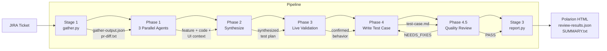
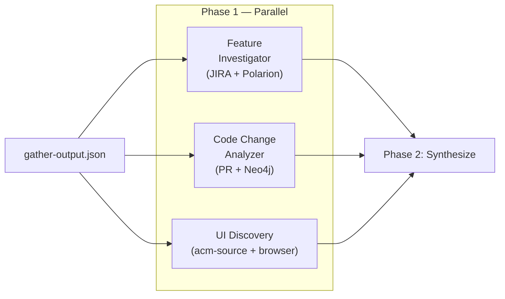

<div align="center">

# ACM Console Test Case Generator

**Generate Polarion-ready test cases from JIRA tickets.**

v2.0 &mdash; 6-phase subagent pipeline &mdash; 7 MCP integrations &mdash; 16 knowledge files

</div>

---

## Quick Start

```bash
cd apps/test-case-generator
claude
```

```
/generate ACM-30459
```

Options: `--version 2.17`, `--pr 5790`, `--area governance`, `--skip-live`, `--cluster-url <URL>`

Other commands: `/batch ACM-30459,ACM-30460` (multi-ticket), `/review path/to/test-case.md` (standalone review).

> [!NOTE]
> First-time setup: from the repo root, run `claude` then `/onboard`. It configures MCP servers and credentials automatically.

> [!TIP]
> Or just say: `Generate a test case for ACM-30459 targeting version 2.17`

## Example

```
Generate a test case for ACM-12345
```

The pipeline investigates the JIRA story, discovers UI selectors from source code, writes the test case, and validates it through a quality review gate. Output is a Polarion-ready markdown file:

<details open>
<summary><b>Generated Test Case</b></summary>

```markdown
# RHACM4K-12345 - [GRC-2.17] Governance - Policy Violation Summary on Details Page

Polarion ID: RHACM4K-12345
Level: System | Component: Governance | Importance: High
Automation: Not Automated | Release: 2.17
```

**Description** — Validates that the violation summary card on the policy details
page displays accurate compliance counts across managed clusters, and that clicking
a compliance status filters the Clusters tab.

**Setup** — Prereqs and environment preparation:

```bash
# Verify ACM version
oc get mch -A -o jsonpath='{.items[0].status.currentVersion}'
# Expected: 2.17.x

# Verify managed clusters
oc get managedclusters --no-headers | wc -l
# Expected: >= 2

# Create test policy targeting both clusters
oc apply -f test-policy.yaml
```

**Test Steps:**

| # | Action | Expected Result |
|:-:|--------|-----------------|
| 1 | Navigate to Governance > Policies > test-policy > Details | Policy details page loads with violation summary card visible |
| 2 | Verify the violation summary shows total, compliant, and non-compliant counts | Counts match actual cluster compliance: 1 compliant, 1 non-compliant |
| 3 | Click the "Non-compliant" count link | Clusters tab opens filtered to non-compliant clusters only |
| 4 | Return to Details tab and propagate policy to a third cluster | Summary card updates within 30s to reflect the new cluster count |
| 5 | Delete the test policy and verify cleanup | Policy removed, no orphaned PlacementBindings remain |

**Teardown** — `oc delete policy test-policy -n default --ignore-not-found`

</details>

The pipeline also generates `test-case-setup.html` and `test-case-steps.html` for direct import into Polarion.

## How It Works



| Phase | What | How |
|:-----:|------|-----|
| **Stage 1** | Gather PR, JIRA, conventions | `gather.py` (deterministic, gh CLI) |
| **1** | Investigate the feature (3 agents in parallel) | Feature Investigator + Code Analyzer + UI Discovery |
| **2** | Synthesize test plan from all findings | Scope gating, AC cross-referencing |
| **3** | Live cluster validation (optional) | Browser + oc + acm-search + acm-kubectl |
| **4** | Write the test case | Test Case Generator agent |
| **4.5** | Quality review gate (mandatory) | Quality Reviewer agent (loop until PASS) |
| **Stage 3** | Generate Polarion output | `report.py` (validation + HTML) |

## Skills

The entire pipeline is orchestrated by [Claude Code Skills](https://docs.anthropic.com/en/docs/claude-code/skills) &mdash; reusable slash commands that define multi-step procedures with phase gates, agent launches, and tool permissions. When you type `/generate`, you're invoking a skill that drives the full pipeline end-to-end: it runs scripts, spawns subagents in parallel, enforces stop-checkpoints between phases, and loops the quality reviewer until it passes.

| Skill | Command | What it does |
|-------|---------|-------------|
| **Generate** | `/generate ACM-XXXXX` | Full pipeline: gather &rarr; 3 parallel investigation agents &rarr; synthesis with scope gating &rarr; optional live validation &rarr; test case writing &rarr; quality review with 3-tier escalation &rarr; Polarion HTML. Includes STOP checkpoints after Phase 2 and Phase 4 for user review. |
| **Review** | `/review path/to/test-case.md` | Standalone quality review: loads an existing test case and runs the quality-reviewer agent against it. Returns PASS or NEEDS_FIXES with specific issues. |
| **Batch** | `/batch ACM-1,ACM-2,ACM-3` | Multi-ticket generation: runs `/generate` sequentially for each JIRA ID. Continues on failure. Produces a summary table with status, step count, and output path per ticket. |

Skills are defined in `.claude/skills/` with supporting files for phase gate enforcement (`phase-gates.md`) and the Phase 2 synthesis template (`synthesis-template.md`).

## Concepts

| Term | What it is | Count |
|------|-----------|-------|
| **Stage** | Deterministic Python script (no AI) | 2 (gather.py, report.py) |
| **Phase** | AI-driven orchestration step | 6 (Phase 0 through Phase 4.5) |
| **Agent** | AI entity executing a phase | 6 (feature-investigator, code-change-analyzer, ui-discovery, live-validator, test-case-generator, quality-reviewer) |
| **Skill** | Reusable slash command | 3 (/generate, /review, /batch) |
| **MCP integration** | External tool connection | 7 (JIRA, Polarion, ACM Source, Neo4j, ACM Search, ACM Kubectl, Playwright) |

The pipeline has **8 steps**: 2 deterministic stages + 6 AI phases. The tagline "6-phase" counts the AI phases only.

<details>
<summary><b>Portable Skill Mapping</b></summary>

The portable skill pack (`.claude/skills/acm-test-case-generator/`) uses a 10-phase model that breaks the 3 investigation agents into sequential phases. The app consolidates them into 1 parallel phase for speed:

| Portable Skill | App Pipeline | Difference |
|---------------|-------------|------------|
| Phase 0: Determine Inputs | Phase 0: Parse Inputs | Same |
| Phase 1: Gather Data | Stage 1: gather.py | Same |
| Phase 2: JIRA Investigation | Phase 1 (agent 1 of 3) | Portable: sequential |
| Phase 3: Code Analysis | Phase 1 (agent 2 of 3) | App: parallel |
| Phase 4: UI Discovery | Phase 1 (agent 3 of 3) | App: parallel |
| Phase 5: Synthesize | Phase 2: Synthesize | Same |
| Phase 6: Live Validation | Phase 3: Live Validation | Same |
| Phase 7: Write Test Case | Phase 4: Write Test Case | Same |
| Phase 8: Quality Review | Phase 4.5: Quality Review | Same |
| Phase 9: Generate Reports | Stage 3: report.py | Same |

</details>

## Standalone Usage

The `/review` skill runs independently on any test case markdown file:

```
/review runs/test-case-generator/ACM-30459/<run-dir>/test-case.md
```

For manual pipeline steps, see [Pipeline Phases](docs/01-PIPELINE-PHASES.md).

## MCP Availability

Not all MCP servers are required. The pipeline degrades gracefully:

| MCP Server | Required? | If unavailable |
|-----------|-----------|---------------|
| **JIRA** | Yes | Pipeline cannot start (no ticket data) |
| **acm-source** | Yes | No UI element discovery; test case quality degrades significantly |
| **Polarion** | No | Skips existing coverage check; no duplication detection |
| **Neo4j** | No | Skips architecture dependency analysis |
| **Playwright** | No | Skips live browser verification (Phase 3) |
| **acm-search** | No | Falls back to `oc get` CLI for resource queries |
| **acm-kubectl** | No | Falls back to `oc` CLI for spoke cluster checks |

When an optional server is unavailable, the agent logs the gap and proceeds. Affected test steps may include `[MANUAL VERIFICATION REQUIRED]` markers in the output.

<details>
<summary><b>Degraded Output Example</b></summary>

When acm-source is partially unavailable (translations search fails):

```markdown
### Step 3: Verify policy status column shows compliance state

1. Navigate to Governance > Policies
2. Locate the test policy in the table
3. Check the Status column value

**Expected Result:**
- [MANUAL VERIFICATION REQUIRED: status column label could not be verified -- acm-source
  search_translations unavailable. Verify exact column header text on a running cluster.]
- Status shows either "Compliant" or "Non-compliant" based on cluster state
```

</details>

## Phase 1: Parallel Investigation

Three agents investigate simultaneously, each with distinct MCP tools:



| Agent | What it discovers | MCP tools |
|-------|-------------------|-----------|
| **Feature Investigator** | JIRA story, comments, linked tickets, Polarion coverage | jira, polarion, neo4j, bash |
| **Code Change Analyzer** | Changed components, new UI elements, architecture impact | acm-source, neo4j, bash |
| **UI Discovery** | Selectors, translations, routes, wizard steps, test IDs | acm-source, neo4j, playwright (optional), bash |

## Supported Areas

9 ACM Console areas, each backed by architecture knowledge files in `knowledge/architecture/`.

Governance &bull; RBAC &bull; Fleet Virtualization &bull; CCLM &bull; MTV &bull; Clusters &bull; Search &bull; Applications &bull; Credentials

<details>
<summary><b>Area Tag Patterns</b></summary>

| Area | Tag Pattern | Knowledge File |
|------|------------|----------------|
| Governance | `[GRC-X.XX]` | `architecture/governance.md` |
| RBAC | `[FG-RBAC-X.XX]` | `architecture/rbac.md` |
| Fleet Virtualization | `[FG-RBAC-X.XX] Fleet Virtualization UI` | `architecture/fleet-virt.md` |
| CCLM | `[FG-RBAC-X.XX] CCLM` | `architecture/cclm.md` |
| MTV | `[MTV-X.XX]` | `architecture/mtv.md` |
| Clusters | `[Clusters-X.XX]` | `architecture/clusters.md` |
| Search | `[FG-RBAC-X.XX] Search` | `architecture/search.md` |
| Applications | `[Apps-X.XX]` | `architecture/applications.md` |
| Credentials | `[Credentials-X.XX]` | `architecture/credentials.md` |

</details>

## Quality Gates

Two independent validation layers. Both must pass before delivery:

| Layer | When | What it checks |
|-------|------|----------------|
| **Phase 4.5** (Quality Reviewer agent) | Before Stage 3 | MCP verification of UI elements, AC vs implementation, scope alignment, numeric thresholds, discovered vs assumed |
| **Stage 3** (`report.py`) | After Phase 4.5 | Title pattern, metadata fields, section order, step format, entry point, teardown |

The quality reviewer uses 3-tier escalation: targeted MCP re-investigation for factual errors, focused retry with evidence, then marking unresolvable steps with `[MANUAL VERIFICATION REQUIRED]` and proceeding.

<details>
<summary><b>Pipeline Details</b></summary>

### Stage 1: Data Gathering

`gather.py` collects factual data (deterministic, no AI):
- JIRA ticket details, linked tickets, fix versions
- PR diff via `gh pr diff`
- Existing test case conventions from `knowledge/conventions/`
- File classification (test files, page objects, components)

### Phase 1: Parallel Investigation

Three subagents investigate simultaneously:
- **Feature Investigator** — Deep JIRA dive: story, comments, linked tickets, Polarion coverage, PR discovery
- **Code Change Analyzer** — PR diff analysis: changed components, new UI elements, Neo4j architecture impact
- **UI Discovery** — Source code: selectors, translations, routes, wizard steps, test IDs. Optional browser verification when cluster URL provided.

### Phase 2: Synthesis

Merges all Phase 1 findings into a test plan:
- Scope gating against JIRA acceptance criteria
- AC cross-referencing (every AC maps to at least one test step)
- Test step planning with discovered UI elements
- Setup/teardown requirements

### Phase 3: Live Validation (Optional)

When `--cluster-url` is provided (or a cluster is accessible):
- Browser navigation to confirm UI behavior
- `oc` CLI verification of backend state
- `acm-search` queries for resource existence
- `acm-kubectl` for spoke cluster verification

Skipped with `--skip-live` or when no cluster is available.

### Phase 4: Test Case Writing

The Test Case Generator agent writes `test-case.md` following conventions from `knowledge/conventions/test-case-format.md`. Every UI label, route, and selector must come from MCP discovery or PR diff.

### Phase 4.5: Quality Review (Mandatory)

The Quality Reviewer agent validates:
1. Convention compliance (title, metadata, section order)
2. AC vs implementation (every acceptance criterion covered)
3. Scope alignment (no out-of-scope steps)
4. Discovered vs assumed (UI elements verified via acm-source MCP)
5. Numeric threshold validation

Returns `PASS` or `NEEDS_FIXES` with specific issues. On `NEEDS_FIXES`, loops back to Phase 4.

### Stage 3: Report Generation

`report.py` generates Polarion-ready output:
- `test-case-setup.html` — Polarion setup section
- `test-case-steps.html` — Polarion steps table
- `review-results.json` — structural validation results
- `SUMMARY.txt` — human-readable summary

</details>

<details>
<summary><b>Agents</b> &mdash; 6 specialized agents</summary>

| Agent | Phase | Role |
|-------|:-----:|------|
| Feature Investigator | 1 (parallel) | JIRA deep dive, linked tickets, Polarion coverage |
| Code Change Analyzer | 1 (parallel) | PR diff analysis, UI elements, Neo4j impact |
| UI Discovery | 1 (parallel) | Source code selectors, translations, routes |
| Live Validator | 3 | Browser + oc CLI + acm-search + acm-kubectl |
| Test Case Generator | 4 | Write test case from synthesized context |
| Quality Reviewer | 4.5 | Conventions, AC vs implementation, scope, PASS/NEEDS_FIXES |

</details>

<details>
<summary><b>Knowledge Database</b> &mdash; 16 files</summary>

| Directory | Content | Files |
|-----------|---------|:-----:|
| `conventions/` | Test case format rules (from 85+ existing cases) | 4 |
| `architecture/` | Per-area domain knowledge (governance, RBAC, fleet-virt, etc.) | 9 |
| `examples/` | Convention-compliant sample test case | 1 |
| `patterns/` | Agent-written patterns from successful runs (grows over time) | 1+ |

</details>

<details>
<summary><b>MCP Servers</b> &mdash; 7 servers, 104 tools</summary>

| Server | Tools | Purpose |
|--------|:-----:|---------|
| acm-source | 18 | ACM Console + kubevirt-plugin source search via GitHub |
| jira | 25 | JIRA ticket investigation (stories, bugs, comments, links) |
| polarion | 25 | Existing test case coverage (Polarion work items) |
| neo4j-rhacm | 2 | Architecture dependency graph (component relationships) |
| acm-search | 5 | Live cluster resource queries across managed clusters |
| acm-kubectl | 3 | Multicluster kubectl (hub and spoke clusters) |
| playwright | 24 | Browser automation for live UI validation |

First-time setup: from the repo root, run `claude` and then `/onboard`.

</details>

<details>
<summary><b>Run Directory Structure</b></summary>

```
runs/test-case-generator/ACM-30459/ACM-30459-2026-04-08T12-00-00/
├── gather-output.json              # Stage 1: all gathered data
├── pr-diff.txt                     # Stage 1: full PR diff
├── phase1-feature-investigation.md # Phase 1: feature investigator output
├── phase1-code-change-analysis.md  # Phase 1: code change analyzer output
├── phase1-ui-discovery.md          # Phase 1: UI discovery output
├── phase2-synthesized-context.md   # Phase 2: merged investigation + test plan
├── phase3-live-validation.md       # Phase 3: live validation (or skip note)
├── test-case.md                    # Phase 4: primary deliverable
├── analysis-results.json           # Phase 4: investigation metadata
├── phase4.5-quality-review.md      # Phase 4.5: quality review output
├── test-case-setup.html            # Stage 3: Polarion setup HTML
├── test-case-steps.html            # Stage 3: Polarion steps HTML
├── review-results.json             # Stage 3: structural validation
├── SUMMARY.txt                     # Stage 3: human-readable summary
└── pipeline.log.jsonl              # All: pipeline telemetry
```

</details>

<details>
<summary><b>Session Tracing</b></summary>

Every session is automatically traced via Claude Code hooks. No setup required.

```
.claude/traces/
├── <session-id>.jsonl     # Detailed per-session trace
└── sessions.jsonl         # One-line summary per session
```

Each trace captures: tool calls, MCP interactions (with server/tool extraction), subagent launches (with pipeline phase tagging), knowledge reads, pattern writes, and errors. Session index tracks aggregate stats: duration, phases seen, tool call count, MCP calls.

See [docs/06-SESSION-TRACING.md](docs/06-SESSION-TRACING.md) for the full field reference.

</details>

## Prerequisites

- **Claude Code CLI** &mdash; [install guide](https://docs.anthropic.com/en/docs/claude-code/getting-started)
- **`gh` CLI** &mdash; authenticated (`gh auth login`)
- **Access to Red Hat JIRA** (Atlassian Cloud)
- **Access to Polarion** (VPN required)
- **Node.js 18+** &mdash; for acm-kubectl and playwright MCP servers
- Optional: **Podman** &mdash; for Neo4j architecture knowledge graph
- Optional: **Live ACM cluster** with console access (for Phase 3 live validation)

> [!NOTE]
> First-time setup: from the repo root, run `claude` then `/onboard`. It detects your environment, configures MCP servers, and prompts for credentials.

## Documentation

| | |
|---|---|
| [Architecture overview](docs/00-OVERVIEW.md) | [Pipeline phases](docs/01-PIPELINE-PHASES.md) |
| [Agent definitions](docs/02-AGENTS.md) | [MCP integration](docs/03-MCP-INTEGRATION.md) |
| [Knowledge system](docs/04-KNOWLEDGE-SYSTEM.md) | [Quality gates](docs/05-QUALITY-GATES.md) |
| [Session tracing](docs/06-SESSION-TRACING.md) | [Interactive diagrams](docs/architecture-diagrams.html) |
