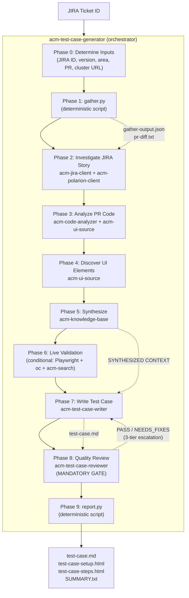
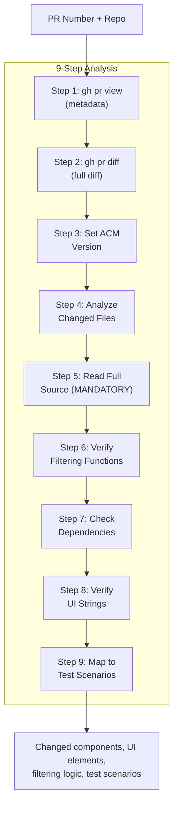
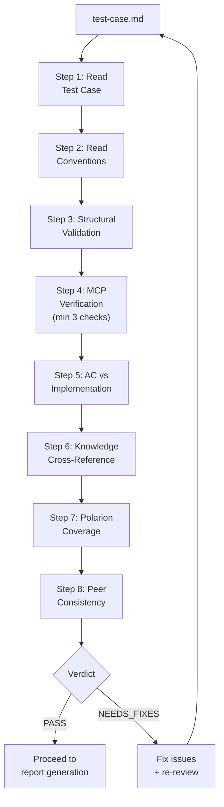
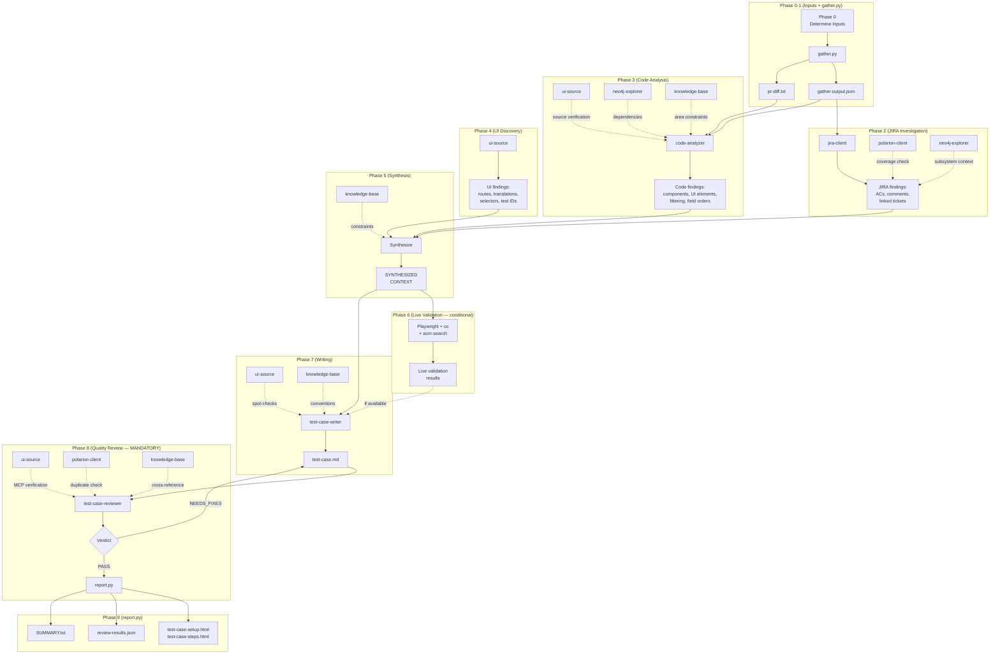
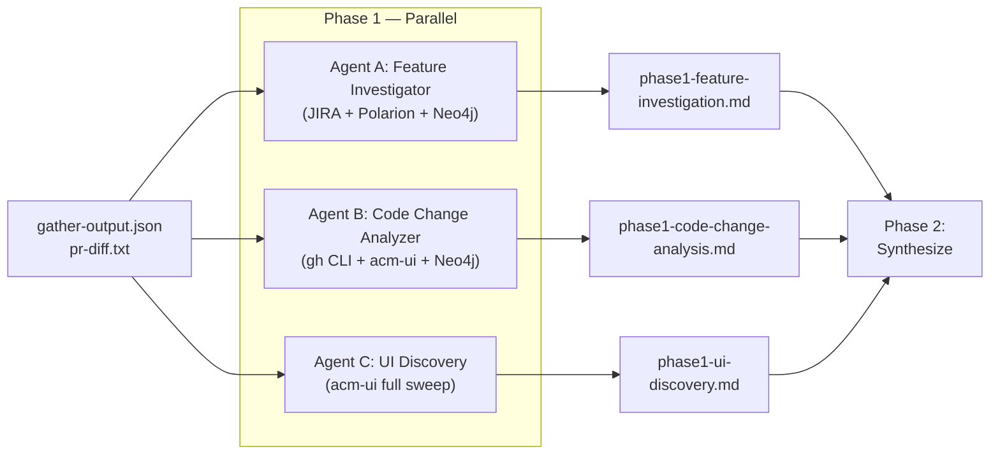
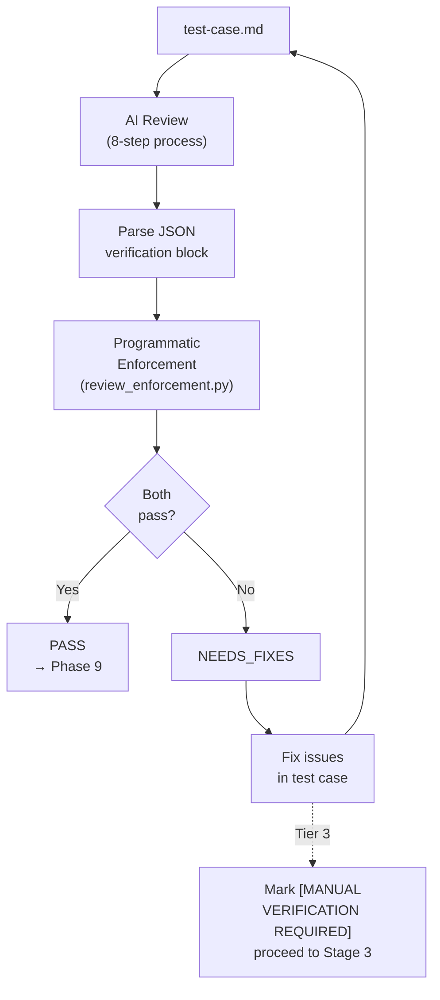

# Test Case Generator: Skill Architecture

How the portable skill pack enables the test case generation pipeline. 9 skills decompose a 10-phase pipeline into reusable, independently testable components — from JIRA investigation through PR code analysis, UI discovery, and synthesis to Polarion-ready test case output with mandatory quality review.

## Skill Inventory

9 skills organized in 4 tiers:

```
┌─────────────────────────────────────────────────────────┐
│                    ORCHESTRATION                        │
│                                                         │
│            acm-test-case-generator                      │
│       (sequences phases, invokes all others)            │
└────────────┬──────────┬──────────┬──────────────────────┘
             │          │          │
     ┌───────▼───┐  ┌───▼────┐ ┌──▼───────────────┐
     │  CORE     │  │  CORE  │ │  CORE            │
     │           │  │        │ │                   │
     │ test-     │  │ code-  │ │ test-case-        │
     │ case-     │  │ ana-   │ │ reviewer          │
     │ writer    │  │ lyzer  │ │                   │
     │           │  │        │ │ Phase 8           │
     │ Phase 7   │  │Phase 3 │ │ (mandatory gate)  │
     └───────────┘  └────────┘ └───────────────────┘
             │          │
     ┌───────▼───────────▼───────────────────────┐
     │   METHODOLOGY + KNOWLEDGE                 │
     │                                           │
     │  knowledge-base    cluster-health         │
     └───────────────────────────────────────────┘
             │
     ┌───────▼───────────────────────────────────┐
     │   MCP INTERFACES                          │
     │                                           │
     │  jira-client       ui-source              │
     │  polarion-client   neo4j-explorer         │
     └───────────────────────────────────────────┘
```

| Tier | Skills | Role |
|------|--------|------|
| Orchestration | acm-test-case-generator | Sequences phases 0→1→2→…→9, manages review loop |
| Core Pipeline | acm-test-case-writer, acm-code-analyzer, acm-test-case-reviewer | Execute writing, code analysis, and quality review |
| Methodology + Knowledge | acm-knowledge-base, acm-cluster-health | Provide conventions, architecture data, cluster diagnostic methodology |
| MCP Interfaces | acm-jira-client, acm-polarion-client, acm-ui-source, acm-neo4j-explorer | Wrap external tool access |

---

## Pipeline Flow: Skills in Action



Deterministic scripts (gather.py, report.py, review_enforcement.py) handle data collection, structural validation, and Polarion HTML generation. AI skills handle investigation, analysis, discovery, synthesis, writing, and quality review.

---

## Skill Details

### 1. acm-test-case-generator — Pipeline Orchestrator

**Pipeline stage:** All phases
**Files:** SKILL.md + 3 reference files (phase-gates.md, pipeline-workflow.md, synthesis-template.md) + 4 script files (gather.py, report.py, generate_html.py, review_enforcement.py)
**Depends on:** All 8 other skills

The entry point. Receives a JIRA ticket ID and orchestrates the 10-phase pipeline with visible phase-by-phase progress:

```
[Phase 0] Determining area and inputs...
[Phase 1] Gathering pipeline data...
  → Gathered PR #5790, 12 files changed. Area: governance.
[Phase 2] Investigating JIRA story...
  → 5 ACs, 3 linked tickets, 0 existing Polarion test cases
[Phase 3] Analyzing PR code changes...
  → 4 new UI elements, 2 modified behaviors, 1 filtering function
[Phase 4] Discovering UI elements...
  → 8 translations verified, entry point route confirmed
[Phase 5] Synthesizing investigation results...
  → Investigation complete. 7 test scenarios identified.
[Phase 6] Running live validation...  (or: Skipping — no cluster URL)
[Phase 7] Writing test case...
  → Test case written: test-case.md (8 steps, medium).
[Phase 8] Running quality review...
  → Quality review PASSED.
[Phase 9] Generating reports...
  → test-case-setup.html, test-case-steps.html, SUMMARY.txt
```

**What it provides:**
- Phase sequencing logic (which skills to invoke when, what data to pass)
- Input resolution protocol (auto-detect version, PR, area from JIRA; ask only what's missing)
- Phase gate enforcement (mandatory quality review, 3-tier review escalation)
- STOP checkpoints (after synthesis, after writing, after review)
- Synthesis template (conflict resolution rules, scope gating, AC cross-reference)
- Run directory structure specification
- Telemetry integration (log_phase calls between AI phases)

**Skill dependency table:**

| Skill Used | Phase(s) | Purpose |
|------------|----------|---------|
| acm-jira-client | 2 | JIRA story deep dive, linked tickets, PR discovery |
| acm-code-analyzer | 3 | PR diff analysis, changed components, filtering logic |
| acm-ui-source | 3, 4, 7, 8 | Routes, translations, selectors, component source |
| acm-knowledge-base | 2–8 | Conventions, area architecture, examples |
| acm-polarion-client | 2, 8 | Existing coverage check, duplicate detection |
| acm-neo4j-explorer | 2–4 | Component dependencies, subsystem impact |
| acm-cluster-health | 6 | Cluster diagnostic methodology (live validation) |
| acm-test-case-writer | 7 | Test case markdown generation |
| acm-test-case-reviewer | 8 | Quality gate with MCP verification |

**Three invocation modes:**

| Mode | Command | Behavior |
|------|---------|----------|
| Full pipeline | `/generate ACM-30459` | All 10 phases, single ticket |
| Batch | `/batch ACM-30459,ACM-30460` | Full pipeline per ticket, summary table |
| Review only | `/review path/to/test-case.md` | Phase 8 only on existing file |

---

### 2. acm-test-case-writer — Test Case Author (Phase 7)

**Pipeline stage:** 7
**Files:** SKILL.md (no separate reference files — conventions come from acm-knowledge-base)
**Depends on:** acm-knowledge-base (conventions + architecture), acm-ui-source (spot-checks)

Produces Polarion-ready test case markdown. Operates in two modes:

```mermaid
flowchart LR
    subgraph "Full Context Mode (via orchestrator)"
        SYN[Synthesized\nContext] --> W1[Read\nConventions]
        W1 --> W2[Read Area\nKnowledge]
        W2 --> W3[Scope Gate\n(ACs only)]
        W3 --> W4[Spot-Check\nvia MCP]
        W4 --> W5[Write Test\nCase]
        W5 --> W6[Self-Review\n(13 checks)]
    end
```

**Standalone mode:** If no synthesized context is available, performs a lightweight investigation first (JIRA read, UI discovery, optional code analysis) before writing. Functional but less thorough than the full pipeline.

**6-step writing process:**

| Step | What | Tools | Output |
|:----:|------|-------|--------|
| 1 | Read conventions | acm-knowledge-base | Format rules, naming patterns |
| 2 | Read area knowledge as constraints | acm-knowledge-base | Field orders, filtering behavior, component patterns |
| 3 | Scope gate | Input context | ACs-only scope, multi-story filtering |
| 4 | Spot-check key UI elements | acm-ui-source MCP | Verified routes, translations, component source |
| 5 | Write the test case | All inputs | test-case.md |
| 6 | Self-review (13 checks) | Internal | Pre-flight before quality gate |

**Output format — Polarion-ready markdown:**

```
# RHACM4K-XXXXX - [Tag-Version] Area - Test Name

## Metadata
Polarion ID, Status, Dates

## Polarion Fields
Type, Level, Component, Subcomponent, Test Type, Pos/Neg,
Importance, Automation, Tags, Release

## Description
What is tested, verification list, Entry Point, Dev JIRA Coverage

## Setup
Numbered bash commands with # Expected: comments

## Test Steps
### Step N: Title
1. Action
2. Action
- Expected result
- Expected result
---

## Teardown
Cleanup commands with --ignore-not-found

## Notes
Implementation details, AC discrepancies with source citations
```

**Three quality rules enforced during writing:**

| Rule | What | Example |
|------|------|---------|
| Step Granularity | Each step verifies ONE behavior | Split "verify tooltip AND click link" into 2 steps |
| Backend Validation Placement | CLI in dedicated steps, after UI steps | "Verify policy status via CLI (Backend Validation)" |
| Implementation Detail Translation | Code details → observable verifications | `compareNumbers(a,b)` → "Sorting is numeric (0,1,2,10 not 0,1,10,2)" |

**13-point self-review checklist:** Metadata fields, Type value, entry point from MCP, labels from investigation, CLI-only for backend, setup format, teardown completeness, Test Steps header, step separators, no fabricated thresholds, step granularity, backend placement, implementation translation.

---

### 3. acm-code-analyzer — PR Diff Analysis (Phase 3)

**Pipeline stage:** 3
**Files:** SKILL.md (no separate reference files)
**Depends on:** acm-ui-source (source verification), acm-neo4j-explorer (dependency graph)

Analyzes PR diffs from `stolostron/console` or `kubevirt-ui/kubevirt-plugin` to understand what changed and what needs testing.



**Per-file analysis identifies:**

| Category | What to find | Example |
|----------|-------------|---------|
| New UI components | Pages, modals, wizards, table columns | New DescriptionList field |
| Modified UI elements | Changed labels, new buttons, removed options | Button label rename |
| Routes | Navigation paths in NavigationPath.tsx | New `/infrastructure/clusters` sub-route |
| API interactions | Fetch calls, resource creation, status checks | New `listResources` call |
| Conditional logic | Feature flags, RBAC checks, state-dependent rendering | `if (isInstalled)` guard |
| Error handling | New error messages, validation rules | Toast notification on failure |
| Translation strings | New i18n keys | `t('policy.table.column.name')` |
| Filtering functions | Label filters, search filters, data transformations | `filterByLabel(items, prefix)` |
| UI interaction model | PatternFly component type | ToolbarFilter vs TextInput |

**Follow-up PR detection:** For each primary changed file, checks for subsequent merged PRs via `gh pr list --search "path:<filepath>" --state merged`. Flags post-merge renames, fixes, and refactors that would make the test case stale.

**Critical rules:**
- MANDATORY: Read full source of primary target file via `get_component_source` — diffs alone miss array construction patterns, import chains, and conditional rendering
- Distinguish test files (`.test.tsx`) from production code — data in test files is MOCK DATA
- Multi-story PRs: tag each file with its JIRA story, focus on the target story
- Cross-reference area knowledge: flag contradictions between analysis and architecture files

---

### 4. acm-test-case-reviewer — Quality Gate (Phase 8)

**Pipeline stage:** 8 (mandatory, cannot skip)
**Files:** SKILL.md + 1 reference file (review-checklist.md) + 1 script (validate_conventions.py)
**Depends on:** acm-ui-source (MCP spot-checks), acm-polarion-client (coverage), acm-knowledge-base (conventions)

The mandatory quality gate. No test case is delivered without passing this review. Operates as a 3-tier escalation loop — targeted MCP re-investigation, focused retry with evidence, then placeholder and proceed. Never retries with the same context.



**8-step review process:**

| Step | What | Checks | Severity |
|:----:|------|--------|----------|
| 1 | Read test case | Full markdown file | — |
| 2 | Read conventions | Format rules, naming, CLI rules | — |
| 3 | Structural validation | Title format, metadata fields, Type value, step format, step separators, CLI-in-steps rule, step granularity | BLOCKING |
| 4 | MCP verification | min 3 checks: translations, routes, component source | BLOCKING if < 3 |
| 5 | AC vs implementation | ACs match expected results, discrepancies cited | BLOCKING |
| 6 | Knowledge cross-reference | Field order, filtering, CRDs vs architecture file | BLOCKING |
| 7 | Polarion coverage | Duplicate check, metadata accuracy | WARNING |
| 8 | Peer consistency | Compare with 2–3 existing test cases in same area | WARNING |

**MCP verification minimum (3 checks):**

| # | Tool | What | Must match |
|:-:|------|------|-----------|
| 1 | `search_translations` | 1–2 key UI labels | Exact string in test case |
| 2 | `get_routes` | Entry point route | Navigation path in Description |
| 3 | `get_component_source` | Primary component source | At least ONE factual claim (field order, filtering, empty state) |

**Programmatic enforcement layer:**

After the AI review, `review_enforcement.py` programmatically verifies the reviewer's output:
1. Contains 3+ MCP verification entries
2. Contains at least one `get_component_source` call
3. Contains at least one `search_translations` call
4. Stale JIRA text check: metric names and labels verified against source code
5. Negative scenario warning: conditional features should have absence-verification steps

If enforcement fails, the verdict is overridden to NEEDS_FIXES regardless of the AI reviewer's conclusion. This two-layer system (AI review + programmatic enforcement) prevents the reviewer from rubber-stamping.

---

### 5. acm-jira-client — JIRA MCP Interface

**Pipeline stage:** 2
**Files:** SKILL.md + 2 reference files
**Used by:** acm-test-case-generator (Phase 2)

Wraps the JIRA MCP server for deep ticket investigation. The test case pipeline uses it to extract every detail from the target JIRA story — not just summary and ACs, but ALL comments (which contain implementation decisions, edge cases, and design trade-offs).

**Phase 2 investigation protocol:**

| Step | Action | JQL/Tool | What it finds |
|:----:|--------|----------|---------------|
| 1 | Read the story | `get_issue(issue_key)` | Summary, description, ACs, fix version, components, status |
| 2 | Read ALL comments | Via `get_issue` | Implementation decisions, edge cases, PR links, QE feedback |
| 3 | Find QE tracking | `summary ~ "[QE] --- ACM-XXXXX"` | Existing test coverage efforts |
| 4 | Find sub-tasks | `parent = ACM-XXXXX` | Task breakdown |
| 5 | Find related bugs | `type = Bug AND summary ~ "keyword"` | Known issues |
| 6 | Find sibling stories | `fixVersion = "X" AND component = "Y" AND type = Story AND key != Z` | Renames, follow-up fixes, shared-area changes |

**Sibling story detection** is a key feature — sibling stories in the same fixVersion + component often contain renames, behavior changes, or edge cases that the target story's JIRA description does not know about.

---

### 6. acm-ui-source — ACM Console MCP Interface

**Pipeline stage:** 3, 4, 7, 8
**Files:** SKILL.md + 1 reference file
**Used by:** acm-code-analyzer, acm-test-case-generator (Phase 4), acm-test-case-writer, acm-test-case-reviewer

The most heavily used MCP interface in the test case pipeline. Wraps the ACM-UI MCP server for source code search across `stolostron/console` and `kubevirt-ui/kubevirt-plugin`.

**Usage across phases:**

| Phase | Purpose | Tools Used |
|-------|---------|-----------|
| 3 (Code Analysis) | Verify source code, translations, routes against PR diff | `set_acm_version`, `search_code`, `get_component_source`, `search_translations`, `get_routes` |
| 4 (UI Discovery) | Discover all UI elements for the feature | `set_acm_version`, `set_cnv_version`, `search_code`, `get_component_source`, `find_test_ids`, `search_translations`, `get_routes`, `get_wizard_steps`, `get_acm_selectors`, `get_patternfly_selectors` |
| 7 (Writing) | Spot-check key elements during writing | `set_acm_version`, `get_routes`, `search_translations`, `get_component_source` |
| 8 (Review) | Verify claims in the test case | `set_acm_version`, `search_translations`, `get_routes`, `get_component_source` |

**Version management:** Every interaction starts with `set_acm_version` (and `set_cnv_version` for Fleet Virt/CCLM/MTV). This ensures all lookups target the correct branch of `stolostron/console` or `kubevirt-ui/kubevirt-plugin`.

---

### 7. acm-polarion-client — Polarion MCP Interface

**Pipeline stage:** 2, 8
**Files:** SKILL.md + 1 reference file
**Used by:** acm-test-case-generator (Phase 2 coverage check, Phase 8 duplicate detection)

Wraps the Polarion MCP server. Used for two purposes in the test case pipeline:

| Phase | Purpose | Tools |
|-------|---------|-------|
| 2 (JIRA Investigation) | Check existing test case coverage before writing | `get_polarion_work_items`, `get_polarion_test_case_summary` |
| 8 (Quality Review) | Verify no duplicate test cases, check metadata accuracy | `get_polarion_work_item`, `get_polarion_test_case_summary` |

**Project ID:** Always `RHACM4K`. Query syntax is Lucene (not JQL).

---

### 8. acm-knowledge-base — Domain Knowledge Repository

**Pipeline stage:** 2–8 (referenced throughout)
**Files:** SKILL.md + 14 reference files (9 architecture + 4 conventions + 1 example)
**Used by:** All core pipeline skills

The knowledge backbone. Provides two categories of reference data:

**Area architecture (9 files, authoritative constraints):**

| File | Area | Key content |
|------|------|-------------|
| `governance.md` | Governance | Policy types, discovered vs managed, label filtering, field orders |
| `rbac.md` | RBAC | FG-RBAC, MCRA, ClusterPermission, scope types |
| `fleet-virt.md` | Fleet Virtualization | Tree view, VM actions, saved searches |
| `cclm.md` | CCLM | Cross-cluster live migration wizard, kubevirt-plugin |
| `mtv.md` | MTV | Migration toolkit, fleet migration status |
| `clusters.md` | Clusters | Cluster lifecycle, cluster sets, import, pools |
| `search.md` | Search | Search API, managed hub clusters, queries |
| `applications.md` | Applications | ALC, subscriptions, channels, Argo |
| `credentials.md` | Credentials | Provider credentials, credential forms |

Each file contains: key components, CRDs, navigation routes, translation keys, description list field orders, filtering behavior, setup prerequisites, testing considerations.

**Conventions (4 files, format rules):**

| File | What it defines |
|------|-----------------|
| `test-case-format.md` | Section order, naming, complexity levels (from 85+ existing test cases) |
| `area-naming-patterns.md` | Title tag patterns and Polarion component mapping by area |
| `cli-in-steps-rules.md` | When CLI is allowed in test steps (backend validation only) |
| `polarion-html-templates.md` | HTML generation rules for Polarion import |

**Authority hierarchy:** Architecture files are authoritative constraints. If analysis contradicts an architecture file on field order, filtering behavior, or component structure, the knowledge file wins until MCP verification resolves the discrepancy.

---

### 9. acm-neo4j-explorer — Knowledge Graph MCP Interface

**Pipeline stage:** 2–4 (optional)
**Files:** SKILL.md + 1 reference file (cypher-patterns.md)
**Used by:** acm-test-case-generator (Phases 2–4)

Wraps the Neo4j RHACM MCP server. Queries the component dependency graph (~370 nodes, 541 relationships across 7 subsystems) to understand impact of code changes.

**Used for:**
- What subsystem does this feature belong to?
- What components depend on the changed component?
- What does the changed component depend on?
- Cross-subsystem impact assessment

Optional — the pipeline proceeds without it, but dependency context improves test case quality (e.g., identifying that a change to `search-api` affects both Search and Governance areas).

---

## Data Flow Between Skills



---

## App Agents vs Portable Skills

The test case generator has two execution paths that use the same underlying logic:

**App agents** (`.claude/agents/`) — used when running the pipeline from inside the app directory:

| Agent | File | Pipeline Phase | Role |
|-------|------|---------------|------|
| Feature Investigator | `feature-investigator.md` | Phase 1 (parallel) | JIRA deep dive |
| Code Change Analyzer | `code-change-analyzer.md` | Phase 1 (parallel) | PR diff analysis |
| UI Discovery | `ui-discovery.md` | Phase 1 (parallel) | Source code discovery |
| Live Validator | `live-validator.md` | Phase 3 | Browser + oc + acm-search |
| Test Case Generator | `test-case-generator.md` | Phase 4 | Write test case |
| Quality Reviewer | `quality-reviewer.md` | Phase 4.5 | Quality gate |

**Portable skills** (`.claude/skills/`) — used from the repo root or any other context:

| Skill | Equivalent Agent(s) | Difference |
|-------|---------------------|------------|
| acm-test-case-generator | All 6 agents orchestrated | Self-contained pipeline in one skill |
| acm-test-case-writer | test-case-generator agent | Can also run standalone (lightweight investigation) |
| acm-test-case-reviewer | quality-reviewer agent | Same review process, independent invocation |
| acm-code-analyzer | code-change-analyzer agent | Same analysis, portable |

The app pipeline runs Phase 1 with **3 parallel agents** (feature-investigator, code-change-analyzer, ui-discovery), while the portable skill runs the same investigation phases sequentially within the single orchestrator skill. Both produce equivalent results; the app pipeline is faster due to parallelism.

---

## Parallel Execution: App Pipeline Phase 1

When running via the app (`/generate`), Phase 1 launches three agents simultaneously:



**Agent A: Feature Investigator**
- Input: JIRA ID
- Tools: jira MCP, polarion MCP, neo4j MCP, gh CLI
- Output: Story summary, ACs, comments (with decisions/edge cases), linked tickets, existing Polarion coverage, sibling story context

**Agent B: Code Change Analyzer**
- Input: PR number, repo, ACM version
- Tools: gh CLI, acm-ui MCP, neo4j MCP
- Output: Changed components, new UI elements, modified behavior, routes, translations, filtering logic, follow-up PRs, test scenarios

**Agent C: UI Discovery**
- Input: ACM version, CNV version (if Fleet Virt), feature name, area
- Tools: acm-ui MCP (full sweep), playwright MCP (if cluster URL provided)
- Output: Selectors, translation keys, routes with parameterized paths, wizard steps, test IDs, QE selectors, PatternFly fallbacks

---

## Synthesis: Conflict Resolution

Phase 5 merges all investigation outputs using explicit precedence rules:

| Data Type | Trust Source | Why |
|-----------|-------------|-----|
| UI elements (labels, routes, selectors) | UI Discovery | Reads source code directly via MCP |
| Business requirements (ACs, scope) | JIRA Investigation | Reads JIRA directly |
| What changed (files, diff) | Code Change Analysis | Reads the diff |
| Architecture constraints | Knowledge Base | Verified behavior from 85+ existing test cases |
| Metric names, translation strings, labels | Current source code | JIRA descriptions may contain stale or proposed names |

**When conflicts occur:**
- Architecture knowledge contradicts analysis → trust knowledge file, verify via `get_component_source`
- JIRA AC says X, code does Y → test against implementation (what users see), note discrepancy
- Diff shows one thing, merged source shows another → trust merged source (MCP reads actual code)

**Scope gating:**
1. Extract target story's ACs
2. For each planned step, verify it maps to at least one AC
3. If a step tests functionality from a different story (even in same PR), exclude it
4. Mention other stories in Notes as "Related but scoped to [other-story]"

---

## Quality Review Loop

The review is a mandatory gate with two enforcement layers:



**Layer 1: AI Review** (acm-test-case-reviewer skill)
- 8-step review: structural validation, MCP verification (min 3), AC vs implementation, knowledge cross-reference, Polarion coverage, peer consistency
- Verdict: PASS or NEEDS_FIXES with specific BLOCKING/WARNING issues

**Layer 2: Programmatic Enforcement** (review_enforcement.py)
- Parses the AI reviewer's output
- Verifies: 3+ MCP verification entries, at least one `get_component_source` call, at least one `search_translations` call
- Checks metric names/labels verified against source code (stale JIRA text detection)
- Warns if conditional feature lacks negative scenario step
- Can override AI verdict to NEEDS_FIXES

**Review loop with 3-tier escalation:** If NEEDS_FIXES: Tier 1 — targeted MCP re-investigation for factual errors. Tier 2 — focused retry with evidence. Tier 3 — mark unresolvable steps with `[MANUAL VERIFICATION REQUIRED]` and proceed.

---

## Deterministic vs AI Components

| Component | Type | What it does | Guarantees |
|-----------|------|-------------|-----------|
| `gather.py` | Deterministic (Python) | PR metadata, file list, peer test cases, area knowledge | Always produces `gather-output.json` + `pr-diff.txt` |
| `review_enforcement.py` | Deterministic (Python) | Parses reviewer output, counts MCP verifications | Cannot be skipped by AI |
| `validate_conventions.py` | Deterministic (Python) | Structural validation of test case markdown | Title format, metadata, step format |
| `generate_html.py` | Deterministic (Python) | Polarion-compatible HTML from markdown | Setup + steps HTML |
| `report.py` | Deterministic (Python) | Orchestrates validation + HTML + summary | Always produces output files |
| `log_phase` | Deterministic (Python) | Write telemetry entries between AI phases | Pipeline observability |
| Phase 2–7 | AI (Skills) | Investigation, analysis, synthesis, writing | Evidence-based, MCP-verified |
| Phase 8 | AI + Deterministic | Review (AI) + enforcement (Python) | Two-layer quality gate |

---

## Validation Layers

The pipeline has two independent validation systems. Both must pass:

| Layer | When | What it checks | Authoritative for |
|-------|------|---------------|-------------------|
| **Phase 8** (quality-reviewer + enforcement) | Before Stage 3 | MCP verification of UI elements, AC vs implementation, scope alignment, numeric thresholds, Polarion coverage, peer consistency, discovered vs assumed | Semantic correctness (are the right things tested?) |
| **Phase 9** (report.py / convention_validator.py) | After Phase 8 | Title pattern, metadata fields, section order, step format, entry point, teardown | Structural correctness (is the format right?) |

If Phase 9 fails after Phase 8 passed, fix the structural issue and re-run `report.py`. Do not re-run the quality reviewer unless the fix changed test content.

---

## Run Directory Layout

Each run produces artifacts under `runs/test-case-generator/<JIRA_ID>/<JIRA_ID>-<timestamp>/`:

```
runs/test-case-generator/ACM-30459/ACM-30459-2026-04-08T12-00-00/
  gather-output.json                 Phase 1: collected data (deterministic)
  pr-diff.txt                        Phase 1: full PR diff (deterministic)
  phase1-feature-investigation.md    Phase 2: feature investigator output
  phase1-code-change-analysis.md     Phase 3: code change analyzer output
  phase1-ui-discovery.md             Phase 4: UI discovery output
  phase2-synthesized-context.md      Phase 5: merged context + test plan
  phase3-live-validation.md          Phase 6: live validation (or skip note)
  test-case.md                       Phase 7: PRIMARY DELIVERABLE
  analysis-results.json              Phase 7: investigation metadata (audit)
  phase4.5-quality-review.md         Phase 8: reviewer output + JSON block
  test-case-setup.html               Phase 9: Polarion setup section HTML
  test-case-steps.html               Phase 9: Polarion steps table HTML
  review-results.json                Phase 9: structural validation results
  SUMMARY.txt                        Phase 9: human-readable summary
  pipeline.log.jsonl                 All phases: telemetry log
```

---

## MCP Tool Usage Matrix

Which tools each skill uses, and when:

| MCP Tool | acm-test-case-generator | acm-code-analyzer | acm-test-case-writer | acm-test-case-reviewer |
|----------|:-:|:-:|:-:|:-:|
| `set_acm_version` | Phase 2 | Step 3 | Step 4 | Step 4 |
| `set_cnv_version` | Phase 4 | — | — | — |
| `get_issue` | Phase 2 | — | — | — |
| `search_issues` | Phase 2 | — | — | — |
| `get_polarion_work_items` | Phase 2 | — | — | Step 7 |
| `get_polarion_test_case_summary` | Phase 2, 8 | — | — | Step 7 |
| `search_code` | Phase 4 | Step 4 | — | — |
| `get_component_source` | Phase 4 | Step 5, 6 | Step 4 | Step 4 |
| `search_translations` | Phase 4 | Step 8 | Step 4 | Step 4 |
| `get_routes` | Phase 4 | — | Step 4 | Step 4 |
| `find_test_ids` | Phase 4 | — | — | — |
| `get_wizard_steps` | Phase 4 | — | — | — |
| `get_acm_selectors` | Phase 4 | — | — | — |
| `get_patternfly_selectors` | Phase 4 | — | — | — |
| `read_neo4j_cypher` | Phase 2–4 | Step 7 | — | — |
| `gh pr view` | Phase 1 | Step 1 | — | — |
| `gh pr diff` | Phase 1 | Step 2 | — | — |
| `browser_navigate` | Phase 6 | — | — | — |
| `browser_snapshot` | Phase 6 | — | — | — |
| `find_resources` | Phase 6 | — | — | — |

---

## Supported Areas and Tag Patterns

| Area | Title Tag | Polarion Component | Knowledge File |
|------|----------|-------------------|----------------|
| Governance | `[GRC-X.XX]` | Governance | `governance.md` |
| RBAC | `[FG-RBAC-X.XX]` | RBAC | `rbac.md` |
| Fleet Virtualization | `[FG-RBAC-X.XX] Fleet Virtualization UI` | Fleet Virt | `fleet-virt.md` |
| CCLM | `[FG-RBAC-X.XX] CCLM` | CCLM | `cclm.md` |
| MTV | `[MTV-X.XX]` | MTV | `mtv.md` |
| Search | `[FG-RBAC-X.XX] Search` | Search | `search.md` |
| Clusters | `[Clusters-X.XX]` | Clusters | `clusters.md` |
| Applications | `[Apps-X.XX]` | Applications | `applications.md` |
| Credentials | `[Credentials-X.XX]` | Credentials | `credentials.md` |

---

## Safety Rules

1. **Read-only investigation** — never modify JIRA tickets, Polarion work items, or cluster resources
2. **No assumed UI elements** — all labels, routes, selectors come from MCP discovery or PR analysis
3. **Evidence-based** — every expected result in a test step traces to a discovered source (JIRA AC, PR code, MCP translation, live validation)
4. **Convention compliance** — output must pass both quality review (Phase 8) and structural validation (Phase 9)
5. **Quality gate** — never deliver a test case that hasn't passed the mandatory review + programmatic enforcement
6. **Knowledge file authority** — architecture files define verified behavior; contradictions flagged and verified via MCP before overriding
7. **Mandatory source verification** — writer (Phase 7) and reviewer (Phase 8) each must call `get_component_source` to verify at least one behavioral claim
8. **Test vs production code** — data from `.test.tsx`/`.test.ts` files is MOCK DATA, not rendering behavior
9. **File isolation** — only write to `runs/` directory and `knowledge/patterns/`

---

## Unit Testing

38 automated tests in `tests/unit/` validate pipeline components:

- **Convention validation** (`test_convention_validator.py`): Title patterns, metadata fields, step format, section order, CLI-in-steps rules
- **Model fields** (`test_models.py`): Analysis result model fields, required attributes
- **File operations** (`test_file_service.py`): File read/write, path handling

```bash
# Run unit tests (38 tests, no external deps)
cd apps/test-case-generator/
python -m pytest tests/unit/ -q
```

No cluster access, MCP servers, or JIRA/Polarion credentials required.
