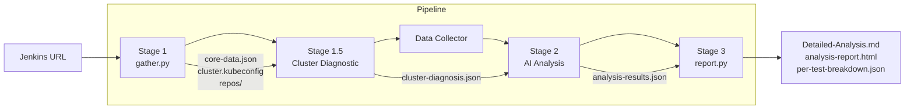
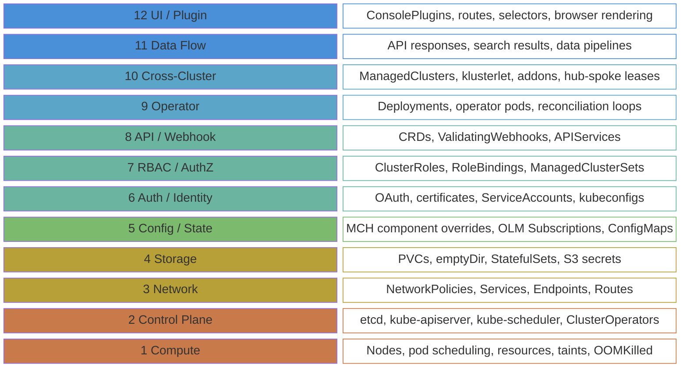

<div align="center">

# Z-Stream Pipeline Analysis

**Classify Jenkins pipeline failures as PRODUCT_BUG, AUTOMATION_BUG, or INFRASTRUCTURE.**

v4.0 &mdash; 12-layer diagnostic investigation &mdash; 5 MCP integrations &mdash; 64+ knowledge files

</div>

---

## Quick Start

```bash
cd apps/z-stream-analysis
claude
```

```
/analyze https://jenkins.example.com/job/pipeline/123/
```

Other commands: `/gather <URL>` (data only), `/quick <URL>` (skip cluster diagnostic).

> [!NOTE]
> First-time setup: from the repo root, run `claude` then `/onboard`. It configures MCP servers and credentials automatically.

> [!TIP]
> Or just say: `Analyze this run: <JENKINS_URL>`

## Example

```
Analyze this run: https://jenkins.example.com/job/acm-qe-pipeline/142/
```

The pipeline gathers data from Jenkins, investigates the cluster, and classifies each failed test with evidence:

<details open>
<summary><b>Analysis Output</b></summary>

```
Stage 1: Gathered 47 failed tests across 6 feature areas, 3 managed clusters
Stage 1.5: Cluster verdict DEGRADED — search-postgres OOMKilled, 2 subsystems affected
Stage 2: Classified 47 tests (12-layer diagnostic investigation)
Stage 3: Reports generated
```

**Classification Breakdown:**

| Classification | Count | Owner |
|:-:|:-:|---|
| AUTOMATION_BUG | 28 | Automation Team |
| INFRASTRUCTURE | 12 | Platform Team |
| NO_BUG | 5 | N/A (cascading hook failure) |
| PRODUCT_BUG | 2 | Product Team |

**Per-Test Results** (excerpt):

| Test | Classification | Root Cause | Layer |
|------|:-:|---|:-:|
| GRC / policy-compliance-history-page | INFRASTRUCTURE | search-postgres OOMKilled, empty query results | 4 |
| GRC / policy-automation-details | AUTOMATION_BUG | Stale selector `[data-testid="auto-btn"]` removed in console#8821 | 12 |
| Search / search-filter-cluster | INFRASTRUCTURE | search-postgres OOMKilled, no indexed data | 4 |
| CLC / create-cluster-aws-wizard | AUTOMATION_BUG | Timeout waiting for `[data-testid="next-btn"]`, changed to `[data-testid="wizard-next"]` | 12 |
| Observability / grafana-dashboard | PRODUCT_BUG | Thanos query returns HTTP 503, confirmed via JIRA ACM-45123 | 9 |

Each test includes an evidence chain with 2+ sources, ruled-out alternatives, and a confidence score.

</details>

Output files: `Detailed-Analysis.md` (full report), `analysis-report.html` (interactive), `per-test-breakdown.json` (structured data).

## How It Works



| Stage | What | How |
|:-----:|------|-----|
| **1** | Gather factual data from Jenkins, cluster, and repos | `gather.py` (9 steps) |
| **1.5** | Investigate cluster health (6-phase diagnostic) | `cluster-diagnostic` agent |
| &mdash; | Enrich selectors, page objects, change history | `data-collector` agent |
| **2** | Classify each failure using 12-layer root cause tracing | `analysis` + `investigation` agents |
| **3** | Generate reports | `report.py` |

## 12-Layer Root Cause Investigation

The AI traces each failure from symptom down through 12 infrastructure layers to find what broke and **who caused it**.



The root cause layer determines who owns the fix: layers 1-5 = **Platform Team**, layers 6-9 = **Product/Operator Team**, layers 10-12 = **Automation or Product Team** depending on evidence.

## Classifications

| Classification | Owner | When |
|:-:|---|---|
| **PRODUCT_BUG** | Product Team | API broken, feature not working, wrong data returned |
| **AUTOMATION_BUG** | Automation Team | Stale selector, wrong assertion, test logic issue |
| **INFRASTRUCTURE** | Platform Team | Cluster down, pod crash, resource pressure, network block |
| **NO_BUG** | N/A | Cascading hook failure from a prior test |

<details>
<summary>Edge cases (rarely assigned)</summary>

| Classification | When |
|:-:|---|
| **FLAKY** | Passes on retry, intermittent timing |
| **MIXED** | Multiple distinct root causes in same test |
| **UNKNOWN** | Insufficient evidence, confidence below 0.50 |

</details>

## Feature Areas

12 subsystems, each backed by architecture docs, data flow maps, and failure signature catalogs in `knowledge/`.

GRC &bull; Search &bull; CLC &bull; Observability &bull; Virtualization &bull; Application &bull; Console &bull; Foundation &bull; Install &bull; Infrastructure &bull; RBAC &bull; Automation

<details>
<summary><b>Pipeline Details</b></summary>

### Stage 1: Data Gathering

`gather.py` collects factual data (9 steps, no classification):
- Jenkins build info, console log, test report
- Cluster login + landscape (managed clusters, operators, resource pressure)
- Environment Oracle (feature-aware dependency health)
- Repository cloning (automation, console, kubevirt-plugin)
- Context extraction (test code, page objects, selector search)
- Feature grounding + knowledge (playbooks, KG dependencies)
- Temporal evidence (git timeline between product and test changes)

### Stage 1.5: Cluster Diagnostic

The `cluster-diagnostic` agent performs a 6-phase investigation:

| Phase | What |
|:-----:|------|
| 1. Discover | Full cluster inventory (MCH/MCE, CSVs, webhooks, ConsolePlugins, nodes) |
| 2. Learn | Compare against healthy baseline, addon catalog, webhook registry, 14 diagnostic traps |
| 3. Check | Per-namespace pod health, log scanning, restart counts, OCP operators |
| 4. Pattern Match | Cross-reference against failure patterns and signatures |
| 5. Correlate | Dependency chain tracing, cross-subsystem impact |
| 6. Output | Write `cluster-diagnosis.json` + self-healing discoveries |

Output: environment health score (0.0-1.0), operator health, subsystem health, image integrity, infrastructure issues, dependency chains, classification guidance.

### Stage 2: AI Analysis

5-phase investigation with the 12-layer diagnostic model:

| Phase | What |
|:-----:|------|
| A | Assessment + provably linked grouping (strict code-path criteria only) |
| B | 12-layer root cause investigation with per-test verification (4-point check) |
| C | Cross-reference validation (multi-evidence, cascading failures) |
| D | Counterfactual validation (9 templates), Polarion check, layer discrepancy detection |
| E | Feature context + JIRA correlation |

### Stage 3: Report Generation

`report.py` generates four output files:
- `analysis-report.html` -- interactive HTML report with filters and per-test cards
- `Detailed-Analysis.md` -- comprehensive markdown report
- `per-test-breakdown.json` -- structured data for tooling
- `SUMMARY.txt` -- brief text summary

</details>

<details>
<summary><b>Knowledge Database</b> &mdash; 64+ files</summary>

| Directory | Content | Files |
|-----------|---------|:-----:|
| `architecture/` | Per-subsystem architecture, data flow, failure signatures | 37 |
| `diagnostics/` | Classification decision tree, evidence tiers, diagnostic traps, 12-layer model | 5 |
| Root YAML | Components, dependencies, selectors, endpoints, baselines, patterns | 14 |
| `learned/` | Agent-contributed corrections and discoveries | 3+ |

Each of the 12 subsystems has `architecture.md`, `data-flow.md`, and `failure-signatures.md`.

</details>

<details>
<summary><b>MCP Servers</b> &mdash; 5 servers, 83 tools</summary>

| Server | Tools | Purpose |
|--------|:-----:|---------|
| ACM-UI | 20 | ACM Console + kubevirt-plugin source search via GitHub |
| JIRA | 25 | Issue search and bug correlation (Jira Cloud) |
| Jenkins | 11 | Pipeline API + ACM analysis tools |
| Polarion | 25 | Test case content and dependency discovery |
| Neo4j | 2 | Component dependency analysis via Cypher |

First-time setup: from the repo root, run `claude` then `/onboard`.

</details>

<details>
<summary><b>Services</b> &mdash; 17 Python modules</summary>

| Service | Purpose |
|---------|---------|
| `EnvironmentOracleService` | Feature-aware dependency health and knowledge database |
| `JenkinsIntelligenceService` | Build info, console log parsing, test report analysis |
| `JenkinsAPIClient` | Jenkins REST API client |
| `EnvironmentValidationService` | Cluster validation via oc/kubectl (read-only) |
| `RepositoryAnalysisService` | Git clone, test file indexing |
| `TimelineComparisonService` | Git date comparison, selector drift detection |
| `StackTraceParser` | JS/TS stack traces to file:line |
| `ACMConsoleKnowledge` | Console directory structure and feature mapping |
| `ACMUIMCPClient` | ACM UI MCP integration for element discovery |
| `ComponentExtractor` | Backend component names from test failures |
| `KnowledgeGraphClient` | Neo4j knowledge graph queries |
| `ClusterInvestigationService` | Component diagnostics and cluster landscape |
| `FeatureAreaService` | Map tests to feature areas |
| `FeatureKnowledgeService` | Playbooks, prerequisites, failure path matching |
| `FeedbackService` | Classification accuracy tracking |
| `SchemaValidationService` | JSON Schema validation for analysis output |
| `shared_utils` | Common functions (subprocess, curl, masking) |

</details>

<details>
<summary><b>Run Directory Structure</b></summary>

```
runs/<job>_<timestamp>/
├── core-data.json              # Primary data (Stage 1)
├── cluster-diagnosis.json      # Cluster health (Stage 1.5)
├── cluster.kubeconfig          # Cluster auth for Stages 1.5 + 2
├── pipeline.log.jsonl          # Structured Python logs
├── console-log.txt             # Full Jenkins console output
├── jenkins-build-info.json     # Build metadata
├── test-report.json            # Per-test failure details
├── repos/                      # Cloned source repos
├── analysis-results.json       # AI classifications (Stage 2)
├── analysis-report.html        # Interactive HTML report (Stage 3)
├── Detailed-Analysis.md        # Markdown report (Stage 3)
├── per-test-breakdown.json     # Structured breakdown (Stage 3)
├── SUMMARY.txt                 # Brief summary (Stage 3)
└── feedback.json               # Classification feedback (optional)
```

</details>

<details>
<summary><b>CLI Options</b></summary>

```bash
python -m src.scripts.gather <url>               # Standard gather
python -m src.scripts.gather <url> --skip-env     # Skip cluster validation
python -m src.scripts.gather <url> --skip-repo    # Skip repository cloning
python -m src.scripts.report <dir>                # Generate reports
python -m src.scripts.report <dir> --keep-repos   # Keep repos/ after report
python -m src.scripts.feedback <dir> --test "name" --correct
python -m src.scripts.feedback <dir> --test "name" --incorrect --should-be PRODUCT_BUG
python -m src.scripts.feedback --stats
```

</details>

<details>
<summary><b>Environment Variables</b></summary>

| Variable | Purpose |
|----------|---------|
| `JENKINS_USER` | Jenkins username |
| `JENKINS_API_TOKEN` | Jenkins API token |
| `Z_STREAM_CONSOLE_REPO_URL` | Override console repo URL |
| `Z_STREAM_KUBEVIRT_REPO_URL` | Override kubevirt-plugin repo URL |
| `NEO4J_HTTP_URL` | Neo4j HTTP URL (default: `http://localhost:7474`) |
| `NEO4J_USER` / `NEO4J_PASSWORD` | Neo4j credentials |

</details>

## Tests

```bash
python -m pytest tests/unit/ tests/regression/ -q   # 756 tests, no external deps
python -m pytest tests/ -q --timeout=300             # 801 tests (needs Jenkins VPN)
```

## Documentation

| | |
|---|---|
| [Pipeline overview](docs/00-OVERVIEW.md) | [Stage 1: Data gathering](docs/01-STAGE1-DATA-GATHERING.md) |
| [Stage 2: AI analysis](docs/02-STAGE2-AI-ANALYSIS.md) | [Stage 3: Reports](docs/03-STAGE3-REPORT-GENERATION.md) |
| [Services reference](docs/04-SERVICES-REFERENCE.md) | [MCP integration](docs/05-MCP-INTEGRATION.md) |
| [Knowledge database](docs/06-KNOWLEDGE-DATABASE.md) | [Skill architecture](docs/07-SKILL-ARCHITECTURE.md) |
| [Version history](docs/CHANGELOG.md) | [Interactive diagrams](docs/architecture-diagrams.html) |
