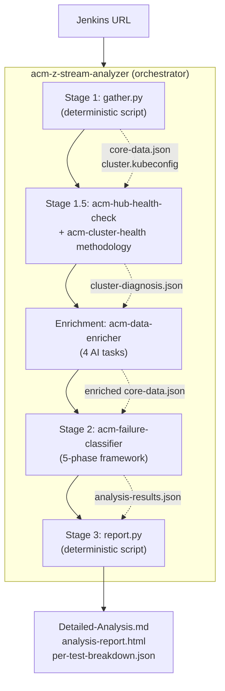
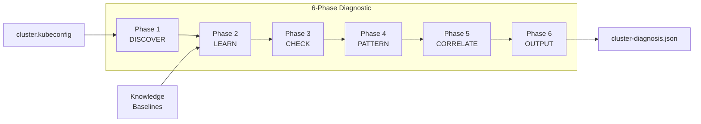
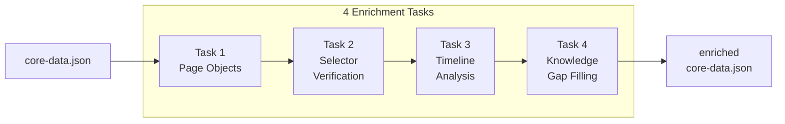
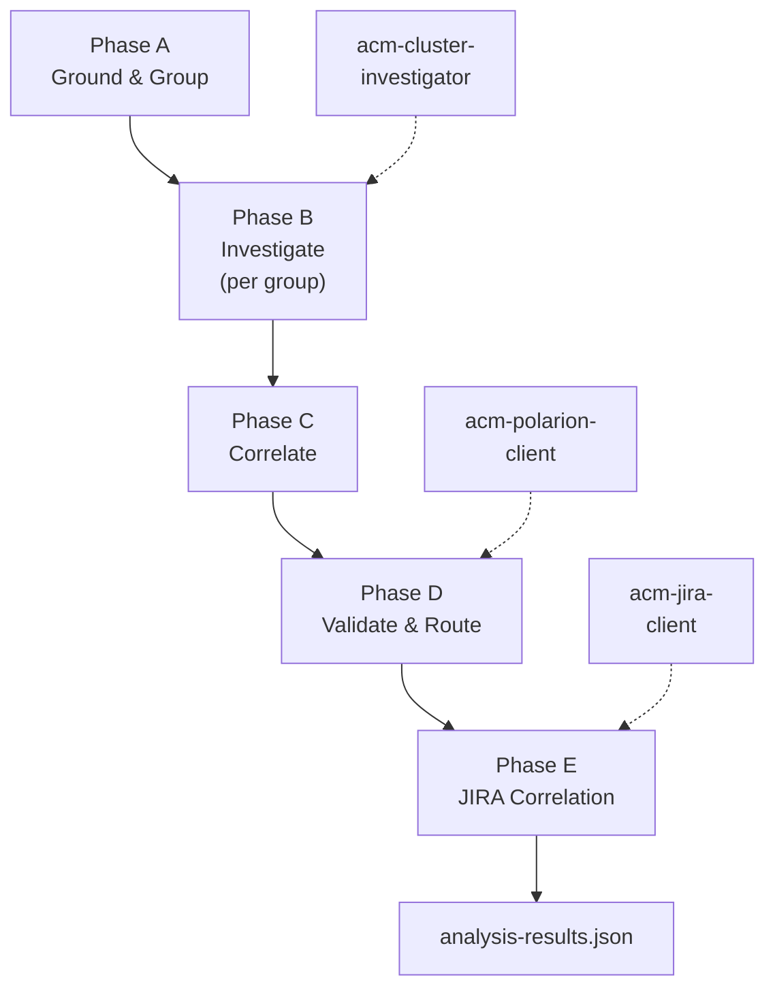
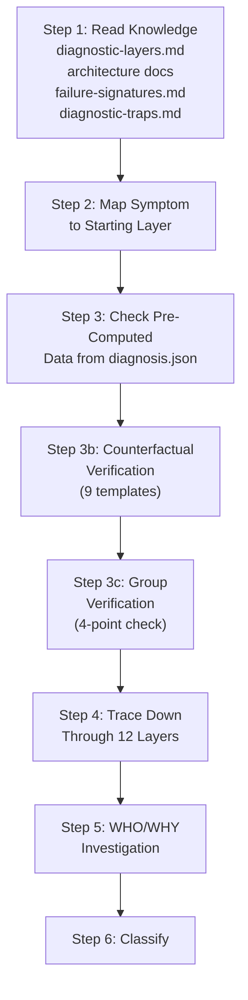
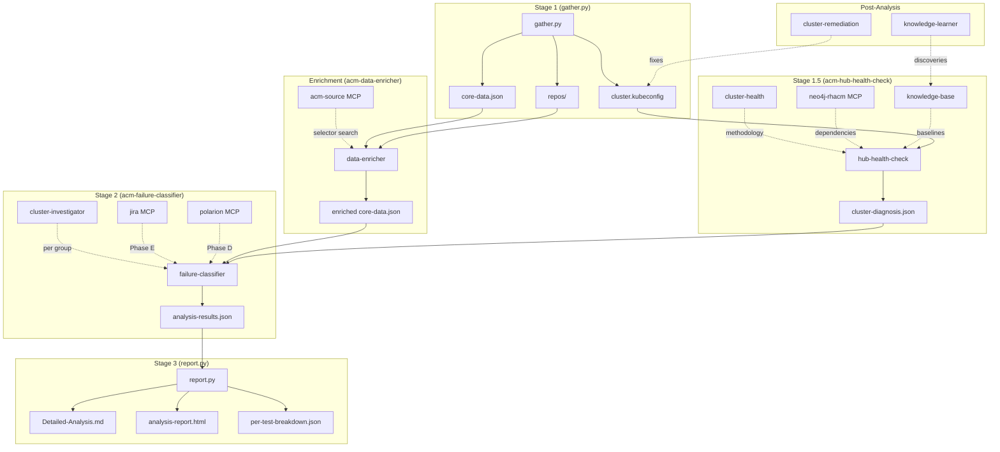

# Z-Stream Analysis: Skill Architecture

How the portable skill pack enables the Z-Stream failure analysis pipeline. 10 skills decompose a 4-stage pipeline into reusable, independently testable components — from Jenkins data collection through 12-layer diagnostic investigation to final classification reports. MCP tools (jira, acm-source, polarion, neo4j-rhacm) are called directly by subagents — no wrapper skill needed.

## Skill Inventory

10 skills organized in 4 tiers:

```
┌─────────────────────────────────────────────────────────┐
│                    ORCHESTRATION                        │
│                                                         │
│              acm-z-stream-analyzer                      │
│         (sequences stages, invokes all others)          │
└────────────┬──────────┬──────────┬──────────┬───────────┘
             │          │          │          │
     ┌───────▼───┐  ┌───▼────┐ ┌──▼───┐ ┌───▼────────┐
     │  CORE     │  │  CORE  │ │ CORE │ │  CORE      │
     │           │  │        │ │      │ │            │
     │ hub-      │  │ data-  │ │fail- │ │ cluster-   │
     │ health-   │  │ enri-  │ │ure-  │ │ investi-   │
     │ check     │  │ cher   │ │class-│ │ gator      │
     │           │  │        │ │ifier │ │            │
     │ Stage 1.5 │  │Post-1.5│ │Stg 2 │ │ Stg 2 sub  │
     └───────────┘  └────────┘ └──────┘ └────────────┘
             │                     │
     ┌───────▼───────────┐  ┌─────▼──────────────────┐
     │   METHODOLOGY     │  │   MCP + POST-ANALYSIS  │
     │                   │  │                        │
     │  cluster-health   │  │  jenkins-client        │
     │  knowledge-base   │  │  cluster-remediation   │
     │  knowledge-learner│  │                        │
     └───────────────────┘  └────────────────────────┘
```

| Tier | Skills | Role |
|------|--------|------|
| Orchestration | acm-z-stream-analyzer | Sequences stages 1→1.5→enrichment→2→3 |
| Core Pipeline | hub-health-check, data-enricher, failure-classifier, cluster-investigator | Execute each pipeline stage |
| Methodology + Knowledge | cluster-health, knowledge-base, knowledge-learner | Provide frameworks, domain data, self-healing |
| MCP + Post-Analysis | jenkins-client, cluster-remediation | Jenkins MCP interface, fix execution with approval gates |

MCP tools (jira, acm-source, polarion, neo4j-rhacm) are called directly by subagents at every tier — no wrapper skill needed.

---

## Pipeline Flow: Skills in Action



Deterministic scripts (gather.py, report.py) handle data collection and report generation. AI skills handle investigation, enrichment, and classification.

---

## Skill Details

### 1. acm-z-stream-analyzer — Pipeline Orchestrator

**Pipeline stage:** All stages
**Files:** SKILL.md + 67 reference files (including full knowledge database)
**Depends on:** All 13 other skills

The entry point. Receives a Jenkins URL and orchestrates the 4-stage pipeline with visible stage-by-stage progress:

```
Stage 1: Gathering pipeline data from Jenkins...
  → Extracted 47 failed tests across 6 feature areas
Stage 1.5: Running comprehensive cluster diagnostic...
  → Verdict: DEGRADED — search-postgres OOM, 2 subsystems affected
Stage 2: Analyzing 47 failed tests (12-layer diagnostic investigation)...
  → 28 AUTOMATION_BUG, 12 INFRASTRUCTURE, 5 NO_BUG, 2 PRODUCT_BUG
Stage 3: Generating report...
  → Detailed-Analysis.md, analysis-report.html
```

**What it provides:**
- Pipeline sequencing logic (which skills to invoke when)
- CLI options (`--skip-env`, `--skip-repo`)
- Classification quick reference (7 types with owners)
- Pre-flight checks (Jenkins access, cluster login, Neo4j)
- Run directory structure specification
- Complete knowledge database (60+ files mirrored from the app)

**Skill dependency table:**

| Skill Used | Stage | Purpose |
|------------|-------|---------|
| acm-jenkins-client | Pre-flight | Verify Jenkins connectivity |
| acm-hub-health-check | 1.5 | Cluster diagnostic execution |
| acm-cluster-health | 1.5 | Diagnostic methodology |
| acm-data-enricher | Post-1.5 | Test data enrichment |
| acm-failure-classifier | 2 | 5-phase classification |
| acm-cluster-investigator | 2 (sub) | Per-group investigation |
| acm-source MCP | 1.5–2 | Selector verification |
| neo4j-rhacm MCP | 1.5–2 | Dependency analysis |
| jira MCP | 2 | Bug correlation |
| polarion MCP | 2 | Test case context |
| acm-knowledge-base | All | Domain reference data |

---

### 2. acm-hub-health-check — Cluster Diagnostic (Stage 1.5)

**Pipeline stage:** 1.5
**Files:** SKILL.md + 62 reference files (architecture knowledge, diagnostics)
**Depends on:** acm-cluster-health (methodology), neo4j-rhacm MCP, acm-knowledge-learner

Produces `cluster-diagnosis.json` — the structured cluster health contract between Stages 1.5 and 2. Runs a 6-phase investigation using the 12-layer diagnostic model.



**Phase details:**

| Phase | What | oc commands | Key outputs |
|:-----:|------|:-----------:|-------------|
| 1. Discover | MCH/MCE, CSVs, nodes, webhooks, ConsolePlugins, StatefulSets | 7–12 | Cluster inventory |
| 2. Learn | Load baselines, architecture docs, service-map, webhook-registry, traps | 0 | Expected vs actual state model |
| 3. Check | Bottom-up layer verification (compute → network → storage → config → pods) | 15–30 | Per-layer health findings |
| 4. Pattern | Match against failure-patterns.yaml, failure-signatures.md, version-constraints | 0 | Known issue matches |
| 5. Correlate | Dependency chain tracing, cross-subsystem impact, root cause consolidation | 0–10 | Root cause graph |
| 6. Output | Write cluster-diagnosis.json, self-healing discoveries | 0 | Structured output |

**cluster-diagnosis.json key sections:**

```
environment_health_score     0.0–1.0 (weighted penalty formula)
subsystem_health             Per-subsystem with health_depth + unchecked_layers
classification_guidance      pre_classified_infrastructure + confirmed_healthy
counter_signals              Tests that should NOT be INFRASTRUCTURE
image_integrity              Console image registry validation
infrastructure_issues        Each with attribution_rule + NOT_affected
diagnostic_traps_applied     All 14 traps reported (triggered / not / n/a)
```

**Environment health score formula:** Start at 1.0, apply penalties:

| Category | Penalty | Condition |
|----------|---------|-----------|
| Operator health | -0.30 | MCH/MCE at 0 replicas |
| Operator health | -0.15 | MCH/MCE degraded |
| Infrastructure guards | -0.10 | NetworkPolicy/ResourceQuota in ACM namespace |
| Subsystem health | -0.10 | Per critical subsystem |
| Managed clusters | -0.05 | Per unavailable cluster (max -0.15) |
| Image integrity | -0.10 | Non-standard console image |

**Depth modes:**

| Mode | Phases | Duration | When |
|------|--------|----------|------|
| Quick | 1 only | ~30s | "Is my hub alive?" |
| Standard | 1–4 | ~2–3 min | "Health check" |
| Deep | All 6 | ~5–10 min | "Full diagnostic" |
| Targeted | Full on one area | ~3–5 min | "Investigate search" |

---

### 3. acm-cluster-health — Diagnostic Methodology

**Pipeline stage:** 1.5 + 2 (provides frameworks, not workflows)
**Files:** SKILL.md + 4 reference files
**Used by:** acm-hub-health-check, acm-cluster-investigator

Pure methodology — no execution workflow. Provides the 12-layer model, 14 diagnostic traps, dependency chain patterns, and evidence tier definitions that other skills reference.

**12-Layer Diagnostic Model:**

```
Layer 12  UI / Plugin           ConsolePlugins, routes, selectors
Layer 11  Data Flow             API responses, search results, pipelines
Layer 10  Cross-Cluster         ManagedClusters, klusterlet, addons
Layer  9  Operator              Deployments, pods, reconciliation
Layer  8  API / Webhook         CRDs, ValidatingWebhooks, APIServices
Layer  7  RBAC / AuthZ          ClusterRoles, RoleBindings
Layer  6  Auth / Identity       OAuth, certificates, ServiceAccounts
Layer  5  Config / State        MCH overrides, OLM, ConfigMaps
Layer  4  Storage               PVCs, StatefulSets, S3
Layer  3  Network               NetworkPolicies, Services, Endpoints
Layer  2  Control Plane         etcd, kube-apiserver, ClusterOperators
Layer  1  Compute               Nodes, scheduling, resources
```

Root cause layer determines owner:
- Layers 1–5: Platform Team (INFRASTRUCTURE)
- Layers 6–9: Product/Operator Team (PRODUCT_BUG)
- Layers 10–12: Automation or Product depending on evidence

**14 Diagnostic Traps** (where the obvious diagnosis is wrong):

| Trap | Pattern | Why it's wrong |
|:----:|---------|----------------|
| 1 | MCH operator at 0 replicas | MCH status is stale — pod health is outdated |
| 1b | Leader election stuck | Pods Running but no reconciliation |
| 2 | Console tabs missing | Plugin backend crashed, not tab removed |
| 3 | Search returns empty | Pods healthy but database has 0 rows |
| 4 | Observability down | S3 credentials expired, not pods crashed |
| 5 | GRC post-upgrade issues | Transient settling period, not broken |
| 6 | ManagedCluster NotReady | Lease is stale, cluster may be fine |
| 7 | All addons unavailable | Check addon-manager first |
| 8 | Console cascade | Search-api dependency, not console bug |
| 9 | ResourceQuota blocking | Silently blocks scheduling |
| 10 | Cert rotation | Pods run, TLS handshakes fail |
| 11 | NetworkPolicy hidden | Pods healthy but traffic blocked |
| 12 | Selector doesn't exist | AUTOMATION_BUG regardless of infra |
| 13 | Backend wrong data | PRODUCT_BUG, not infrastructure |
| 14 | Disabled prerequisite | Setup failure, not product failure |

**Evidence tiers:**
- Tier 1 (weight 1.0): oc output, MCP result, cluster-diagnosis finding
- Tier 2 (weight 0.5): KG analysis, JIRA correlation, knowledge match
- Tier 3 (weight 0.25): Pattern similarity, timing inference
- Minimum combined weight >= 1.8 for high confidence (0.85+)

---

### 4. acm-data-enricher — Test Data Enrichment

**Pipeline stage:** Runs after Stage 1.5, before Stage 2
**Files:** SKILL.md + 1 reference file (enrichment-tasks.md)
**Depends on:** acm-source MCP (for selector verification)

Enriches `core-data.json` with AI-analyzed context that gather.py cannot produce deterministically. Runs 4 sequential tasks:



| Task | What | Tools | Output field |
|:----:|------|-------|-------------|
| 1 | Trace import chains to find selector definitions | Bash (grep, find) | `page_objects` |
| 2 | Verify selectors exist in official product source | acm-source MCP | `console_search` |
| 3 | Git history analysis of selector changes + intent | Bash (git log -S) | `recent_selector_changes`, `temporal_summary` |
| 4 | Fill gaps in failure pattern matching (conditional) | Knowledge files | `feature_knowledge.ai_enrichment` |

**Task 2 detail — Selector verification:**
1. Set ACM version via `set_acm_version()` (from `cluster_landscape.mch_version`)
2. Classify selector type (data-testid, PatternFly class, custom class, hex color skip)
3. Search official product source via `search_code()`
4. For VM tests: also search kubevirt repo
5. Record `found: true/false` with verification method and detail

**Task 3 detail — Intent assessment values:**

| Intent | Meaning | Classification hint |
|--------|---------|-------------------|
| `intentional_rename` | Product deliberately renamed selector | AUTOMATION_BUG |
| `likely_unintentional` | Product accidentally removed selector | PRODUCT_BUG |
| `product_fix` | Bug fix that changed behavior | Neutral |
| `no_recent_change` | No recent git activity on this selector | Null |

**Task 4 triggers:** Runs only when `overall_match_rate < 0.3` OR `gap_areas >= 3` OR `stale_components >= 5`.

---

### 5. acm-failure-classifier — Classification Engine (Stage 2)

**Pipeline stage:** 2
**Files:** SKILL.md + 6 reference files (one per phase + output schema + decision routing)
**Depends on:** acm-cluster-investigator, jira MCP, polarion MCP, acm-source MCP, acm-knowledge-base

The core AI analysis engine. Implements a 5-phase investigation framework that produces per-test classifications with evidence chains.



**Phase A: Ground and Group** (`references/phase-a-grouping.md`)

Reads cluster-diagnosis.json (14-point reading protocol), grounds tests in feature areas, detects cross-test patterns, and groups tests using strict criteria.

14-point cluster-diagnosis.json reading protocol covers: overall_verdict, infrastructure_issues, operator_health, operator_inventory, subsystem_health, classification_guidance (pre_classified + confirmed_healthy), managed_cluster_detail, baseline_comparison, console_plugins, image_integrity, component_log_excerpts, component_restart_counts, ocp_operators_degraded, counter_signals.

Provably linked grouping (strict criteria only):

| Criterion | Valid? |
|-----------|:------:|
| Same exact selector + same calling function | Yes |
| Same before-all hook failure | Yes |
| Same spec + exact error + same line | Yes |
| Same feature area | No |
| Similar error message | No |
| "Button disabled" on same page | No |

Instant classifications (no investigation needed):
- After-all hook cascade → NO_BUG
- Dead selector (`console_search.found=false`) shared by 3+ tests → AUTOMATION_BUG

**Phase B: Investigate** (`references/phase-b-investigation.md`)

Dispatches each group to acm-cluster-investigator for 12-layer investigation. Includes:
- B1: Extracted context analysis with `failure_mode_category` routing
- B3b: External service dependency checks (Minio, Gogs, AAP/Tower)
- MCP trigger matrix (21+ trigger conditions mapping to specific MCP tools)
- Tiered playbook (Tier 0: context only → Tier 1: MCP → Tier 2: repo code → Tier 3: cluster → Tier 4: JIRA/Polarion)

**Phase C: Correlate**

Multi-evidence check (2+ sources per classification), cascading failure detection, pattern correlation.

**Phase D: Validate and Route** (`references/phase-d-validation.md`)

7 pre-routing checks (PR-1 through PR-7), 3-path routing, counterfactual validation, causal link verification, counter-bias checks.

Pre-routing checks:

| Check | What | Signal |
|-------|------|--------|
| PR-1 | Blank page / no-js | 7-row routing table by context |
| PR-2 | After-all hook cascade | NO_BUG |
| PR-3 | Temporal signal (stale test) | AUTOMATION_BUG hypothesis |
| PR-4 | Feature knowledge match | Playbook classification |
| PR-5 | Data assertion mismatch | PRODUCT_BUG hypothesis |
| PR-6 | Backend health from diagnosis | INFRASTRUCTURE hypothesis |
| PR-6b | Polarion expected behavior (v4.0) | PRODUCT_BUG fast-path |
| PR-7 | Oracle/diagnostic signals (v4.0) | Additive context only |

3-path routing:
- **Path A:** Selector mismatch (`found=false`) → AUTOMATION_BUG
- **Path B1:** Timeout + unhealthy subsystem → INFRASTRUCTURE
- **Path B2:** Complex → full JIRA-informed investigation

Counterfactual validation (D-V5, 4 steps):
1. "Would this test PASS if the issue were fixed?" (9 templates)
2. D-V5c symmetric: "Does backend confirm test expectation?" (AUTOMATION_BUG check)
3. D-V5e symmetric: "Is product behavior actually correct?" (PRODUCT_BUG check)
4. Evidence duplication detection + per-test evidence requirement

D4b causal link verification with failure_mode_category compatibility table:

| Dominant Signal | Compatible Modes | Incompatible Modes |
|----------------|-----------------|-------------------|
| Pod restarts | render_failure, timeout_general | data_incorrect, assertion_logic |
| Network errors | render_failure, timeout_general, server_error | data_incorrect, element_missing |
| Backend 500s | server_error, render_failure, element_missing | data_incorrect |
| Selector removed | element_missing | data_incorrect, timeout_general |

D5 counter-bias: anchoring prevention, oracle-primary-source check, failure_mode match, dominant signal threshold (5+ tests), layer discrepancy detection.

**Phase E: JIRA Correlation** (`references/phase-e-jira.md`)

Search for existing bugs, read feature stories, optionally create/link bugs (with user approval).

**Output:** `analysis-results.json` (`references/output-schema.md`)

Required per-test fields: test_name, classification, confidence (0.0–1.0), root_cause_layer (1–12), root_cause_layer_name, root_cause, cause_owner, evidence_sources (tiered), ruled_out_alternatives, reasoning (with causal_link), investigation_steps_taken, recommended_fix, jira_correlation, feature_context, backend_cross_check.

---

### 6. acm-cluster-investigator — Per-Group Investigation (Stage 2 sub)

**Pipeline stage:** 2 (dispatched by failure-classifier per group)
**Files:** SKILL.md + 2 reference files (symptom-layer-map, group-verification)
**Depends on:** acm-cluster-health (methodology), acm-source MCP, neo4j-rhacm MCP

Performs deep 12-layer root cause investigation for individual tests or test groups.

**Methodology (6 steps):**



**Symptom-to-layer mapping:**

| Error Pattern | Start Layer |
|---|---|
| "element not found" | 12 (UI) |
| "timed out waiting for" | 12, trace down |
| "Expected X but got Y" | 11 (Data Flow) |
| "500 Internal Server Error" | 9 (Operator) |
| "403 Forbidden" | 7 (RBAC) |
| "401 Unauthorized" | 6 (Auth) |
| "connection refused" | 3 (Network) |
| blank page / `class="no-js"` | Multiple (3, 6, 9, 12) |
| CSS visibility:hidden | 12 (UI) |

**9 counterfactual verification templates:** Selector not found, Button disabled, Timeout, Data assertion, Blank page, CSS visibility:hidden, NetworkPolicy, Operator at 0, ResourceQuota.

**4-point group verification:** For each subsequent test in a group, check: (1) same code path, (2) same backend component, (3) same user role, (4) same error element. All 4 pass → apply group result. Any fail → split and investigate individually.

**Safety:** 9 allowed oc commands (get, describe, logs, exec read-only, auth can-i, adm top, api-resources, whoami, get events). 9 forbidden (patch, delete, apply, scale, annotate, label, create, edit, rollout restart).

**10 anti-patterns:** No error-message-only classification, no blanket infrastructure attribution, no anchoring bias, no unverified selectors, no timeout assumptions, no redundant oc commands, no wasted Layer 1–2 checks when healthy, no evidence copying across groups, no cluster-wide-only classification, no skipped group verification.

---

### 7. acm-jenkins-client — Jenkins MCP Interface

**Pipeline stage:** Pre-flight + Stage 1
**Files:** SKILL.md + 1 reference file (tool-reference.md)

Wraps the Jenkins MCP server. Used for build verification before the pipeline starts and for extracting test results during Stage 1.

**Key tools:** `get_build` (build details), `get_build_status` (quick check), `get_build_log` (console with pagination), `get_test_results` (JUnit results), `analyze_pipeline` (AI analysis), `get_pipeline_stages` (stage breakdown), `get_downstream_tree` (build tree).

---

### 8. MCP Tools Reference (Direct Access)

Subagents call these MCP servers directly — no wrapper skill needed.

#### jira MCP

**Stage:** 2 (Phase E) — Bug correlation: searching for existing bugs, reading feature stories, optionally creating/linking bug tickets.

**Key tools:** `search_issues` (JQL search), `get_issue` (read story/ACs/PRs), `create_issue` (with user approval), `link_issue` (relate failures).

**Gotcha:** `get_issue` does not return links — use `search_issues` for linked ticket queries.

#### polarion MCP

**Stage:** 2 (Phase D, PR-6b) — Polarion expected behavior check: verifying what a test EXPECTS to fast-path PRODUCT_BUG classification without needing a JIRA ticket.

**Key tools:** `get_polarion_test_case_summary`, `get_polarion_test_steps`, `get_polarion_setup_html`, `get_polarion_work_item`.

**Gotcha:** Project ID is always `RHACM4K`. Query syntax is Lucene (not JQL).

#### acm-source MCP

**Stage:** 1.5–2 — Selector verification (data-enricher Task 2), translation lookup, component source reading, wizard step analysis.

**Key tools:** `search_code` (cross-repo search), `find_test_ids` (exact file lookup), `search_translations` (UI text verification), `get_acm_selectors` (QE catalog), `get_component_source` (read source), `set_acm_version` / `detect_cnv_version` (version context).

**Gotcha:** Always call `set_acm_version` before any search. Without it, lookups target the wrong branch.

#### neo4j-rhacm MCP

**Stage:** 1.5–2 (optional) — Component dependency graph (~370 nodes, 541 relationships across 7 subsystems).

**Query patterns:** Component lookup, downstream dependencies, upstream impact, subsystem listing, cross-component relationships.

---

### 9. acm-knowledge-base — Domain Knowledge Repository

**Pipeline stage:** All stages
**Files:** SKILL.md + 14 reference files

Curated ACM domain knowledge — per-area architecture, test conventions, naming patterns. Used by all other skills when they need context about a specific ACM subsystem.

**Coverage:** 9 console areas (Governance, RBAC, Fleet Virt, CCLM, MTV, Clusters, Search, Applications, Credentials). Each with components, CRDs, namespaces, routes, field orders, filtering logic, and testing considerations.

---

### 10. acm-knowledge-learner — Self-Healing Knowledge

**Pipeline stage:** Post-analysis
**Files:** SKILL.md + 2 reference files

Builds and updates the knowledge base by comparing live cluster state to known baselines. Uses 8-source introspection for unknown components (ownerReferences, OLM labels, CSV metadata, K8s labels, environment variables, webhooks, ConsolePlugins, APIServices).

**Discovery triggers:** Unknown CSV, unrecognized error pattern, unexplained dependency, TLS errors, post-upgrade settling.

**Output:** Writes to `knowledge/learned/` — unknown operator profiles, new failure patterns, new dependency chains, certificate issues, upgrade observations.

---

### 11. acm-cluster-remediation — Fix Execution

**Pipeline stage:** Post-diagnosis (not during analysis)
**Files:** SKILL.md only (no references)

Executes cluster fixes with a mandatory approval workflow. Analysis is strictly read-only; this skill is invoked only after diagnosis is complete and the user explicitly approves a fix plan.

**Allowed mutations:** oc patch, oc scale, oc rollout restart, oc delete pod (NOT deployment), oc annotate, oc label, oc apply.

**Forbidden:** oc delete on resources besides pods, oc adm drain/cordon, data destruction, namespace creation.

---

## Data Flow Between Skills



---

## How Each Architecture Diagram Maps to Skills

Cross-reference with `architecture-diagrams.html`:

| Architecture Diagram | Skill(s) Responsible |
|---------------------|---------------------|
| Diagram 1: Pipeline Overview | **acm-z-stream-analyzer** (orchestration flow) |
| Diagram 2: Stage 1 Data Gathering (Steps 1–9) | **gather.py** script + **acm-jenkins-client** (Step 1) |
| Diagram 2a: Step 4 Cluster Login + Landscape | **gather.py** script (deterministic) |
| Diagram 2b: Step 5 Feature Context Oracle | **gather.py** script + **neo4j-rhacm MCP** (KG queries) + **polarion MCP** (test case context) |
| Diagram 2d: Step 7 Test Context Extraction | **acm-data-enricher** (Tasks 1–3: page objects, selector verification, timeline analysis) |
| Diagram 2e: Step 9 Feature Knowledge | **gather.py** script + **acm-knowledge-base** (playbooks, architecture) |
| Diagram 2c: Stage 1.5 Cluster Diagnostic | **acm-hub-health-check** (6-phase execution) + **acm-cluster-health** (methodology) |
| Diagram 3a: Stage 2 Investigation Framework | **acm-failure-classifier** (5-phase A→E) |
| Diagram 3a-1: Phase A Sub-Steps | **acm-failure-classifier** (`references/phase-a-grouping.md`) |
| Diagram 3a-2: Phase B 12-Layer Investigation | **acm-cluster-investigator** (symptom-layer mapping, counterfactual, group verification) |
| Diagram 3b: Phase D Classification Decision Tree | **acm-failure-classifier** (`references/phase-d-validation.md`) |
| Diagram 4: Stage 3 Report Output | **report.py** script (deterministic) |

---

## Classification Decision Summary

The 5-phase framework produces one of 7 classifications per test:

| Classification | Owner | Root Cause Layers | Trigger |
|:-:|---|---|---|
| PRODUCT_BUG | Product Team | 6–9, 11–12 | Backend broken, wrong data, UI logic error |
| AUTOMATION_BUG | Automation Team | 12 (selector), test code | Stale selector, wrong assertion, test setup |
| INFRASTRUCTURE | Platform Team | 1–5 | Cluster down, pod crash, network block |
| NO_BUG | N/A | — | After-all hook cascade, disabled feature |
| MIXED | Multiple | Multiple | Independent root causes in same test |
| FLAKY | QE | — | Passes on retry, timing issue |
| UNKNOWN | Triage | — | Insufficient evidence (confidence < 0.50) |

Every classification requires:
1. Minimum 2 evidence sources
2. Ruled out alternatives documented
3. MCP tools used when trigger conditions met
4. Cross-test correlation checked
5. JIRA correlation performed

---

## Regression Testing

70 automated tests in `tests/regression/test_skill_conversion.py` validate skill integrity:

- **Structural:** SKILL.md existence, YAML frontmatter, cross-skill references, knowledge file parity
- **Schema compliance:** Classification values, output field names, format correctness
- **Content completeness:** 14-point reading protocol, MCP trigger matrix (15+ rows), B3b external services, 9 counterfactual templates, D4b compatibility table, D5 counter-bias (5+ checks), PR-1 routing (5+ conditions), 10 anti-patterns, forbidden oc commands
- **Dependency chain:** Orchestrator references all 10 dependencies, all reference files exist, knowledge files match app
- **Diagnostic traps:** 14 traps documented, knowledge files present

```bash
# Run skill conversion tests
python -m pytest tests/regression/test_skill_conversion.py -v

# Run all tests (756 total)
python -m pytest tests/unit/ tests/regression/ -q
```
