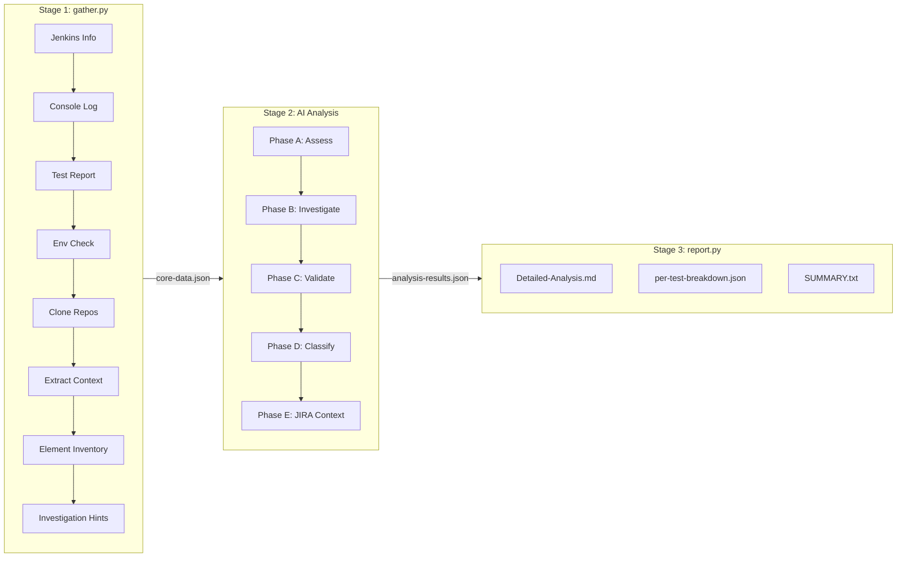
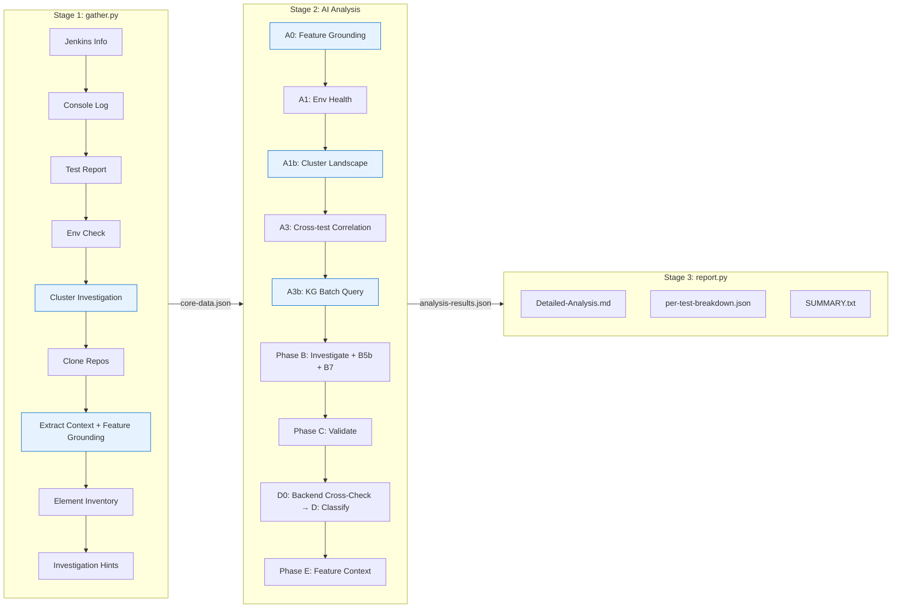
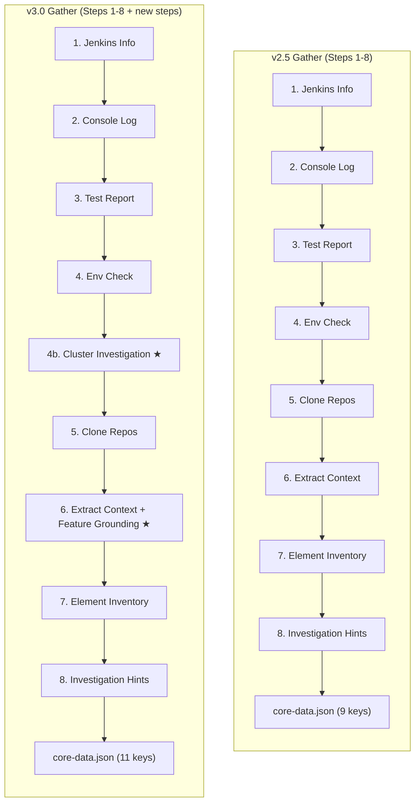
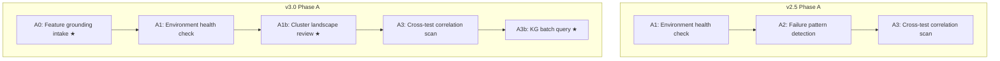
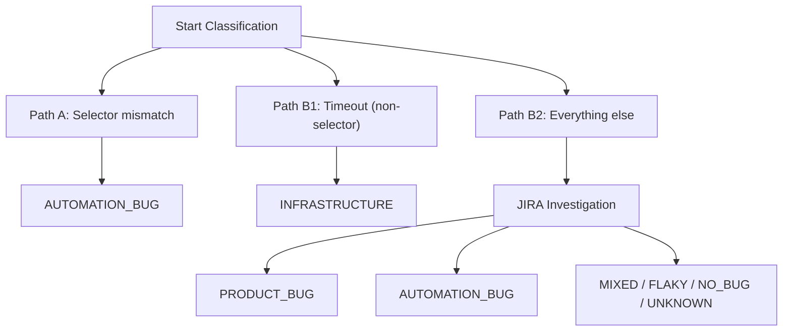
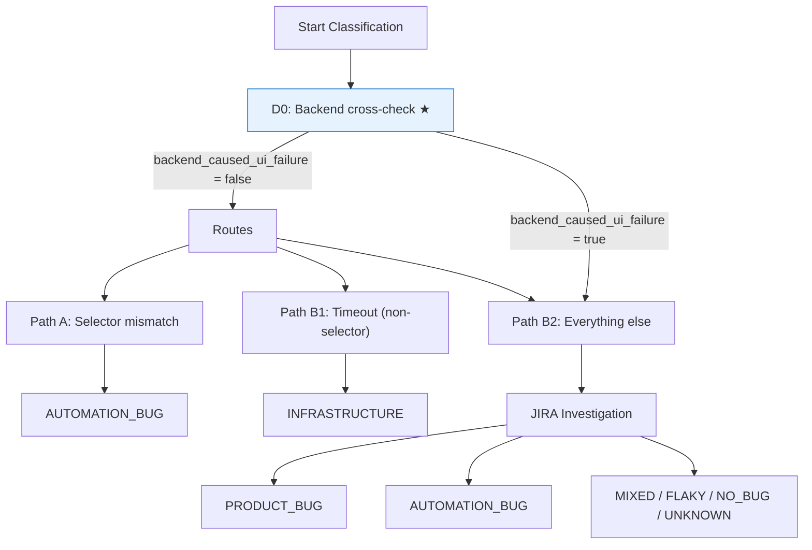

# v2.5 vs v3.0 Comparison Report

Comparison of two analysis runs against the same Jenkins build (`clc-e2e-pipeline #3757`, branch `test-failure-scenarios`) to evaluate the differences between analyzer versions.

| | v2.5 Run | v3.0 Run |
|---|---|---|
| **Run directory** | `qe-acm-automation-poc_clc-e2e-pipeline_20260212_040341` | `qe-acm-automation-poc_clc-e2e-pipeline_20260213_035519` |
| **Analyzed at** | 2026-02-12T04:10:00Z | 2026-02-13T04:10:00Z |
| **Data version** | 2.4.0 | 3.0.0 |
| **Analyzer version** | 2.5.0 | 3.0.0 |

---

## 1. Executive Summary

### Side-by-Side Metrics

| Metric | v2.5 | v3.0 | Delta |
|--------|------|------|-------|
| core-data.json size | 234,575 bytes | 239,406 bytes | +2.1% |
| analysis-results.json size | 39,843 bytes | 57,253 bytes | +43.7% |
| Detailed-Analysis.md size | 15,106 bytes | 18,276 bytes | +21.0% |
| core-data.json top-level keys | 9 | 11 | +2 |
| per-test fields (avg) | 16 | 19 | +3 |
| Total tests | 34 | 34 | — |
| Failed tests | 11 | 11 | — |
| Pass rate | 67.65% | 67.6% | — |
| AUTOMATION_BUG count | 11 | 11 | — |
| PRODUCT_BUG count | 0 | 0 | — |
| INFRASTRUCTURE count | 0 | 0 | — |
| Overall confidence | 0.95 | 0.91 | -0.04 |
| MCP queries executed | 4 | 4 | — |
| JIRA queries executed | 3 | 0 | -3 |
| ACM-UI queries executed | 1 | 2 | +1 |
| Investigation phases | A, B, C, D, E | A, B, C, D, E | — |
| Gather time (seconds) | 38.7 | 30.3 | -21.9% |

**Key finding:** Both versions reach the same 11 AUTOMATION_BUG classifications. v3.0 produces richer per-test output (+3 fields each: `feature_area`, `backend_cross_check`, `feature_context`) and adds cluster-level context (`cluster_investigation`, `feature_context_summary`) to the analysis results. The core analysis accuracy is equivalent; the improvements are in evidence depth and structural context.

---

## 2. Pipeline Architecture Comparison

### v2.5 Pipeline



### v3.0 Pipeline



### core-data.json Top-Level Keys

| Key | v2.5 | v3.0 | Notes |
|-----|------|------|-------|
| `metadata` | Yes | Yes | `data_version` changed: `2.4.0` → `3.0.0` |
| `jenkins` | Yes | Yes | Identical content |
| `test_report` | Yes | Yes | Identical content |
| `console_log` | Yes | Yes | Identical content |
| `environment` | Yes | Yes | Identical content |
| `repositories` | Yes | Yes | Identical content |
| `investigation_hints` | Yes | Yes | Identical content |
| `cluster_landscape` | — | Yes | **New:** 3 managed clusters, 34 operators, resource pressure |
| `feature_grounding` | — | Yes | **New:** 3 feature groups, test-to-subsystem mapping |
| `errors` | Yes | Yes | Identical content |
| `ai_instructions` | Yes | Yes | Identical content |

---

## 3. Stage 1: Data Gathering Comparison

### Step-by-Step Comparison

| Step | v2.5 | v3.0 | Change |
|------|------|------|--------|
| 1. Jenkins build info | `_gather_jenkins_build_info()` | `_gather_jenkins_build_info()` | Unchanged |
| 2. Console log | `_gather_console_log()` | `_gather_console_log()` | Unchanged |
| 3. Test report | Parse JUnit XML artifacts | Parse JUnit XML artifacts | Unchanged |
| 4. Environment check | `_gather_environment_status()` | `_gather_environment_status()` | Unchanged |
| 4b. Cluster investigation | — | `_gather_cluster_landscape()` via `ClusterInvestigationService` | **New** |
| 5. Clone repos | `_clone_repositories()` | `_clone_repositories()` | Unchanged |
| 6. Extract context | `_extract_complete_test_context()` | `_extract_complete_test_context()` | Unchanged |
| 6b. Feature grounding | — | `_ground_feature_areas()` via `FeatureAreaService` | **New** |
| 7. Element inventory | `_gather_element_inventory()` | `_gather_element_inventory()` | Unchanged |
| 8. Investigation hints | `_build_investigation_hints()` | `_build_investigation_hints()` | Unchanged |

### Gather Flow Diagram



### New: Cluster Landscape (v3.0)

Collected by `ClusterInvestigationService` during Step 4. Provides cluster-wide health context before per-test analysis begins.

```json
{
  "managed_cluster_count": 3,
  "managed_cluster_statuses": { "Ready": 3 },
  "operator_statuses": { "all_available": true },
  "degraded_operators": [],
  "resource_pressure": { "cpu": false, "memory": false, "disk": false, "pid": false },
  "policy_count": 9,
  "multiclusterhub_status": "Running"
}
```

**Actual data from build #3757:** 3 managed clusters (all Ready), 34 operators (all Available), no degraded operators, no resource pressure on CPU/memory/disk/PID. MultiClusterHub Running.

### New: Feature Grounding (v3.0)

Collected by `FeatureAreaService` during Step 6. Groups failed tests by feature area with subsystem context.

| Feature Group | Subsystem | Test Count | Tests |
|---------------|-----------|------------|-------|
| CLC | Cluster Lifecycle | 6 | 51364, 51365, 51367, 51368, 29240, 3046 |
| Unknown | Unknown | 4 | 30168, 3177, 52891, 1502 |
| Search | Search | 1 | 52779 |

**Total:** 3 groups, 11 tests mapped. The "Unknown" group contains credential tests that don't match a specific feature area tag.

---

## 4. Stage 2: AI Analysis Phase-by-Phase Comparison

### Phase A: Initial Assessment



| Sub-step | v2.5 | v3.0 | Change |
|----------|------|------|--------|
| A0: Feature grounding intake | — | Read `feature_grounding` from core-data.json | **New** |
| A1: Environment health check | Check `environment.environment_score` | Check `environment.environment_score` | Unchanged |
| A1b: Cluster landscape review | — | Read `cluster_landscape`, check for degraded operators and resource pressure | **New** |
| A2: Failure pattern detection | Console log patterns, mass timeouts | Merged into A3 cross-test correlation | Merged |
| A3: Cross-test correlation scan | Shared selectors, shared components | Shared selectors, shared components, shared feature areas | Extended |
| A3b: KG batch query | — | Build subsystem context for detected components before per-test analysis | **New** |

### Phase B: Deep Investigation (Per Test)

```mermaid
flowchart TD
    subgraph v25_B["v2.5 Phase B"]
        B1_25["B1: Check extracted_context"]
        B2_25["B2: Check timeline_evidence"]
        B3_25["B3: Check console_log"]
        B4_25["B4: Query MCP tools"]
        B5_25["B5: Backend component analysis"]
        B6_25["B6: Repository deep dive"]
        B1_25 --> B2_25 --> B3_25 --> B4_25 --> B5_25 --> B6_25
    end

    subgraph v30_B["v3.0 Phase B"]
        B1_30["B1: Check extracted_context"]
        B2_30["B2: Check timeline_evidence"]
        B3_30["B3: Check console_log"]
        B4_30["B4: Query MCP tools"]
        B5_30["B5: Backend component analysis"]
        B5b_30["B5b: Targeted pod investigation ★"]
        B6_30["B6: Repository deep dive"]
        B7_30["B7: Backend cross-check ★"]
        B1_30 --> B2_30 --> B3_30 --> B4_30 --> B5_30 --> B5b_30 --> B6_30 --> B7_30
    end
```



| Sub-step | v2.5 | v3.0 | Change |
|----------|------|------|--------|
| B1-B4 | Same | Same | Unchanged |
| B5: Backend component analysis | KG query for detected_components | KG query for detected_components | Unchanged |
| B5b: Targeted pod investigation | — | On-demand pod diagnostics for feature area components | **New** |
| B6: Repository deep dive | Fallback when extracted_context insufficient | Fallback when extracted_context insufficient | Unchanged |
| B7: Backend cross-check | — | Detects UI failures caused by backend problems | **New** |

**Build #3757 Phase B7 results:** Backend cross-check performed on all 11 tests. All returned `backend_caused_ui_failure: false` with no failing components. This is expected since the cluster was fully healthy.

### Phase C: Cross-Reference Validation

| Evidence Tier | v2.5 Sources | v3.0 Sources |
|---------------|--------------|--------------|
| Tier 1 (Definitive, 1.0) | 500 errors in log, element_removed=true, env_score<0.3 | 500 errors in log, element_removed=true, env_score<0.3, **pod_crash**, **backend_cross_check** |
| Tier 2 (Strong, 0.8) | Selector mismatch, multiple tests same selector | Selector mismatch, multiple tests same selector |
| Tier 3 (Supportive, 0.5) | Similar selectors exist, timing issues | Similar selectors exist, timing issues |
| **Minimum requirement** | 2+ sources (unchanged) | 2+ sources (unchanged) |

### Phase D: Classification Routing

#### v2.5 Decision Tree



#### v3.0 Decision Tree (with D0 Backend Cross-Check Override)



**D0 Backend Cross-Check Override:** In v3.0, the backend cross-check (Phase B7) runs before classification routing. If `backend_caused_ui_failure = true`, the test is routed to Path B2 regardless of whether it looks like a selector mismatch (Path A). This prevents misclassifying UI failures that are actually caused by backend component failures.

**Build #3757:** D0 did not override any classifications because all backend components were healthy.

### Phase E: Feature Context & JIRA

| Aspect | v2.5 | v3.0 |
|--------|------|------|
| E0: Build subsystem context | Full Knowledge Graph query per test | **Incremental** — uses A3b pre-built context |
| E1-E5: JIRA correlation | Per-test JIRA queries | Per-test JIRA queries (same) |
| E6: Issue creation | Optional JIRA issue creation | Optional JIRA issue creation (same) |

---

## 5. Per-Test Classification Comparison

### Full 11-Test Comparison Table

| # | Test ID | v2.5 Class | v2.5 Path | v2.5 Conf | v3.0 Class | v3.0 Path | v3.0 Conf | Match? |
|---|---------|-----------|-----------|-----------|-----------|-----------|-----------|--------|
| 1 | RHACM4K-51364 | AUTOMATION_BUG | A | 0.95 | AUTOMATION_BUG | A | 0.90 | Yes |
| 2 | RHACM4K-51365 | AUTOMATION_BUG | A | 0.95 | AUTOMATION_BUG | A | 0.92 | Yes |
| 3 | RHACM4K-51367 | AUTOMATION_BUG | A | 0.95 | AUTOMATION_BUG | A | 0.92 | Yes |
| 4 | RHACM4K-51368 | AUTOMATION_BUG | A | 0.95 | AUTOMATION_BUG | A | 0.92 | Yes |
| 5 | RHACM4K-29240 | AUTOMATION_BUG | A | 0.92 | AUTOMATION_BUG | A | 0.92 | Yes |
| 6 | RHACM4K-30168 | AUTOMATION_BUG | B2 | 0.95 | AUTOMATION_BUG | A | 0.90 | Yes* |
| 7 | RHACM4K-3177 | AUTOMATION_BUG | B2 | 0.95 | AUTOMATION_BUG | A | 0.90 | Yes* |
| 8 | RHACM4K-52891 | AUTOMATION_BUG | B2 | 0.95 | AUTOMATION_BUG | A | 0.90 | Yes* |
| 9 | RHACM4K-1502 | AUTOMATION_BUG | B2 | 0.97 | AUTOMATION_BUG | B2 | 0.90 | Yes |
| 10 | RHACM4K-52779 | AUTOMATION_BUG | B2 | 0.97 | AUTOMATION_BUG | B2 | 0.90 | Yes |
| 11 | RHACM4K-3046 | AUTOMATION_BUG | A | 0.97 | AUTOMATION_BUG | A | 0.95 | Yes |

**11/11 classifications match (100%).**

\*Tests 6-8 (RHACM4K-30168, 3177, 52891) changed from Path B2 to Path A between versions. v2.5 classified these through the JIRA-investigation path; v3.0 classified them as straightforward selector/URL mismatches routed through Path A. The final classification (AUTOMATION_BUG) is the same.

**Confidence delta:** v3.0 overall confidence (0.91) is slightly lower than v2.5 (0.95). This is a calibration change — v3.0 is more conservative with confidence scores, which is appropriate given the additional evidence dimensions it evaluates.

### Detailed Comparison: Key Tests

#### RHACM4K-51364 (CSV Export — Timeout)

| Aspect | v2.5 | v3.0 |
|--------|------|------|
| Classification | AUTOMATION_BUG | AUTOMATION_BUG |
| Path | A | A |
| Confidence | 0.95 | 0.90 |
| Evidence source naming | `console_search` | `console_repo_search` |
| Evidence count | 3 | 3 |
| Root cause | 1000ms timeout too short | 1000ms timeout too short |
| `backend_cross_check` | — | `{ performed: true, backend_caused_ui_failure: false }` |
| `feature_area` | — | `CLC` |
| `feature_context.subsystem` | — | `Cluster Lifecycle` |

#### RHACM4K-1502 (Missing Config — TypeError)

| Aspect | v2.5 | v3.0 |
|--------|------|------|
| Classification | AUTOMATION_BUG | AUTOMATION_BUG |
| Path | B2 | B2 |
| Confidence | 0.97 | 0.90 |
| Evidence sources | `test_code_analysis`, `error_type_analysis` | `test_code_analysis`, `jenkins_parameters`, `error_type_analysis` |
| `backend_cross_check` | — | `{ performed: true, backend_caused_ui_failure: false }` |
| `feature_area` | — | `CLC` |
| `feature_context.subsystem` | — | `Cluster Lifecycle` |

#### RHACM4K-52779 (Missing Spoke Cluster)

| Aspect | v2.5 | v3.0 |
|--------|------|------|
| Classification | AUTOMATION_BUG | AUTOMATION_BUG |
| Path | B2 | B2 |
| Confidence | 0.97 | 0.90 |
| Evidence sources | `test_code_analysis`, `jenkins_parameters`, `error_type_analysis` | `test_code_analysis`, `jenkins_parameters`, `error_message_analysis` |
| `backend_cross_check` | — | `{ performed: true, backend_caused_ui_failure: false }` |
| `feature_area` | — | `CLC` |
| `feature_context.subsystem` | — | `Search` |

#### RHACM4K-3046 (ClusterSet Button Text)

| Aspect | v2.5 | v3.0 |
|--------|------|------|
| Classification | AUTOMATION_BUG | AUTOMATION_BUG |
| Path | A | A |
| Confidence | 0.97 | 0.95 |
| Evidence sources | `test_code_analysis`, `translation_lookup`, `product_source` | `console_repo_search`, `console_search`, `test_code_analysis` |
| v2.5 used MCP tool | `mcp__acm-ui__search_translations` | — |
| v3.0 used local repo | — | `grep_local_repo` for translation |
| `backend_cross_check` | — | `{ performed: true, backend_caused_ui_failure: false }` |
| `feature_area` | — | `CLC` |
| `feature_context.subsystem` | — | `Cluster Lifecycle` |

---

## 6. MCP Tool Usage Comparison

### Summary

| Metric | v2.5 | v3.0 |
|--------|------|------|
| Total MCP queries | 4 | 4 |
| ACM-UI MCP queries | 1 | 2 |
| JIRA MCP queries | 3 | 0 |
| Neo4j/KG MCP queries | 0 | 0 |
| Local repo (grep) queries | 0 | 2 |
| All queries successful | Yes | Yes |

### Full Query List — v2.5

| # | Tool | Query | Success | Result |
|---|------|-------|---------|--------|
| 1 | `mcp__acm-ui__search_translations` | `managed.createClusterSet (exact)` | Yes | Translation is 'Create cluster set' — test regex expects 'Create ClusterSet' |
| 2 | `mcp__jira__search_issues` | `project = ACM AND text ~ 'export CSV' AND status != Closed` | Yes | No matching issues found |
| 3 | `mcp__jira__search_issues` | `project = ACM AND text ~ 'pf-v6-c-chip' AND status != Closed` | Yes | No matching issues found |
| 4 | `mcp__jira__search_issues` | `project = ACM AND text ~ 'credentials' AND text ~ 'Add credential'` | Yes | No matching issues found |

### Full Query List — v3.0

| # | Tool | Query | Success | Result |
|---|------|-------|---------|--------|
| 1 | `mcp__acm-ui__search_code` | `export-search-result in acm console repo` | Yes | Found in AcmTableToolbar.tsx:529 |
| 2 | `mcp__acm-ui__search_code` | `OUIA-Generated-DropdownItem in acm console repo` | Yes | Not found — auto-generated by PF at runtime |
| 3 | `grep_local_repo` | `pf-v6-c-chip in console repo` | Yes | Only 1 occurrence in CSS, PF6 replaced Chip with Label |
| 4 | `grep_local_repo` | `managed.createClusterSet translation` | Yes | Translation is 'Create cluster set' |

### Per-MCP-Server Breakdown

| Server | v2.5 Queries | v3.0 Queries | Change |
|--------|-------------|-------------|--------|
| ACM-UI (`mcp__acm-ui__*`) | 1 (`search_translations`) | 2 (`search_code` x2) | +1, different tools used |
| JIRA (`mcp__jira__*`) | 3 (`search_issues` x3) | 0 | -3 |
| Neo4j RHACM (`mcp__neo4j-rhacm__*`) | 0 | 0 | — |
| Local repo (grep) | 0 | 2 | +2 |

### Evidence Source Naming

v3.0 introduces a more specific evidence source name for console searches:

| v2.5 Source Name | v3.0 Source Name | Meaning |
|------------------|------------------|---------|
| `console_search` | `console_repo_search` | Search in cloned ACM Console repository |
| `console_search` | `console_search` | Also used in v3.0 for general console searches |

### Tool Availability vs Actual Usage

| Server | Available Tools | v2.5 Used | v3.0 Used |
|--------|----------------|-----------|-----------|
| ACM-UI | 20 | 1 (5%) | 2 (10%) |
| JIRA | 24 | 3 (12.5%) | 0 (0%) |
| Neo4j RHACM | 3 | 0 (0%) | 0 (0%) |

Both versions use a small fraction of available MCP tools. For this particular run (synthetic automation bugs on a healthy cluster), heavy tool usage is unnecessary — the failures are identifiable from extracted context and local repo searches.

### JIRA Query Drop Analysis

v2.5 executed 3 JIRA `search_issues` queries; v3.0 executed 0. Possible explanations:

1. **All 11 tests classified as AUTOMATION_BUG** — JIRA correlation is most valuable for Path B2 (PRODUCT_BUG candidates). With all tests routed through Path A or B2-to-AUTOMATION_BUG, the AI may have determined JIRA queries would not change any classification.
2. **Synthetic failure branch** — The `test-failure-scenarios` branch contains intentionally broken tests. The AI recognized these as synthetic automation bugs early and skipped JIRA correlation.
3. **Local repo evidence was sufficient** — v3.0 used local `grep_local_repo` to find translations and selectors instead of MCP tools.

The v3.0 `jira_correlation` section confirms: `search_performed: false` for all 11 tests and `queries_executed: 0` at the top level.

---

## 7. New v3.0 Output Fields

### analysis-results.json Structure Comparison

#### Top-Level Sections

| Section | v2.5 | v3.0 | Notes |
|---------|------|------|-------|
| `analysis_metadata` | Yes | Yes | `analyzer_version` changed 2.5.0 → 3.0.0 |
| `investigation_phases_completed` | Yes | Yes | Same: ["A", "B", "C", "D", "E"] |
| `mcp_queries_executed` | Yes | Yes | Different queries (see Section 6) |
| `cross_test_correlations` | Yes | Yes | v3.0 adds `shared_feature_areas` using full test names |
| `cluster_investigation` | — | Yes | **New** |
| `cascading_failure_analysis` | Yes | Yes | v3.0 sets `analysis_performed: true` (v2.5 was `false`) |
| `environment_summary` | Yes | Yes | Identical content |
| `per_test_analysis` | Yes | Yes | v3.0 adds 3 new fields per test; v3.2 adds 2 more; v3.3 adds 2 more (see Per-Test Field Count) |
| `summary` | Yes | Yes | Same structure, minor confidence difference. v3.2 adds `cascading_hook_failures`, `blank_page_failures`. v3.3 adds `data_assertion_failures`, `feature_area_health`. |
| `jira_correlation` | Yes | Yes | v3.0: `queries_executed: 0` vs v2.5: `queries_executed: 4` |
| `feature_context_summary` | — | Yes | **New** |
| `patterns_detected` | Yes | Yes | Slightly different groupings |
| `action_items` | Yes | Yes | v3.0 has 7 items (v2.5 had 5, less granular) |

#### New Top-Level: `cluster_investigation`

```json
{
  "cluster_investigation": {
    "landscape": {
      "managed_cluster_count": 3,
      "managed_cluster_statuses": { "Ready": 3 },
      "operator_statuses": { "all_available": true },
      "degraded_operators": [],
      "resource_pressure": { "cpu": false, "memory": false, "disk": false, "pid": false },
      "multiclusterhub_status": "Running"
    },
    "component_diagnostics": [],
    "infrastructure_signals": [],
    "backend_failure_signals": []
  }
}
```

#### New Top-Level: `feature_context_summary`

```json
{
  "feature_context_summary": {
    "subsystems_investigated": ["Cluster Lifecycle", "Search"],
    "feature_stories_read": [],
    "linked_prs_found": 0,
    "knowledge_graph_queries": 0,
    "jira_feature_queries": 0
  }
}
```

#### New Per-Test Fields (3 fields added)

| Field | Type | Build #3757 Example |
|-------|------|---------------------|
| `feature_area` | string | `"CLC"` |
| `backend_cross_check` | object | `{ "performed": true, "backend_caused_ui_failure": false, "failing_components": [], "evidence": [], "overrides_path_a": false }` |
| `feature_context` | object | `{ "subsystem": "Cluster Lifecycle", "components_involved": ["console", "AcmTableToolbar"], "feature_story": null, ... }` |

#### Per-Test Field Count

| Version | Fields per test (typical) |
|---------|--------------------------|
| v2.5 | 16 (`test_name`, `test_file`, `class_name`, `classification`, `classification_path`, `confidence`, `evidence_sources`, `ruled_out_alternatives`, `reasoning`, `root_cause`, `error`, `recommended_fix`, `jira_correlation`, `owner`, `priority`, `related_files`) |
| v3.0 | 19 (all v2.5 fields + `feature_area`, `backend_cross_check`, `feature_context`) |
| v3.2 | 21 (v3.0 fields + `is_cascading_hook_failure`, `blank_page_detected`) |
| v3.3 | 23 (v3.2 fields + `failure_mode_category`, `assertion_analysis`) |

---

## 8. Report Output Comparison

### Detailed-Analysis.md Section Comparison

| Section | v2.5 | v3.0 |
|---------|------|------|
| Executive Summary | Yes | Yes |
| Classification Breakdown | Yes | Yes |
| Build Information | Yes | Yes |
| Individual Test Failures (11 tests) | Yes | Yes |
| Recommended Actions (by Priority) | 6 groups | 7 groups |
| Cluster Investigation | — | **Yes** |
| Feature Area Grouping | — | **Yes** |
| Environment Status | Yes | Yes |
| Feedback CLI | — | **Yes** |

### File Size Comparison

| File | v2.5 | v3.0 | Delta |
|------|------|------|-------|
| core-data.json | 234,575 bytes | 239,406 bytes | +2.1% |
| analysis-results.json | 39,843 bytes | 57,253 bytes | +43.7% |
| Detailed-Analysis.md | 15,106 bytes | 18,276 bytes | +21.0% |

The +43.7% increase in analysis-results.json comes from the 3 new per-test fields (`backend_cross_check`, `feature_area`, `feature_context`) and 2 new top-level sections (`cluster_investigation`, `feature_context_summary`).

### Recommended Actions Grouping

v3.0 groups correlated tests into combined action items:

| v2.5 Action Items | v3.0 Action Items |
|-------------------|-------------------|
| RHACM4K-30168 | RHACM4K-30168 / 3177 / 52891 (grouped) |
| RHACM4K-3046 | RHACM4K-51365 / 51367 / 51368 (grouped) |
| RHACM4K-51365 | RHACM4K-3046 |
| RHACM4K-29240 | RHACM4K-51364 |
| RHACM4K-1502 | RHACM4K-29240 |
| RHACM4K-52779 | RHACM4K-1502 |
| | RHACM4K-52779 |

v3.0 has 7 action items (more granular, each test addressed) vs v2.5's 6 items (less granular grouping). The v3.0 priority ordering also differs — it leads with the stale-URL fix (3 tests) before the OUIA-selector fix (3 tests).

---

## 9. Limitations and Next Steps

### Limitations of This Comparison

1. **Synthetic failures only.** Both runs used the `test-failure-scenarios` branch, which contains intentionally broken tests. All 11 failures are genuinely AUTOMATION_BUG. This means:
   - The backend cross-check (D0) confirmed a healthy cluster but couldn't demonstrate its override capability
   - Feature grounding mapped tests to areas but couldn't demonstrate how it changes classification
   - Cluster investigation found no degraded operators or resource pressure to act on

2. **JIRA queries dropped to 0 in v3.0.** The v3.0 run performed no JIRA queries (`queries_executed: 0`), while v2.5 ran 3. This may be because:
   - All tests were classified as AUTOMATION_BUG through Paths A/B2 without needing JIRA correlation
   - The AI recognized the synthetic nature of the failures
   - Investigation with real production failures would likely trigger JIRA queries

3. **Knowledge Graph not exercised.** Neither run executed Neo4j queries (`knowledge_graph_queries: 0`). The KG is most valuable when backend component failures cascade across subsystems, which didn't occur with synthetic automation bugs.

4. **Single pipeline type.** Both runs analyzed the same CLC e2e pipeline. Other pipeline types (GRC, Search, Observability) may exercise different code paths and MCP tools.

### What Would Demonstrate v3.0 Advantages

To fully validate v3.0's new capabilities, the following scenarios are needed:

| Scenario | v3.0 Capability Tested | Expected Outcome |
|----------|------------------------|------------------|
| Backend API returning 500 errors | Backend cross-check (B7, D0) | D0 overrides Path A → routes to Path B2 → PRODUCT_BUG |
| Degraded operator causing UI failures | Cluster landscape + B5b pod investigation | Infrastructure signals detected, classification informed by cluster state |
| Multi-subsystem failure cascade | Feature grounding + KG queries | Feature grouping reveals cross-subsystem impact |
| Known JIRA bug matching test failure | JIRA correlation (Phase E) | Bug linked to test failure, classification enriched |
| Production z-stream regression | Full pipeline end-to-end | Real-world validation of all v3.0 capabilities |

### Path Forward

1. Run v3.0 against a real z-stream pipeline with actual product bugs to validate backend cross-check and JIRA correlation
2. Investigate why JIRA queries dropped to 0 — determine if this is a regression or correct behavior for automation-only failures
3. Test with a cluster that has degraded operators to validate cluster investigation impact on classification
4. Compare against a pipeline with mixed classification outcomes (PRODUCT_BUG + AUTOMATION_BUG + INFRASTRUCTURE) to see how feature grounding improves analysis
