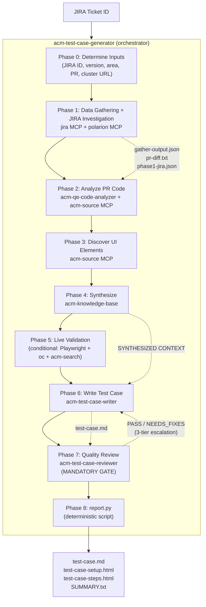
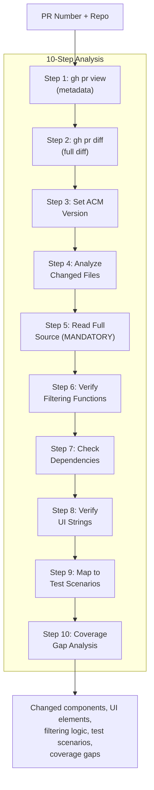
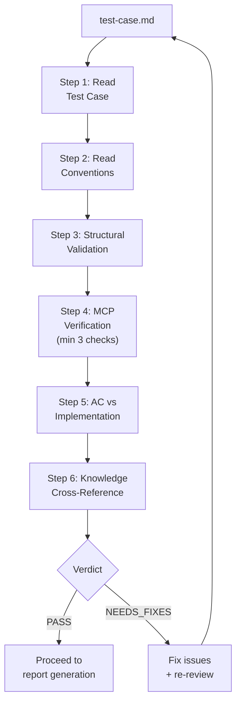
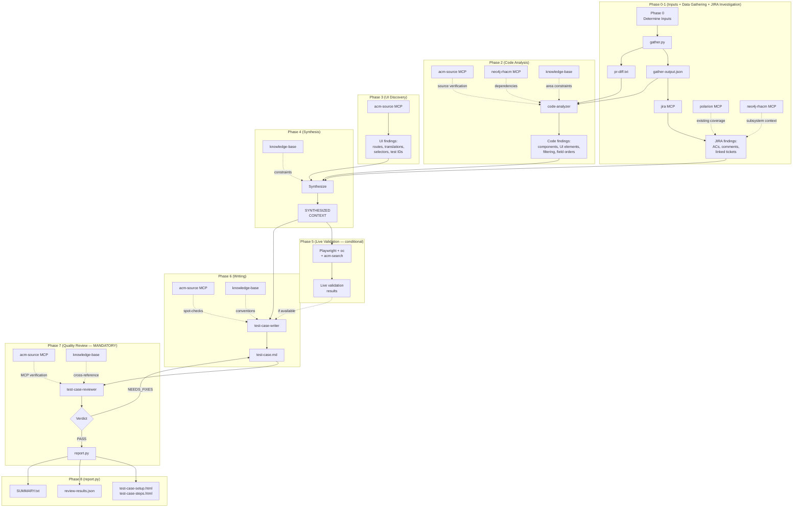
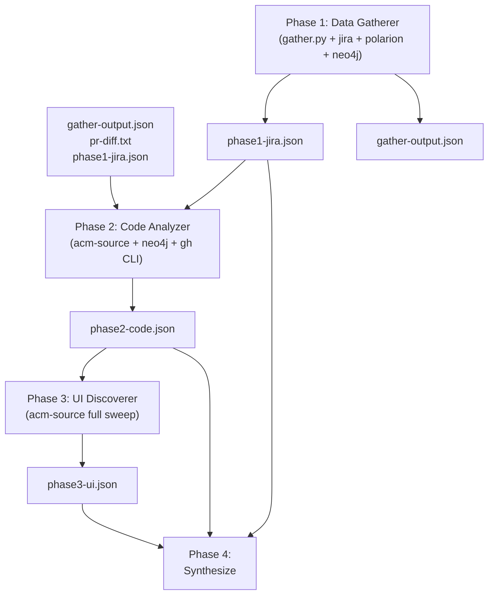
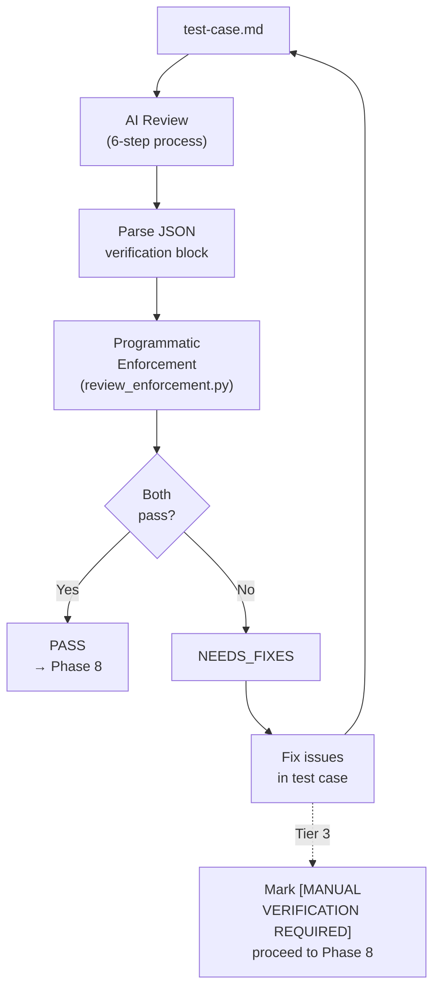

# Test Case Generator: Skill Architecture

How the portable skill pack enables the test case generation pipeline. 6 skills support a 9-phase pipeline with reusable, independently testable components — from data gathering and JIRA investigation through PR code analysis, UI discovery, and synthesis to Polarion-ready test case output with mandatory quality review. MCP tools (jira, acm-source, polarion, neo4j-rhacm) are called directly by subagents — no wrapper skill needed.

## Skill Inventory

6 skills organized in 3 tiers:

```
┌─────────────────────────────────────────────────────────┐
│                    ORCHESTRATION                        │
│                                                         │
│            acm-test-case-generator                      │
│       (sequences phases, invokes all others)            │
└────────────┬──────────┬──────────┬──────────────────────┘
             │          │          │
     ┌───────▼───┐  ┌───▼────┐ ┌──▼───────────────┐
     │  CORE     │  │  CORE  │ │  CORE            │
     │           │  │        │ │                   │
     │ test-     │  │ code-  │ │ test-case-        │
     │ case-     │  │ ana-   │ │ reviewer          │
     │ writer    │  │ lyzer  │ │                   │
     │           │  │        │ │ Phase 7           │
     │ Phase 6   │  │Phase 2 │ │ (mandatory gate)  │
     └───────────┘  └────────┘ └───────────────────┘
             │          │
     ┌───────▼───────────▼───────────────────────┐
     │   METHODOLOGY + KNOWLEDGE                 │
     │                                           │
     │  knowledge-base    cluster-health         │
     └───────────────────────────────────────────┘
```

| Tier | Skills | Role |
|------|--------|------|
| Orchestration | acm-test-case-generator | Sequences phases 0→1→2→…→8, manages review loop |
| Core Pipeline | acm-test-case-writer, acm-qe-code-analyzer, acm-test-case-reviewer | Execute writing, code analysis, and quality review |
| Methodology + Knowledge | acm-knowledge-base, acm-cluster-health | Provide conventions, architecture data, cluster diagnostic methodology |

MCP tools (jira, acm-source, polarion, neo4j-rhacm) are called directly by subagents at every tier — no wrapper skill needed. `acm-cluster-health` is shared with hub-health — it provides cluster diagnostic methodology for live validation context.

---

## Pipeline Flow: Skills in Action



Deterministic scripts (gather.py, report.py, review_enforcement.py, validate_artifact.py) handle data collection, artifact validation, structural validation, and Polarion HTML generation. AI skills handle investigation, analysis, discovery, synthesis, writing, and quality review. After each AI phase (1-4, 6), `validate_artifact.py` validates the output and triggers retry on failure (up to 3 attempts). A pre-synthesis readiness check verifies minimum viable data across all investigation artifacts before Phase 4.

---

## Skill Details

### 1. acm-test-case-generator — Pipeline Orchestrator

**Pipeline stage:** All phases
**Files:** SKILL.md + 3 reference files (phase-gates.md, pipeline-workflow.md, synthesis-template.md) + 5 script files (gather.py, report.py, generate_html.py, review_enforcement.py, validate_artifact.py)
**Depends on:** All 5 other skills + MCP tools (jira, acm-source, polarion, neo4j-rhacm)

The entry point. Receives a JIRA ticket ID and orchestrates the 9-phase pipeline with visible phase-by-phase progress:

```
[Phase 0] Determining area and inputs...
[Phase 1] Gathering data + investigating JIRA story...
  → Gathered PR #5790, 12 files changed. Area: governance.
  → 5 ACs, 3 linked tickets, 0 existing Polarion test cases
[Phase 2] Analyzing PR code changes...
  → 4 new UI elements, 2 modified behaviors, 1 filtering function
[Phase 3] Discovering UI elements...
  → 8 translations verified, entry point route confirmed
[Phase 4] Synthesizing investigation results...
  → Investigation complete. 7 test scenarios identified.
[Phase 5] Running live validation...  (or: Skipping — no cluster URL)
[Phase 6] Writing test case...
  → Test case written: test-case.md (8 steps, medium).
[Phase 7] Running quality review...
  → Quality review PASSED.
[Phase 8] Generating reports...
  → test-case-setup.html, test-case-steps.html, SUMMARY.txt
```

**What it provides:**
- Phase sequencing logic (which skills to invoke when, what data to pass)
- Input resolution protocol (auto-detect version, PR, area from JIRA; ask only what's missing)
- Phase gate enforcement (mandatory quality review, 3-tier review escalation)
- STOP checkpoints (after synthesis, after writing, after review)
- Synthesis template (conflict resolution rules, scope gating, AC cross-reference)
- Run directory structure specification
- Telemetry integration (log_phase calls between AI phases)

**Skill dependency table:**

| Skill Used | Phase(s) | Purpose |
|------------|----------|---------|
| jira MCP | 1 | JIRA story deep dive, linked tickets, PR discovery |
| acm-qe-code-analyzer | 2 | PR diff analysis, changed components, filtering logic |
| acm-source MCP | 2, 3, 6, 7 | Routes, translations, selectors, component source |
| acm-knowledge-base | 1–7 | Conventions, area architecture, examples |
| polarion MCP | 1 | Existing coverage check (feature investigator) |
| neo4j-rhacm MCP | 1–3 | Component dependencies, subsystem impact |
| acm-cluster-health | 5 | Cluster diagnostic methodology (live validation) |
| acm-test-case-writer | 6 | Test case markdown generation |
| acm-test-case-reviewer | 7 | Quality gate with MCP verification |

**Three invocation modes:**

| Mode | Command | Behavior |
|------|---------|----------|
| Full pipeline | `/generate ACM-30459` | All 9 phases, single ticket |
| Batch | `/batch ACM-30459,ACM-30460` | Full pipeline per ticket, summary table |
| Review only | `/review path/to/test-case.md` | Phase 7 only on existing file |

---

### 2. acm-test-case-writer — Test Case Author (Phase 6)

**Pipeline stage:** 6
**Files:** SKILL.md (no separate reference files — conventions come from acm-knowledge-base)
**Depends on:** acm-knowledge-base (conventions + architecture), acm-source MCP (spot-checks)

Produces Polarion-ready test case markdown. Operates in two modes:

```mermaid
flowchart LR
    subgraph "Full Context Mode (via orchestrator)"
        SYN[Synthesized\nContext] --> W1[Read\nConventions]
        W1 --> W2[Read Area\nKnowledge]
        W2 --> W3[Scope Gate\n(ACs only)]
        W3 --> W4[Spot-Check\nvia MCP]
        W4 --> W5[Write Test\nCase]
        W5 --> W6[Self-Review\n(13 checks)]
    end
```

**Standalone mode:** If no synthesized context is available, performs a lightweight investigation first (JIRA read, UI discovery, optional code analysis) before writing. Functional but less thorough than the full pipeline.

**6-step writing process:**

| Step | What | Tools | Output |
|:----:|------|-------|--------|
| 1 | Read conventions | acm-knowledge-base | Format rules, naming patterns |
| 2 | Read area knowledge as constraints | acm-knowledge-base | Field orders, filtering behavior, component patterns |
| 3 | Scope gate | Input context | ACs-only scope, multi-story filtering |
| 4 | Spot-check key UI elements | acm-source MCP | Verified routes, translations, component source |
| 5 | Write the test case | All inputs | test-case.md |
| 6 | Self-review (13 checks) | Internal | Pre-flight before quality gate |

**Output format — Polarion-ready markdown:**

```
# RHACM4K-XXXXX - [Tag-Version] Area - Test Name

## Metadata
Polarion ID, Status, Dates

## Polarion Fields
Type, Level, Component, Subcomponent, Test Type, Pos/Neg,
Importance, Automation, Tags, Release

## Description
What is tested, verification list, Entry Point, Dev JIRA Coverage

## Setup
Numbered bash commands with # Expected: comments

## Test Steps
### Step N: Title
1. Action
2. Action
- Expected result
- Expected result
---

## Teardown
Cleanup commands with --ignore-not-found

## Notes
Implementation details, AC discrepancies with source citations
```

**Three quality rules enforced during writing:**

| Rule | What | Example |
|------|------|---------|
| Step Granularity | Each step verifies ONE behavior | Split "verify tooltip AND click link" into 2 steps |
| Backend Validation Placement | CLI in dedicated steps, after UI steps | "Verify policy status via CLI (Backend Validation)" |
| Implementation Detail Translation | Code details → observable verifications | `compareNumbers(a,b)` → "Sorting is numeric (0,1,2,10 not 0,1,10,2)" |

**13-point self-review checklist:** Metadata fields, Type value, entry point from MCP, labels from investigation, CLI-only for backend, setup format, teardown completeness, Test Steps header, step separators, no fabricated thresholds, step granularity, backend placement, implementation translation.

---

### 3. acm-qe-code-analyzer — PR Diff Analysis (Phase 2)

**Pipeline stage:** 2
**Files:** SKILL.md (no separate reference files)
**Depends on:** acm-source MCP (source verification), neo4j-rhacm MCP (dependency graph), jira MCP (coverage gap analysis)

Analyzes PR diffs from `stolostron/console` or `kubevirt-ui/kubevirt-plugin` to understand what changed and what needs testing.



**Per-file analysis identifies:**

| Category | What to find | Example |
|----------|-------------|---------|
| New UI components | Pages, modals, wizards, table columns | New DescriptionList field |
| Modified UI elements | Changed labels, new buttons, removed options | Button label rename |
| Routes | Navigation paths in NavigationPath.tsx | New `/infrastructure/clusters` sub-route |
| API interactions | Fetch calls, resource creation, status checks | New `listResources` call |
| Conditional logic | Feature flags, RBAC checks, state-dependent rendering | `if (isInstalled)` guard |
| Error handling | New error messages, validation rules | Toast notification on failure |
| Translation strings | New i18n keys | `t('policy.table.column.name')` |
| Filtering functions | Label filters, search filters, data transformations | `filterByLabel(items, prefix)` |
| UI interaction model | PatternFly component type | ToolbarFilter vs TextInput |

**Follow-up PR detection:** For each primary changed file, checks for subsequent merged PRs via `gh pr list --search "path:<filepath>" --state merged`. Flags post-merge renames, fixes, and refactors that would make the test case stale.

**Coverage gap analysis (Step 10):** Cross-references every conditional branch, error handler, and edge case in the diff against the JIRA story's Acceptance Criteria (retrieved via `get_issue`). Code behaviors not covered by any AC are reported as Coverage Gaps with description, code reference, and user impact. Internal defensive code (null checks with no UI effect) is excluded. The synthesis phase triages gaps as ADD TO TEST PLAN, NOTE ONLY, or SKIP.

**Critical rules:**
- MANDATORY: Read full source of primary target file via `get_component_source` — diffs alone miss array construction patterns, import chains, and conditional rendering
- Distinguish test files (`.test.tsx`) from production code — data in test files is MOCK DATA
- Multi-story PRs: tag each file with its JIRA story, focus on the target story
- Cross-reference area knowledge: flag contradictions between analysis and architecture files

---

### 4. acm-test-case-reviewer — Quality Gate (Phase 7)

**Pipeline stage:** 7 (mandatory, cannot skip)
**Files:** SKILL.md (standalone with inlined validation)
**Depends on:** acm-source MCP (MCP spot-checks), acm-knowledge-base (conventions)

The mandatory quality gate. No test case is delivered without passing this review. Operates as a 3-tier escalation loop — targeted MCP re-investigation, focused retry with evidence, then placeholder and proceed. Never retries with the same context.



**6-step review process:**

| Step | What | Checks | Severity |
|:----:|------|--------|----------|
| 1 | Read test case | Full markdown file | — |
| 2 | Read conventions | Format rules, naming, CLI rules | — |
| 3 | Structural validation | Title format, metadata fields, Type value, step format, step separators, CLI-in-steps rule, step granularity | BLOCKING |
| 4 | MCP verification | min 3 checks: translations, routes, component source | BLOCKING if < 3 |
| 5 | AC vs implementation | ACs match expected results, discrepancies cited | BLOCKING |
| 6 | Knowledge cross-reference | Field order, filtering, CRDs vs architecture file | BLOCKING |
| 6.5 | Design efficiency | Redundant resources, missed state transitions, duplicate verifications, setup/step ratio | WARNING |
| 6.6 | Coverage gap verification | Gaps triaged as ADD have test steps, gaps triaged as NOTE mentioned | WARNING |

**MCP verification minimum (3 checks):**

| # | Tool | What | Must match |
|:-:|------|------|-----------|
| 1 | `search_translations` | 1–2 key UI labels | Exact string in test case |
| 2 | `get_routes` | Entry point route | Navigation path in Description |
| 3 | `get_component_source` | Primary component source | At least ONE factual claim (field order, filtering, empty state) |

**Programmatic enforcement layer:**

After the AI review, `review_enforcement.py` programmatically verifies the reviewer's output:
1. Contains 3+ MCP verification entries
2. Contains at least one `get_component_source` call
3. Contains at least one `search_translations` call
4. Stale JIRA text check: metric names and labels verified against source code
5. Negative scenario warning: conditional features should have absence-verification steps

If enforcement fails, the verdict is overridden to NEEDS_FIXES regardless of the AI reviewer's conclusion. This two-layer system (AI review + programmatic enforcement) prevents the reviewer from rubber-stamping.

---

### 5. MCP Tools Reference (Direct Access)

Subagents call these MCP servers directly — no wrapper skill needed.

#### jira MCP

**Phases:** 1 | **Used by:** Data gatherer subagent

Deep ticket investigation — extracts summary, ACs, ALL comments (implementation decisions, edge cases, design trade-offs), linked tickets, and sibling stories.

| Step | Action | Tool | What it finds |
|:----:|--------|------|---------------|
| 1 | Read the story | `get_issue(issue_key)` | Summary, description, ACs, fix version, components, status |
| 2 | Read ALL comments | Via `get_issue` | Implementation decisions, edge cases, PR links, QE feedback |
| 3 | Find QE tracking | `search_issues("summary ~ \"[QE] --- ACM-XXXXX\"")` | Existing test coverage efforts |
| 4 | Find sub-tasks | `search_issues("parent = ACM-XXXXX")` | Task breakdown |
| 5 | Find related bugs | `search_issues("type = Bug AND summary ~ \"keyword\"")` | Known issues |
| 6 | Find sibling stories | `search_issues("fixVersion = X AND component = Y AND type = Story AND key != Z")` | Renames, follow-up fixes |

**Gotcha:** `get_issue` does not return links — use `search_issues` for linked ticket queries.

#### acm-source MCP

**Phases:** 2, 3, 6, 7 | **Used by:** All core pipeline subagents

The most heavily used MCP server. Source code search across `stolostron/console` and `kubevirt-ui/kubevirt-plugin`.

| Phase | Purpose | Key Tools |
|-------|---------|-----------|
| 2 (Code Analysis) | Verify source code, translations, routes against PR diff | `set_acm_version`, `search_code`, `get_component_source`, `search_translations`, `get_routes` |
| 3 (UI Discovery) | Discover all UI elements for the feature | `set_acm_version`, `set_cnv_version`, `search_code`, `get_component_source`, `find_test_ids`, `search_translations`, `get_routes`, `get_wizard_steps`, `get_acm_selectors`, `get_patternfly_selectors` |
| 6 (Writing) | Spot-check key elements during writing | `set_acm_version`, `get_routes`, `search_translations`, `get_component_source` |
| 7 (Review) | Verify claims in the test case | `set_acm_version`, `search_translations`, `get_routes`, `get_component_source` |

**Gotcha:** Always call `set_acm_version` (and `set_cnv_version` for Fleet Virt/CCLM/MTV) before any search. Without it, lookups target the wrong branch.

#### polarion MCP

**Phases:** 1 | **Used by:** Data gatherer subagent

| Phase | Purpose | Tools |
|-------|---------|-------|
| 1 (Data Gathering) | Check existing test case coverage before writing | `get_polarion_work_items`, `get_polarion_test_case_summary` |

**Gotcha:** Project ID is always `RHACM4K`. Query syntax is Lucene (not JQL).

#### neo4j-rhacm MCP

**Phases:** 1–3 (optional) | **Used by:** Data gatherer, code analyzer, UI discoverer subagents

Queries the component dependency graph (~370 nodes, 541 relationships across 7 subsystems) to understand impact of code changes. Optional — the pipeline proceeds without it, but dependency context improves test case quality.

**Used for:** subsystem membership, component dependencies, cross-subsystem impact assessment.

---

### 6. acm-knowledge-base — Domain Knowledge Repository

**Pipeline stage:** 1–7 (referenced throughout)
**Files:** SKILL.md + 14 knowledge files in `.claude/knowledge/test-case-generator/` (9 architecture + 4 conventions + 1 example)
**Used by:** All core pipeline skills
**Resolution:** `KNOWLEDGE_DIR = ${CLAUDE_SKILL_DIR}/../../knowledge/test-case-generator/`

The knowledge backbone. Provides two categories of reference data:

**Area architecture (9 files, authoritative constraints):**

| File | Area | Key content |
|------|------|-------------|
| `governance.md` | Governance | Policy types, discovered vs managed, label filtering, field orders |
| `rbac.md` | RBAC | FG-RBAC, MCRA, ClusterPermission, scope types |
| `fleet-virt.md` | Fleet Virtualization | Tree view, VM actions, saved searches |
| `cclm.md` | CCLM | Cross-cluster live migration wizard, kubevirt-plugin |
| `mtv.md` | MTV | Migration toolkit, fleet migration status |
| `clusters.md` | Clusters | Cluster lifecycle, cluster sets, import, pools |
| `search.md` | Search | Search API, managed hub clusters, queries |
| `applications.md` | Applications | ALC, subscriptions, channels, Argo |
| `credentials.md` | Credentials | Provider credentials, credential forms |

Each file contains: key components, CRDs, navigation routes, translation keys, description list field orders, filtering behavior, setup prerequisites, testing considerations.

**Conventions (4 files, format rules):**

| File | What it defines |
|------|-----------------|
| `test-case-format.md` | Section order, naming, complexity levels (from 85+ existing test cases) |
| `area-naming-patterns.md` | Title tag patterns and Polarion component mapping by area |
| `cli-in-steps-rules.md` | When CLI is allowed in test steps (backend validation only) |
| `polarion-html-templates.md` | HTML generation rules for Polarion import |

**Authority hierarchy:** Architecture files are authoritative constraints. If analysis contradicts an architecture file on field order, filtering behavior, or component structure, the knowledge file wins until MCP verification resolves the discrepancy.

---

## Data Flow Between Skills



---

## Subagent Execution Model

The pipeline runs 7 subagents sequentially (Phases 1–7), each spawned via the Agent tool into a fresh context. Each subagent receives file paths as input, reads from disk, writes structured output to disk, and terminates — preventing context pressure and recency bias.

| Subagent | File | Phase | Role |
|----------|------|-------|------|
| Data Gatherer | `references/agents/data-gatherer.md` | 1 | Data collection + JIRA deep dive |
| Code Analyzer | `references/agents/code-analyzer.md` | 2 | PR diff analysis |
| UI Discoverer | `references/agents/ui-discoverer.md` | 3 | Source code discovery |
| Synthesizer | `references/agents/synthesizer.md` | 4 | Merge + scope gate + test plan |
| Live Validator | `references/agents/live-validator.md` | 5 | Browser + oc + acm-search |
| Test Case Writer | `references/agents/test-case-writer.md` | 6 | Write test case |
| Quality Reviewer | `references/agents/quality-reviewer.md` | 7 | Quality gate |

> **App pipeline note:** The app pipeline (`apps/test-case-generator/`) consolidates Phases 1–3 into one parallel Phase 1 for speed. The portable skill runs them sequentially for context isolation. Both produce equivalent results.

---

## Context Isolation Model

The portable skill uses isolated subagents to prevent context pressure. Each investigation phase runs in a fresh subagent context:

| Phase | Context Size | Why Isolated |
|-------|-------------|-------------|
| Phase 1 (Data + JIRA) | ~40-60 KB | Runs gather.py, JIRA investigation, PR discovery; isolation prevents crowding later analysis |
| Phase 2 (Code) | ~20-40 KB | PR diffs consume significant context; discard after extracting findings |
| Phase 3 (UI) | ~15-30 KB | MCP results (selectors, translations) are voluminous |
| Phase 4 (Synthesis) | ~30-60 KB | Merges all three, but writes to disk and terminates |
| Phase 6 (Writer) | ~40-60 KB | Reads synthesized context + conventions, writes test case |
| Phase 7 (Reviewer) | ~30-50 KB | Reads test case + conventions + makes MCP calls |

**How it works:**

1. Orchestrator spawns subagent via the `Agent` tool with full instructions from `references/agents/<agent>.md`
2. Subagent receives `<input>` block with file paths (not file contents) — reads from disk
3. Subagent writes structured output (JSON or markdown) to the run directory
4. Subagent terminates — its context is released
5. Orchestrator verifies the output file exists, does NOT read it into its own context
6. Next phase's subagent reads previous output from disk independently

This model means no single context window holds more than one phase's data. The orchestrator's context stays thin (just file paths and phase status).

---

## Sequential Investigation: Phases 1–3

The investigation phases run sequentially, each as an isolated subagent:



**Phase 1: Data Gatherer**
- Input: JIRA ID, ACM version, area, run directory
- Tools: bash (gather.py, gh CLI), jira MCP, polarion MCP, neo4j MCP
- Output: `gather-output.json` + `phase1-jira.json` — PR metadata, diffs, story summary, ACs, comments, linked tickets, existing Polarion coverage, sibling story context

**Phase 2: Code Analyzer**
- Input: PR number, repo, ACM version, JIRA ID, area, run directory, pr-diff.txt path
- Tools: gh CLI, acm-source MCP, neo4j MCP, jira MCP
- Output: `phase2-code.json` — changed components, new UI elements, modified behavior, routes, translations, filtering logic, follow-up PRs, test scenarios, coverage gaps

**Phase 3: UI Discoverer**
- Input: ACM version, CNV version (if Fleet Virt), feature name, area, run directory
- Tools: acm-source MCP (full sweep)
- Output: `phase3-ui.json` — selectors, translation keys, routes with parameterized paths, wizard steps, test IDs, QE selectors, PatternFly fallbacks

---

## Synthesis: Conflict Resolution

Phase 4 merges all investigation outputs using explicit precedence rules:

| Data Type | Trust Source | Why |
|-----------|-------------|-----|
| UI elements (labels, routes, selectors) | UI Discovery | Reads source code directly via MCP |
| Business requirements (ACs, scope) | JIRA Investigation | Reads JIRA directly |
| What changed (files, diff) | Code Change Analysis | Reads the diff |
| Architecture constraints | Knowledge Base | Verified behavior from 85+ existing test cases |
| Metric names, translation strings, labels | Current source code | JIRA descriptions may contain stale or proposed names |

**When conflicts occur:**
- Architecture knowledge contradicts analysis → trust knowledge file, verify via `get_component_source`
- JIRA AC says X, code does Y → test against implementation (what users see), note discrepancy
- Diff shows one thing, merged source shows another → trust merged source (MCP reads actual code)

**Scope gating:**
1. Extract target story's ACs
2. For each planned step, verify it maps to at least one AC
3. If a step tests functionality from a different story (even in same PR), exclude it
4. Mention other stories in Notes as "Related but scoped to [other-story]"

**Coverage gap triage:** If the code analyzer (Phase 2) identified code behaviors not covered by any AC, the synthesis phase triages each gap: ADD TO TEST PLAN (user-visible, worth testing), NOTE ONLY (real but minor), or SKIP (internal, not UI-testable). Gaps triaged as ADD get corresponding test steps.

**Test design optimization:** 5 passes applied to the planned steps before writing: state transition consolidation (test state changes on one entity instead of creating multiple), resource minimization, step flow sequencing (observe → act → verify), deduplication, and negative scenario placement (before positive when no extra setup needed).

---

## Quality Review Loop

The review is a mandatory gate with two enforcement layers:



**Layer 1: AI Review** (acm-test-case-reviewer skill)
- 6-step review: structural validation, MCP verification (min 3), AC vs implementation, knowledge cross-reference, design efficiency check, coverage gap verification
- Verdict: PASS or NEEDS_FIXES with specific BLOCKING/WARNING issues

**Layer 2: Programmatic Enforcement** (review_enforcement.py)
- Parses the AI reviewer's output
- Verifies: 3+ MCP verification entries, at least one `get_component_source` call, at least one `search_translations` call
- Checks metric names/labels verified against source code (stale JIRA text detection)
- Warns if conditional feature lacks negative scenario step
- Can override AI verdict to NEEDS_FIXES

**Review loop with 3-tier escalation:** If NEEDS_FIXES: Tier 1 — targeted MCP re-investigation for factual errors. Tier 2 — focused retry with evidence. Tier 3 — mark unresolvable steps with `[MANUAL VERIFICATION REQUIRED]` and proceed.

---

## Deterministic vs AI Components

| Component | Type | What it does | Guarantees |
|-----------|------|-------------|-----------|
| `gather.py` | Deterministic (Python) | PR metadata, file list, peer test cases, area knowledge | Always produces `gather-output.json` + `pr-diff.txt` |
| `validate_artifact.py` | Deterministic (Python) | Schema validation for all phase artifacts + pre-synthesis readiness check | Exit 0 = PASS, exit 1 = FAIL; cannot be skipped by AI |
| `review_enforcement.py` | Deterministic (Python) | Parses reviewer output, counts MCP verifications | Cannot be skipped by AI |
| `report.py` (validation) | Deterministic (Python) | Structural validation of test case markdown (inlined) | Title format, metadata, step format |
| `generate_html.py` | Deterministic (Python) | Polarion-compatible HTML from markdown | Setup + steps HTML |
| `report.py` | Deterministic (Python) | Orchestrates validation + HTML + summary + artifact completeness check (inlines validator + HTML generator) | Always produces output files; reports artifact completeness in `review-results.json` and `SUMMARY.txt` |
| `log_phase` | Deterministic (Python) | Write telemetry entries between AI phases | Pipeline observability |
| Phase 1–6 | AI (Skills) | Investigation, analysis, synthesis, writing | Evidence-based, MCP-verified |
| Phase 7 | AI + Deterministic | Review (AI) + enforcement (Python) | Two-layer quality gate |

**Portable skill scripts:** The portable skill pack (`.claude/skills/acm-test-case-generator/scripts/`) contains standalone versions of `gather.py`, `report.py`, `review_enforcement.py`, `generate_html.py`, and `validate_artifact.py` with zero external dependencies — all `src/` imports are inlined. Referenced via `${CLAUDE_SKILL_DIR}/scripts/` for portability.

---

## Validation Layers

The pipeline has three independent validation systems. All must pass at their respective checkpoints:

| Layer | When | What it checks | Authoritative for |
|-------|------|---------------|-------------------|
| **Artifact Validation** (validate_artifact.py) | After each phase (1-4, 6) | Required fields, types, non-empty constraints, nested keys, patterns | Data completeness at each handoff |
| **Pre-Synthesis Gate** (validate_artifact.py --pre-synthesis) | Between Phase 3 and Phase 4 | 8 minimum data points across 3 investigation artifacts | Minimum viable synthesis inputs |
| **Phase 7** (quality-reviewer + enforcement) | Before Phase 8 | MCP verification of UI elements, AC vs implementation, scope alignment, numeric thresholds, discovered vs assumed | Semantic correctness (are the right things tested?) |
| **Phase 8** (report.py) | After Phase 7 | Title pattern, metadata fields, section order, step format, entry point, teardown, artifact completeness | Structural correctness (is the format right?) |

Phase 8 also checks pipeline artifact completeness (9 expected files: `gather-output.json`, `pr-diff.txt`, `phase1-jira.json`, `phase2-code.json`, `phase3-ui.json`, `synthesized-context.md`, `test-case.md`, `phase7-review.md`, `analysis-results.json`) and includes the result in `review-results.json` and `SUMMARY.txt`. This is reporting-only — it does not block the pipeline.

All 7 subagents include an `anomalies` array in their structured output for surfacing data quality issues (empty MCP results, missing JIRA ACs, unexpected PR structure).

If Phase 8 fails after Phase 7 passed, fix the structural issue and re-run `report.py`. Do not re-run the quality reviewer unless the fix changed test content.

---

## Run Directory Layout

Each run produces artifacts under `runs/<JIRA_ID>/<JIRA_ID>-<timestamp>/`:

```
runs/ACM-30459/ACM-30459-2026-04-08T12-00-00/
  gather-output.json                 Phase 1: collected data (deterministic)
  pr-diff.txt                        Phase 1: full PR diff (deterministic)
  phase1-jira.json                   Phase 1: JIRA investigation findings
  phase2-code.json                   Phase 2: code change analysis
  phase3-ui.json                     Phase 3: UI element discovery
  synthesized-context.md             Phase 4: merged context + test plan
  phase5-live-validation.md          Phase 5: live validation (optional)
  test-case.md                       Phase 6: PRIMARY DELIVERABLE
  analysis-results.json              Phase 6: investigation metadata (audit)
  phase7-review.md                   Phase 7: quality review output
  test-case-setup.html               Phase 8: Polarion setup section HTML
  test-case-steps.html               Phase 8: Polarion steps table HTML
  review-results.json                Phase 8: structural validation + artifact completeness
  SUMMARY.txt                        Phase 8: human-readable summary + artifact completeness
  validation-warnings.json           Retry Protocol: present only if validation failed after 3 attempts
  pipeline.log.jsonl                 All phases: telemetry log
```

---

## MCP Tool Usage Matrix

Which tools each skill uses, and when:

| MCP Tool | acm-test-case-generator | acm-qe-code-analyzer | acm-test-case-writer | acm-test-case-reviewer |
|----------|:-:|:-:|:-:|:-:|
| `set_acm_version` | Phase 1 | Step 3 | Step 4 | Step 4 |
| `set_cnv_version` | Phase 3 | — | — | — |
| `get_issue` | Phase 1 | Step 10 | — | — |
| `search_issues` | Phase 1 | — | — | — |
| `get_polarion_work_items` | Phase 1 | — | — | — |
| `get_polarion_test_case_summary` | Phase 1 | — | — | — |
| `search_code` | Phase 3 | Step 4 | — | — |
| `get_component_source` | Phase 3 | Step 5, 6 | Step 4 | Step 4 |
| `search_translations` | Phase 3 | Step 8 | Step 4 | Step 4 |
| `get_routes` | Phase 3 | — | Step 4 | Step 4 |
| `find_test_ids` | Phase 3 | — | — | — |
| `get_wizard_steps` | Phase 3 | — | — | — |
| `get_acm_selectors` | Phase 3 | — | — | — |
| `get_patternfly_selectors` | Phase 3 | — | — | — |
| `read_neo4j_cypher` | Phase 1–3 | Step 7 | — | — |
| `gh pr view` | Phase 1 | Step 1 | — | — |
| `gh pr diff` | Phase 1 | Step 2 | — | — |
| `browser_navigate` | Phase 5 | — | — | — |
| `browser_snapshot` | Phase 5 | — | — | — |
| `find_resources` | Phase 5 | — | — | — |

---

## Supported Areas and Tag Patterns

| Area | Title Tag | Polarion Component | Knowledge File |
|------|----------|-------------------|----------------|
| Governance | `[GRC-X.XX]` | Governance | `governance.md` |
| RBAC | `[FG-RBAC-X.XX]` | RBAC | `rbac.md` |
| Fleet Virtualization | `[FG-RBAC-X.XX] Fleet Virtualization UI` | Fleet Virt | `fleet-virt.md` |
| CCLM | `[FG-RBAC-X.XX] CCLM` | CCLM | `cclm.md` |
| MTV | `[MTV-X.XX]` | MTV | `mtv.md` |
| Search | `[FG-RBAC-X.XX] Search` | Search | `search.md` |
| Clusters | `[Clusters-X.XX]` | Clusters | `clusters.md` |
| Applications | `[Apps-X.XX]` | Applications | `applications.md` |
| Credentials | `[Credentials-X.XX]` | Credentials | `credentials.md` |

---

## Safety Rules

1. **Read-only investigation** — never modify JIRA tickets, Polarion work items, or cluster resources
2. **No assumed UI elements** — all labels, routes, selectors come from MCP discovery or PR analysis
3. **Evidence-based** — every expected result in a test step traces to a discovered source (JIRA AC, PR code, MCP translation, live validation)
4. **Convention compliance** — output must pass both quality review (Phase 7) and structural validation (Phase 8)
5. **Quality gate** — never deliver a test case that hasn't passed the mandatory review + programmatic enforcement
6. **Knowledge file authority** — architecture files define verified behavior; contradictions flagged and verified via MCP before overriding
7. **Mandatory source verification** — writer (Phase 6) and reviewer (Phase 7) each must call `get_component_source` to verify at least one behavioral claim
8. **Test vs production code** — data from `.test.tsx`/`.test.ts` files is MOCK DATA, not rendering behavior
9. **File isolation** — only write to `runs/` directory and `${KNOWLEDGE_DIR}/patterns/`

---

## Unit Testing

93 automated tests in `tests/unit/` validate pipeline components:

- **Convention validation** (`test_convention_validator.py`): Title patterns, metadata fields, step format, section order, CLI-in-steps rules
- **Model fields** (`test_models.py`): Analysis result model fields, required attributes
- **File operations** (`test_file_service.py`): File read/write, path handling
- **Artifact completeness** (`test_artifact_completeness.py`): Pipeline artifact detection and completeness reporting
- **Artifact validation** (`test_validate_artifact.py`): Schema validation for all 6 artifact schemas (phase1-jira, phase2-code, phase3-ui, analysis-results, gather-output, synthesized-context), pre-synthesis readiness check (8 data points across 3 artifacts), edge cases (invalid JSON, unknown schema, empty file, null values), output format

```bash
# Run unit tests (93 tests, no external deps)
cd apps/test-case-generator/
python -m pytest tests/unit/ -q
```

No cluster access, MCP servers, or JIRA/Polarion credentials required.
