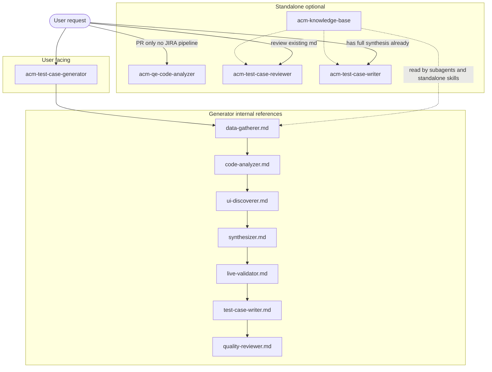

# Test Case Generator Workflow: Skill Disambiguation Report

**Audience:** Claude Code (or any agent) tasked with rewriting `description` fields in SKILL.md frontmatter for the Test Case Generator workflow.

**Goal:** Eliminate ambiguous skill selection when multiple skills sound like they do the same job. Descriptions must make **exactly one** primary skill obvious for each user intent.

**Scope:** Five skills only — the Test Case Generator workflow and its direct dependencies. Z-Stream / hub-health skills are out of scope.

---

## 1. Executive summary

Claude Code (and similar clients) load **only** each skill’s `name` and `description` at discovery time. If two skills both say “Polarion-ready test case” or “analyze PR for testing,” the model may pick the wrong skill, skip the full pipeline, or duplicate work.

In this repo:

- **One** skill is the **user-facing orchestrator** for end-to-end test case generation: `acm-test-case-generator`.
- **Two** skills are **pipeline components** with `disable-model-invocation: true` (not auto-selected as top-level skills, but still need clear descriptions for documentation and any explicit loads): `acm-test-case-writer`, `acm-test-case-reviewer`.
- **One** skill is a **reusable capability** often used inside Phase 2 but also valid standalone: `acm-qe-code-analyzer`.
- **One** skill is **shared reference knowledge** (no workflow): `acm-knowledge-base`.

The fix is **not** only shorter prose — it is **explicit TRIGGER / DO NOT TRIGGER** language, **naming the sibling skill** where confusion is likely, and **stating prerequisites** (e.g. “only after synthesized context exists”) in the description itself (within the 1024-character limit per Agent Skills spec).

---

## 2. Skill relationship map

### 2.1 Responsibility matrix

| Skill | Type | User should invoke directly? | Relationship to pipeline |
|-------|------|-------------------------------|----------------------------|
| `acm-test-case-generator` | Orchestrator | **Yes** — default for “generate test case from JIRA” | Runs Phases 0–8; spawns subagents using `references/agents/*.md` (not by loading other skills’ SKILL.md for phases 2–7 logic) |
| `acm-test-case-writer` | Component | **Rarely** — only if user already has full synthesized context and only needs markdown | Phase 6; expects prior investigation + synthesis artifacts or equivalent context |
| `acm-test-case-reviewer` | Component | **Sometimes** — “review this existing test case file” | Phase 7; can run on any Polarion-style test case `.md` the user points to |
| `acm-qe-code-analyzer` | Capability | **Yes** — “analyze this PR / diff for test impact” without full tc-gen | Phase 2 uses analogous workflow via `code-analyzer.md`; skill is the standalone packaging of PR analysis |
| `acm-knowledge-base` | Reference | **Yes** — when any task needs conventions / architecture facts | Read by orchestrator subagents and by writer/reviewer; not a substitute for running the generator |

### 2.2 Pipeline phase map (orchestrator)

Phases are defined in [`.claude/skills/acm-test-case-generator/SKILL.md`](../../.claude/skills/acm-test-case-generator/SKILL.md). Summary for disambiguation copy:

| Phase | Name | Subagent instruction file (not separate SKILL) |
|-------|------|---------------------------------------------------|
| 0 | Inputs / credentials / MCP probe | `references/pipeline-detail.md` |
| 1 | Gather + JIRA | `references/agents/data-gatherer.md` |
| 2 | PR code analysis | `references/agents/code-analyzer.md` |
| 3 | UI discovery | `references/agents/ui-discoverer.md` |
| 4 | Synthesis | `references/agents/synthesizer.md` |
| 5 | Live validation (optional) | `references/agents/live-validator.md` |
| 6 | Write test case | `references/agents/test-case-writer.md` |
| 7 | Quality review | `references/agents/quality-reviewer.md` |
| 8 | Reports | `scripts/report.py` |

**Important:** Phases 2–7 are driven by **agent markdown under the generator skill**, not by invoking `acm-qe-code-analyzer` / `acm-test-case-writer` / `acm-test-case-reviewer` as separate Claude “Skill” tools during the default pipeline. Standalone skills exist for **partial** workflows and **reuse**; the orchestrator description must say clearly: “full JIRA → Polarion path = this skill only.”

### 2.3 Diagram (data / control flow)



---

## 3. Current descriptions (verbatim) — what is wrong

### 3.1 `acm-test-case-generator`

**Current:**

> Generate Polarion-ready ACM Console UI test cases from JIRA tickets. Runs a multi-phase subagent pipeline with JIRA investigation, PR diff analysis, UI discovery, synthesis, optional live validation, test case writing, and mandatory quality review. Use when asked to generate a test case, write test coverage, or process an ACM JIRA ticket for testing.

**Problems:**

- “Write test coverage” overlaps with `acm-test-case-writer` (“Write Polarion-ready … markdown”).
- Does not say **DO NOT** use sibling skills for the same end-to-end ask.
- Does not name **ACM-####** style trigger explicitly (optional but helps demos).

### 3.2 `acm-test-case-writer`

**Current:**

> Write Polarion-ready ACM Console UI test case markdown from synthesized investigation context. Use when you need to produce a test case document for an ACM Console feature after investigation is complete.

**Problems:**

- Sounds like the main “write a test case” skill; almost duplicates generator wording.
- “After investigation is complete” is vague — user may think running generator once counts as “complete” and then call writer (redundant) or call writer without artifacts (wrong).

### 3.3 `acm-test-case-reviewer`

**Current:**

> Quality gate for ACM Console UI test cases. Validates conventions, verifies UI elements are discovered not assumed, checks AC vs implementation consistency, cross-references area knowledge, and enforces minimum MCP verification. Use after a test case is written to validate it before delivery.

**Problems:**

- “Use after a test case is written” does not distinguish **Phase 7 inside generator** vs **standalone review of any file**.
- Does not say to **prefer** generator for “review the test case we just generated from ACM-####”.

### 3.4 `acm-qe-code-analyzer`

**Current:**

> Analyze GitHub PR diffs for ACM Console to identify changed components, new UI elements, modified behavior, filtering logic, field orders, and test scenarios. Use when writing test cases that need to understand what code changed in a PR.

**Problems:**

- “When writing test cases” strongly pulls toward **generator** use case; agent may invoke this skill instead of starting `acm-test-case-generator` when user says “test case for ACM-####”.
- Does not say **DO NOT** use for full JIRA-driven Polarion pipeline.

### 3.5 `acm-knowledge-base`

**Current:**

> ACM Console domain knowledge including per-area architecture, test case conventions, naming patterns, and shared reference data. Use when any ACM-related skill or workflow needs domain context about governance, RBAC, fleet virtualization, clusters, search, applications, credentials, CCLM, or MTV areas.

**Problems:**

- “Any ACM-related skill” is very broad — can look like a **catch-all** first choice before the orchestrator.
- Does not say this skill **does not** run JIRA, PR, or UI discovery.

---

## 4. Proposed descriptions (copy targets for SKILL.md)

Constraints:

- Keep each `description` under **1024 characters** (Agent Skills / Anthropic convention).
- Use **imperative** phrasing: “Use this skill when…” (see [agentskills.io — optimizing descriptions](https://agentskills.io/skill-creation/optimizing-descriptions)).
- Include **near-miss negatives** (adjacent skills).

Below are **recommended** replacements (edit for tone; keep triggers explicit).

### 4.1 `acm-test-case-generator` (orchestrator)

```yaml
description: >-
  Use this skill when the user wants a FULL end-to-end Polarion-ready ACM Console UI
  test case from a JIRA ticket (e.g. ACM-30459): JIRA + PRs + UI discovery + synthesis
  + optional live validation + writing + mandatory quality review. This is the ONLY
  skill for that complete path. Do NOT use acm-test-case-writer or acm-qe-code-analyzer
  for the same request—they are partial workflows. Do NOT use acm-knowledge-base alone;
  it is reference-only. TRIGGER: generate/write test case from JIRA, Polarion test case
  for ACM ticket, test coverage for a story. DO NOT TRIGGER: PR-only diff analysis without
  JIRA-to-Polarion pipeline (use acm-qe-code-analyzer); review-only (use acm-test-case-reviewer).
```

### 4.2 `acm-test-case-writer` (component; `disable-model-invocation: true`)

```yaml
description: >-
  Use ONLY when a Polarion-style ACM Console test case markdown must be authored from
  ALREADY-SYNTHESIZED investigation context (JIRA + code + UI summary present in the
  thread or artifacts)—not for starting from a bare JIRA ID. For starting from JIRA,
  use acm-test-case-generator instead. TRIGGER: user explicitly asks to convert existing
  synthesis into test-case.md; Phase-6-style write with context already in hand. DO NOT
  TRIGGER: user gives only ACM-#### and expects full pipeline; user wants PR diff analysis
  only (acm-qe-code-analyzer); user wants quality review only (acm-test-case-reviewer).
```

### 4.3 `acm-test-case-reviewer` (component; `disable-model-invocation: true`)

```yaml
description: >-
  Use when the user wants a QUALITY REVIEW of an existing ACM Console UI test case
  markdown file (conventions, discovered-vs-assumed UI, MCP spot-checks, AC consistency)—
  without re-running JIRA/PR/UI investigation. If the user just finished acm-test-case-generator,
  review is already Phase 7 inside that skill—do not invoke this unless reviewing a
  standalone file or an out-of-band draft. TRIGGER: review this test-case.md, pre-Polarion
  QA, validate test steps. DO NOT TRIGGER: full test case from JIRA (acm-test-case-generator).
```

### 4.4 `acm-qe-code-analyzer` (standalone capability)

```yaml
description: >-
  Use when the user wants GitHub PR diff analysis for stolostron/console or kubevirt-plugin
  to understand what changed (components, UI, filters, field order) and what to test—
  WITHOUT running the full JIRA-to-Polarion test case generator pipeline. TRIGGER: analyze
  PR #N, what changed in this merge, test impact of this diff. DO NOT TRIGGER: user wants
  Polarion test case from ACM-#### end-to-end (use acm-test-case-generator); user wants
  only domain facts (use acm-knowledge-base reads inside whichever skill is appropriate).
```

### 4.5 `acm-knowledge-base` (reference)

```yaml
description: >-
  Use when you need READ-ONLY ACM Console domain reference: per-area architecture,
  Polarion conventions, naming patterns, examples. Load the specific references/ file for
  the task. This skill does NOT gather JIRA, PRs, or UI via MCP and does NOT run the
  test-case pipeline. TRIGGER: conventions, field order, area architecture, template
  rules while executing another skill. DO NOT TRIGGER: user asks to generate a test case
  from ACM-#### (acm-test-case-generator); PR-only analysis (acm-qe-code-analyzer).
```

---

## 5. Disambiguation rules (for the implementing agent)

Use these as **hard rules** when rewriting copy or when choosing a skill at runtime:

1. **Bare JIRA ID + Polarion / test case intent** → `acm-test-case-generator` only.
2. **PR number / URL + “what changed / test impact”** and **no** Polarion deliverable from JIRA → `acm-qe-code-analyzer`.
3. **Existing `.md` test case + “review / QA / blocking issues”** → `acm-test-case-reviewer` (unless the session is already inside generator Phase 7).
4. **“Conventions / architecture / which fields in description list”** → read `acm-knowledge-base` **as part of** another skill’s work; never as a substitute for the orchestrator.
5. **Writer** only if the conversation already contains **structured synthesis** equivalent to generator Phase 4 output; otherwise refuse and point to generator.

### 5.1 Near-miss examples (for eval sets)

| User query | Correct skill |
|------------|----------------|
| “Generate a Polarion test case for ACM-32282” | `acm-test-case-generator` |
| “What should we test in console PR 5432?” | `acm-qe-code-analyzer` |
| “Review `RHACM4K-61726.md` before I paste into Polarion” | `acm-test-case-reviewer` |
| “What is the description list field order for RBAC roles?” | `acm-knowledge-base` (then answer; no generator) |
| “Turn this synthesis into test-case markdown” (pasted synthesis) | `acm-test-case-writer` |

---

## 6. `disable-model-invocation` (already present)

`acm-test-case-writer` and `acm-test-case-reviewer` include:

```yaml
disable-model-invocation: true
```

**Meaning:** Claude Code should **not** auto-invoke these as top-level skills from the menu of all skills. That reduces accidental selection.

**Why descriptions still matter:**

- Documentation and onboarding still show the text.
- Users or scripts may still `Skill(...)` explicitly.
- Future clients may interpret the field differently.
- Clear TRIGGER/DO NOT TRIGGER text prevents wrong **manual** invocation.

When rewriting descriptions, **keep** `disable-model-invocation: true` on those two skills unless product requirements change.

---

## 7. Suggested verification (after edits)

Per [agentskills.io — optimizing descriptions](https://agentskills.io/skill-creation/optimizing-descriptions):

- Build ~20 labeled queries per skill (mix should-trigger / should-not-trigger; include **near-misses** from section 5.1).
- Run each query 3×; measure trigger rate for false positives/negatives.
- Split train/validation to avoid overfitting wording.

---

## 8. Files to edit (checklist)

| File | Action |
|------|--------|
| [`.claude/skills/acm-test-case-generator/SKILL.md`](../../.claude/skills/acm-test-case-generator/SKILL.md) | Replace `description:` under frontmatter |
| [`.claude/skills/acm-test-case-writer/SKILL.md`](../../.claude/skills/acm-test-case-writer/SKILL.md) | Replace `description:` |
| [`.claude/skills/acm-test-case-reviewer/SKILL.md`](../../.claude/skills/acm-test-case-reviewer/SKILL.md) | Replace `description:` |
| [`.claude/skills/acm-qe-code-analyzer/SKILL.md`](../../.claude/skills/acm-qe-code-analyzer/SKILL.md) | Replace `description:` |
| [`.claude/skills/acm-knowledge-base/SKILL.md`](../../.claude/skills/acm-knowledge-base/SKILL.md) | Replace `description:` |
| [`docs/skill-architecture.md`](../skill-architecture.md) | Optional: add pointer to this report under Test Case Generator section |

---

## Document history

| Date | Author | Change |
|------|--------|--------|
| 2026-05-10 | QE / AI Systems | Initial report for demo prep and Claude Code handoff |
