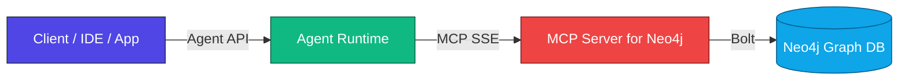
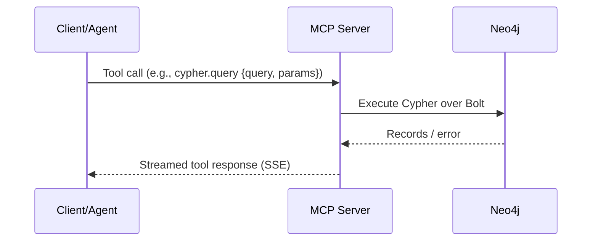
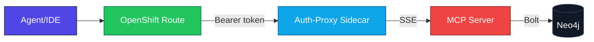

## MCP for the Dependency Graph — Architecture and Usage Guide

This guide explains how MCP (Model Context Protocol) is used to let agents and tools safely query the dependency graph in Neo4j. It is app‑agnostic and focuses on concepts, flows, security, and reuse for other purposes.

### 1) What MCP provides
- A standard, tool‑centric interface that agent clients can call (over SSE) to perform operations without embedding DB drivers in the client.
- Decoupling of UI/model from data backends; the client only needs the MCP endpoint and tool names.
- Transport: Server‑Sent Events (SSE) in this deployment.

### 2) High‑level architecture



Key roles:
- Client/Agent: composes tasks; converts NL prompts into tool calls.
- MCP Server: exposes a small set of tools (e.g., run a Cypher query with params) and mediates access to Neo4j.
- Neo4j: executes Cypher and returns results.

### 3) Request/response flow (sequence)



Notes:
- SSE is long‑lived; simple `curl` checks may appear to “hang” after HTTP 200 — that’s expected for streams.
- Prefer short timeout `-m 2` for health checks.

### 4) Deployment topologies

#### 4.1 Local development (Podman)
```bash
podman run --name neo4j-dg --restart always \
  -p 7474:7474 -p 7687:7687 \
  -e NEO4J_AUTH=neo4j/neoadmin \
  -e NEO4J_PLUGINS='["apoc"]' \
  -d neo4j:2025.01.0

podman run -d --name neo4j-mcp-sse -p 8000:8000 \
  quay.io/bjoydeep/neo4j-cypher:fixed \
  mcp-neo4j-cypher --db-url bolt://host.containers.internal:7687 \
  --username neo4j --password neoadmin --transport sse
```

#### 4.2 Kubernetes with auth‑proxy


Properties of the auth‑proxy sidecar:
- Validates the `Authorization: Bearer <token>` header using the cluster TokenReview API.
- Forwards only authenticated requests to the MCP server.
- Provides `/health` without authentication for liveness checks.

### 5) Tool surface (conceptual)
Typical tools implemented by the Neo4j MCP server:
- `cypher.query(query: string, params?: object)` → rows/records
- `cypher.explain(query: string, params?: object)` → plan (optional)

These names are representative; consult the MCP server’s documentation or `/health`/capabilities endpoint if available.

### 6) Example client usage

Registering the endpoint with a Python client (Agent runtime), then calling a tool:

```python
from llama_stack_client import LlamaStackClient
from llama_stack_client.types.toolgroup_register_params import McpEndpoint

client = LlamaStackClient(base_url="http://localhost:8321")
client.toolgroups.register(
    toolgroup_id="mcp::neo",
    provider_id="model-context-protocol",
    mcp_endpoint=McpEndpoint(uri="http://localhost:8000/sse"),
)

# In an agent turn, call a tool to fetch data (pseudo-code)
tool_name = "cypher.query"
args = {"query": "MATCH (n)-[r]-(m) RETURN n, r, m LIMIT 10", "params": {}}
# agent orchestrates the tool call via MCP and streams the response
```

### 7) Security model
- Network: use TLS‑terminated routes; prefer the auth‑proxy MCP route in clusters.
- Identity: issue service‑account tokens with least privilege for clients.
- Secrets: keep DB credentials in K8s secrets or Podman envs; do not embed in clients.
- Observability: log tool calls without sensitive params; sample result sizes.

### 8) Failure modes and troubleshooting
- MCP container exits with `--db-url` error → pass explicit CLI args (see Podman example).
- SSE health check “hangs” → expected; add `-m 2` timeout or use headers only.
- 401/403 at auth‑proxy → missing/invalid Bearer token; reissue and retry.
- Bolt connection refused → check Neo4j IP/port reachability and credentials.
- Slow queries → add indexes on anchor props; bound variable-length traversals.

Quick checks:
```bash
curl -m 2 -D - http://localhost:8000/sse -o /dev/null
podman ps --filter name=neo4j-mcp-sse
podman logs neo4j-mcp-sse | tail -n +1
```

### 9) Reuse patterns beyond the dependency graph
- Multi‑backend broker: expose additional tools (e.g., search index, CMDB, ticketing) under separate toolgroups; the agent composes them.
- Read/Write tools: add safe write ops (e.g., create annotations) behind MCP with guardrails.
- Test/data synthesis: return structured outputs (JSON rows) that feed CI pipelines.
- Documentation generation: run Cypher, then emit Mermaid diagrams or tables from results.

### 10) Governance and reliability for MCP integrations
- Capability discovery: expose a “capabilities” tool to list tool names and versions.
- Contracts: keep tool signatures narrow and stable (`query`, `params`); version if needed.
- Limits: enforce max result size and execution timeouts server‑side.
- Audit: log caller identity, tool name, timing, and row counts.

### 11) End‑to‑end concept map

```mermaid
flowchart TD
  Specs[Tool Specs] --> Server[MCP Server]
  Server --> Policies[Auth/Rate/Quotas]
  Policies --> Runtime[SSE Router]
  Runtime --> Adapters[Adapters (Neo4j Bolt)]
  Adapters --> Data[(Data Stores)]
  Client[Agent/IDE] --> Registry[Toolgroup Registry]
  Registry --> Client
  Client --> Server

  %% styling
  style Specs fill:#a78bfa,stroke:#4c1d95,color:#ffffff
  style Server fill:#ef4444,stroke:#7f1d1d,color:#ffffff
  style Policies fill:#fb7185,stroke:#7f1d1d,color:#ffffff
  style Runtime fill:#0ea5e9,stroke:#075985,color:#ffffff
  style Adapters fill:#22c55e,stroke:#065f46,color:#ffffff
  style Data fill:#111827,stroke:#374151,color:#ffffff
  style Client fill:#4f46e5,stroke:#1e293b,color:#ffffff
  style Registry fill:#f59e0b,stroke:#7c2d12,color:#111111
```

### 12) Why MCP here
- Standardizes access: clients talk MCP, not bespoke DB adapters.
- Enables agentic flows: tools can be chosen by the model, mixed with reasoning.
- Secures data: auth‑proxy + tokens + server‑side limits keep DB surface minimal.
- Portable: the same client config works locally and in clusters by only swapping endpoint URLs.

